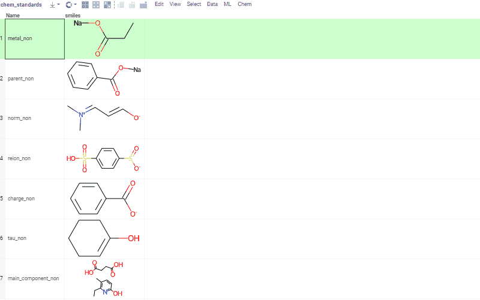
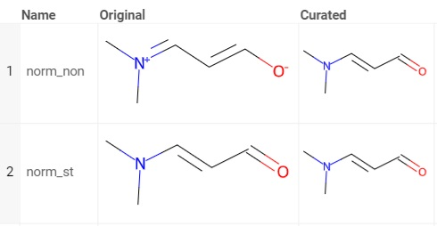
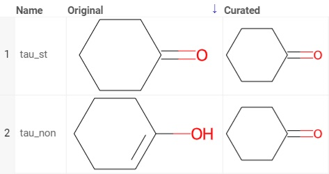
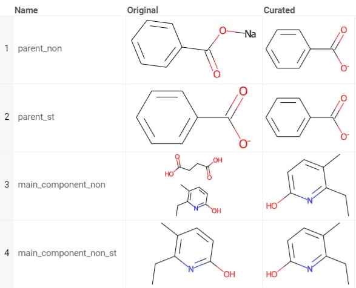

<!-- TITLE: Cheminformatics chemical structures curation -->
<!-- SUBTITLE: -->

# Cheminformatics chemical structures curation

Curation tools could be used for a wide spectrum of purposes and propose different ways which one can use in a preferred
combination. When no options are chosen the curation tools will process sanitization procedures and will perform
chemotypes standardization with no actual modification of input data. All possible options also include this procedure
and execute a specific task. All given examples show that pairs of different graphs may correspond to a single structure
if certain conditions are applied.

# Kekulization

Chemical structure graphs with aromatic systems have different representations. In the first case all bonds in aromatic
systems are introduced as single and double bonds and in the other all aromatic bonds are introduced in a special way
and thus to generate other type of descriptors. This option detects and unifies all aromatic bonds.

# Normalization

Normalization is used mostly for handling the zwitterions - ions with both positive and negative charges that could be
neutralized by each other at certain pH values. Such molecules are electrically neutral and in physiological conditions,
such atom charges are indeed neutralized.

# Reionization

In some other cases structures are not electrically neutral but atom charges do not satisfy the lowest energy condition
so reionization procedure is advisable.

# Neutralization

In cases when biological properties of the compound are prior to all other properties, it is commonly practiced to
proceed with neutralized structures so even charged molecules are transformed to their electrically neutral form. This
procedure should be used with the assumption that base and salt forms have the same activities. It should be noted
though that there are structures that could not be neutralized, such as structures with quaternary nitrogen with no
hydrogen neighbors, they basically do not have base form and exist only as salts.

# Tautomerization

One of the most surprising phenomenon are tautomers - compounds that exist in two or more structural forms at the same
time in everyconverting state. To simplify the analysis of such structures tautomerization procedure has to be done. As
a result, there will be only one most common form of the tautomer in the dataset.

# Main fragment

Analysis of mixtures or salts is rarely used so one may prefer to proceed only with the main fragment. This procedure is
widely used in combination with neutralization.

