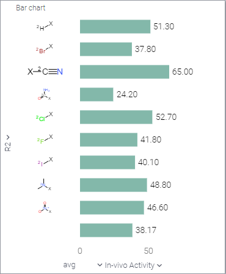
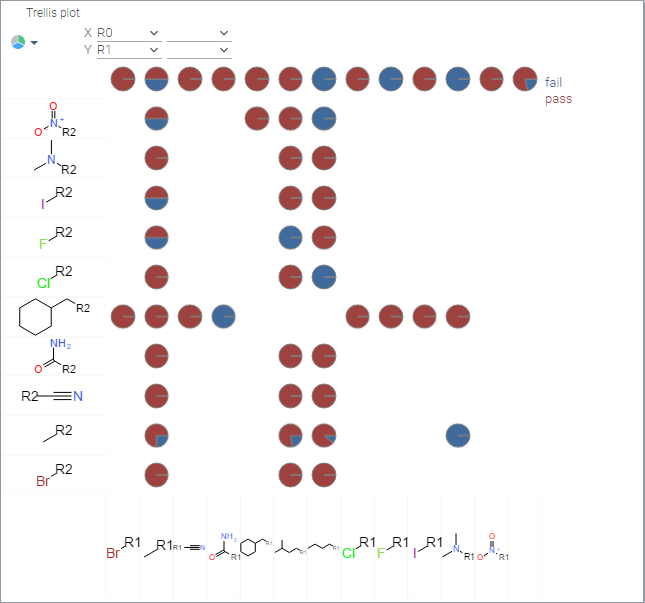
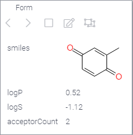
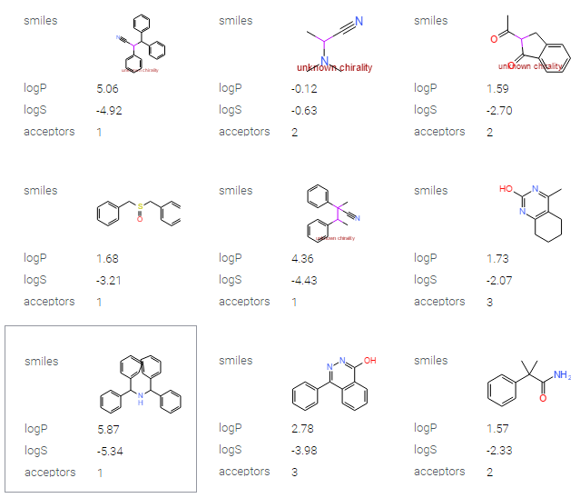
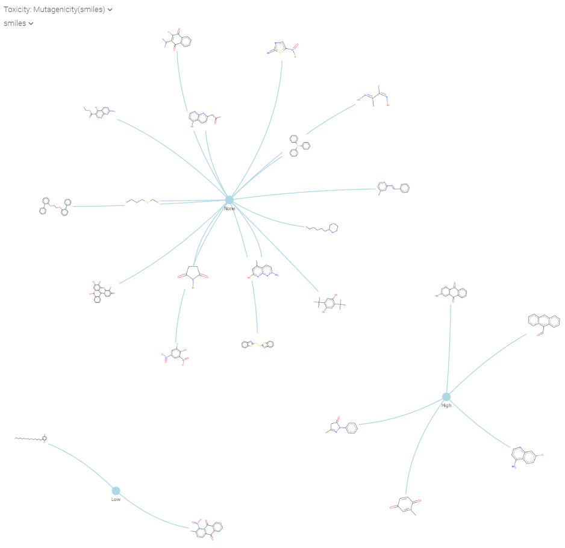

<!-- TITLE: Chemically Aware Viewers -->
<!-- SUBTITLE: -->

# Chemically Aware Viewers

Many of the view

## Grid

Molecules in the [grid](../../visualize/viewers/grid.md)

## Scatter plot

## Bar chart

Molecules in [bar chart](../../visualize/viewers/bar-chart.md)

## Trellis plot

R-group analysis done using [trellis plot](../../visualize/viewers/trellis-plot.md).

   
## Form

Molecules in the [form](../../visualize/viewers/form.md).

## Tile viewer

 
## Network diagram

 
   
See also:
  * [Viewers](../../visualize/viewers.md)
