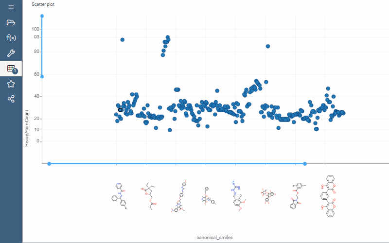
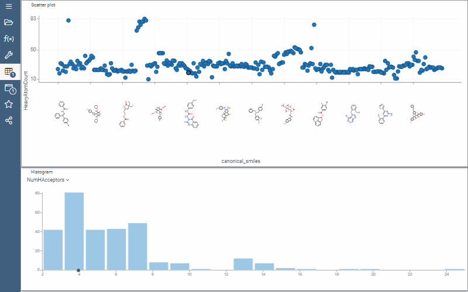
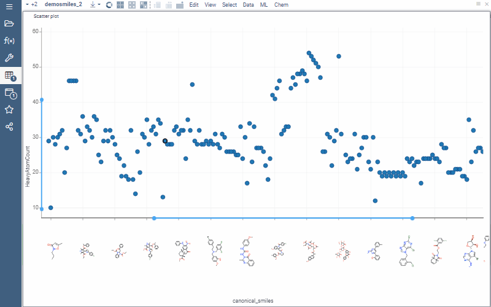
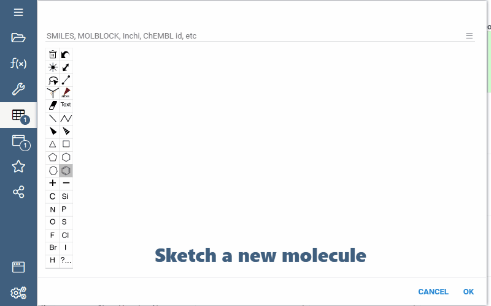
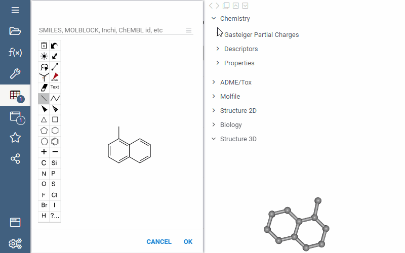
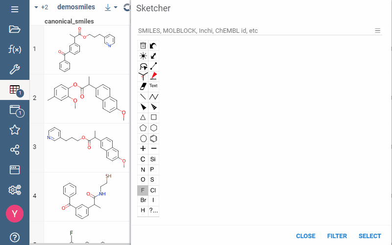
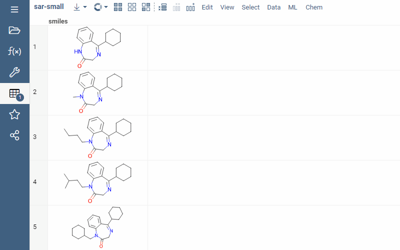
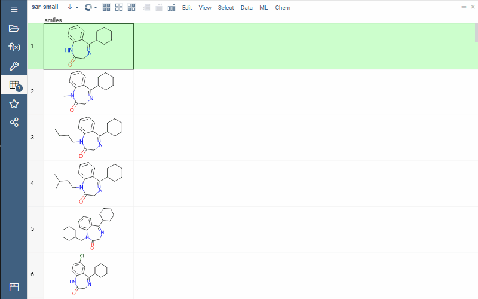
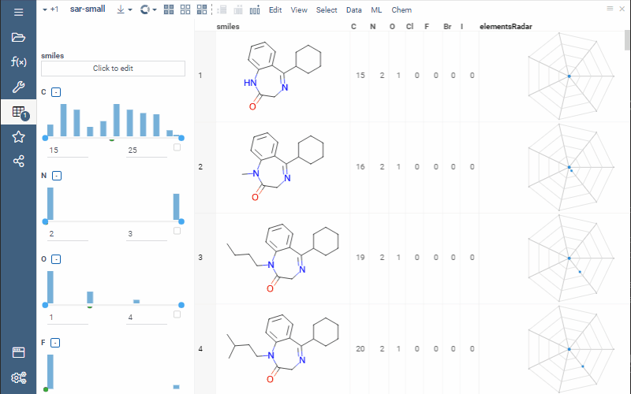
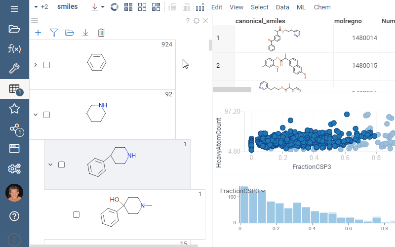

import Tabs from '@theme/Tabs';
import TabItem from '@theme/TabItem';

Datagrok provides a powerful set of tools for [Cheminformatics](https://en.wikipedia.org/wiki/Cheminformatics), accelerating chemically-related workflows.

## Overview

With Datagrok, you can:

* Instantly import your data of the most common [molecular structure formats](../../access/supported-formats.md#molecular-structure-formats).
  For databases and cloud services we provide [30+ data connectors](../../access/data-connection.md), [data queries](../../access/data-query.md) and [data preparation pipelines](../../access/data-pipeline.md).  
  Our [semantic types](../../discover/semantic-types.md) include molecules that enables automatic structures rendering, chemically-aware viewers and adaptive info panels.

  

* Visualize your data with context-driven [Viewers](../../visualize/viewers/). For molecular data, [chemically aware viewers](chemically-aware-viewers) offer additional functionality:

  * Vizualization of molecules on axes

    

  * Synchronized filtering across selected viewers
  
    
  
  * Datapoint-associated tooltip with useful information
  
    

* Sketch a new molecule, edit an existing one, or retrieve one by entering compound identifier/trivial name with [Sketcher](sketcher.md)

  

  While drawing a molecule, info panels update interactively.

  

  With a structure in Sketcher, substructure search is available. You can select or filter rows in dataset by sketched substuctures.

  
  
  We support several Sketcher types: Marvin, ChemDraw, OpenChemLib, Ketcher.

* Explore molecules in [info panels](../../discover/info-panels.md): view structures in 2D and 3D, evaluate [drug likeness](info-panels/drug-likeness.md), [toxicity risks](info-panels/toxicity-risks), [structural alerts](info-panels/structural-alerts.md), chemical properties

* Navigate through molecules with [diversity search](diversity-search.md) and [similarity search](similarity-search.md)
* Extract [molecular descriptors](descriptors.md) and [fingerprints](fingerprints.md) on the fly
* Train models using [predictive modeling](chem-predictive-modeling.md) and incorporate them in pipelines or [info panels](../../discover/info-panels.md)

## Augment

Explore your data with [info panels](../../discover/info-panels.md). Datagrok's info panels collect molecule-specific functions in one place, calculating them on the fly.


By opening, info panels automatically enable the following functions:

* Structure 2D – visualizes a molecule in 2D
* Structure 3D – visualizes a molecule in 3D through generating .mol file
* Molfile – provides a .mol file

All the rest functions are optional and fall into Chemistry, Biology, Databases groups:

```mdx-code-block
<Tabs>
<TabItem value="chemistry" label="Chemistry" default>
```

Chemistry group helps explore chemical features and includes:

* [Gasteiger Partial Charges](functions/gasteiger-charges.md) - visualizes and highlights partial charges in a molecule
* [Chem descriptors](descriptors.md) – calculates and displays the specified descriptors for a molecule
* Properties – yields the list of physical and chemical properties: empirical formula, molecular weight, hydrogen bond acceptor (HBA) and donor (HDA) values, LogP and LogS, polar surface area (PSA), number of rotatable bonds and stereocenters, also IUPAC name

```mdx-code-block
</TabItem>
<TabItem value="biology" label="Biology">
```

Biology group helps explore drug design related features and includes:

* [Toxicity](info-panels/toxicity-risks.md) –  predicts the toxicity scores. Consists of such categories as mutagenicity, tumorogenicity, irritating effects, reproductive effects
* [Structural alerts](info-panels/structural-alerts.md) – highlights the fragments in structures that might greatly increase the toxicity and other problematic structural features
* [Drug likeness](info-panels/structural-alerts.md) – predicts a score that shows how likely this molecule is to be a drug.
* ADME/Tox - performs ADME and Toxicity analysis

```mdx-code-block
</TabItem>
<TabItem value="Databases" label="Databases" default>
```

Databases group helps access ChEmbl, PubChem and DrugBank public databases and includes:

* Identifiers - fetches all known identifiers for the specified structure across [UniChem databases](https://www.ebi.ac.uk/unichem/)
* Substructure and similarity search - provides search across ChEmbl, PubChem and DrugBank public databases

```mdx-code-block
</TabItem>
</Tabs>
```

:::info Information
In addition to predefined info panels, users also can develop their own using any scripting language supported by the Datagrok platform.
:::

## Calculate

With chemical dataset uploaded, you can use two types of calculation functions: descriptors/fingerprints and mapping functions.

### Descriptors and fingerprints

To vectorize molecular graph data, the platform supports [descriptors](descriptors.md) and [fingerprints](fingerprints.md).

While descriptors are more physical and fingerprints are more abstract vectors, both enable the following procedures:

* Similarity and diversity search
* Chem space dimensionality reduction
* SAR analysis
* Machine learning predictive modeling

We support the following descriptors: Lipinski, Crippen, EState, EState VSA, Fragments, Graph, MolSurf, QED and [others](descriptors.md).


We support the following fingerprints: RDKFingerprint, MACCSKeys, AtomPair, TopologicalTorsion, Morgan/Circular and [others](fingerprints.md).

<!-- GIF with fingerprints. Doesn't work yet! -->

### Mapping functions

Datagrok's mapping functions calculate molecules' unique textual identifiers known as [International Chemical Identifiers](https://en.wikipedia.org/wiki/International_Chemical_Identifier), interlinking the same molecules between multiple databases.

With just a few clicks, you can convert your structures to InChI and InChI keys, its hashed version.



## Transform

Datagrok lets transform your molecular structures for standartization and/or augmentation purposes.  
In addition to general [data wrangling](../../transform/data-wrangling.md) procedures, you can use chemistry-specific ones: curation and mutation.

### Curation

[Сhemical structure curation](chem-curate.md) standardizes your chemical structures and helps avoid data-associated errors such as duplicated vectors in the training set or incorrect structure representation.

:::tip
By chemical structure curation you can improve your SAR analysis or model's prediction accuracy
:::

We offer the following curation methods:

* Kekulization
* Reionization
* Normalization
* Neutralization
* Tautomerization
* Main fragment selection


### Mutation

Mutation function generates new structures based on the specified one. Generation is combinatorial and has the following parameters:

* `step` - number of permutations applied to the structure
* `max random result` - number of output structures

## Search

Оur search functions help navigate across molecular structures and include the following types:

* ### [Similarity and diversity search](similarity-search.md)

  For the specified structure, finds the 10 most similar/diverse ones in your dataset.  
  Similarity search sorts all the found structures by similarity score based on Morgan fingerprints and multiple [distance metrics](similarity-spe#available-distance-metrics) to opt.

  

* ### [Substructure search](substructure-search.md)

  Sketcher-supported function that searches for specified structural pattern in the datasource.

  In Datagrok, substructure search implements several advanced features:

  * Sketcher-oriented structural adjustment of the found molecules
  * Explicit hydrogen search support
  * Extended toolset for aromaticity search
  * Multicolumn filtering

:::info
Similarity and substructure search support uploaded dataset, public databases (Chembl, PubChem, DrugBank) and [relational databases](db-substructure-similarity-search.md).
:::
<!-- #GIF с поиском субструктур в опен-сорсных БД, doesn't work -->

## Analyze

For chemical analysis, Datagrok offers multiple methods. Functionally, they fall into 2 categories:

```mdx-code-block
<Tabs>
<TabItem value="Analyze SAR" label="Analyze SAR" default>
```

Identifies structure-based bioactivity values and includes:

* [R-group analysis](r-group-analysis.md)

  Identifies R-group branches connected to a scaffold. For comparative visualizations, trellis plot is available.

  <!-- new GIF, doesn't work -->

* Activity Cliffs

  Finds similar compounds with different activity in your dataset.  
  Choose similarity percent of neighbors, run the function and explore activity cliffs displayed on 2D plots.

<!-- GIF with Activity cliffs, doesn't work -->

* Structural Alerts

  Flags potential chemical hazards taken from several rule sets containing
[1,251 substructures in the SMARTS format](https://raw.githubusercontent.com/PatWalters/rd_filters/5f70235b387baa39669f25d95079e5dfec49a47c/rd_filters/data/alert_collection.csv).
  Presence of any of these substructures triggers a structural alert shown on the info panel.

<!-- GIF with Structural Alerts, doesn't work -->

```mdx-code-block
</TabItem>
<TabItem value="Analyze Structure" label="Analyze Structure">
```

Investigates exclusively structural pecularities and includes:

* Chem space

  Explores structural similarity of your molecular data on 2D clusters. For dimensionality reduction, you can choose either t-SNE or UMAP algorithm with any of Cosine, Sokal, Tanimoto, Assimetric distance metrics.

  <!-- GIF, but tooltip bagged! -->

* Elemental Analysis
  
  Represents molecules as the sum of its constituent atoms with optional radar plots.

  

  :::tip

  Use elemental analysis to filter the molecules on appropriate atoms  

  
  :::

* Scaffold Tree

  Constructs tree hierarchy based on molecular scaffolds in your dataset. Use the hierarchy to filter or select the corresponding rows in the dataset.

  

```mdx-code-block
</TabItem>
</Tabs>
```

## Predict

Datagrok   enables   machine   learning   predictive   models   by   using
chemical properties, descriptors, and fingerprints as features, and the
observed properties as targets. Within Datagrok, you can train, assess, execute,
share and use your models in pipelines.

We offer several models: PCA, Naive Bayes, K-Means, Distributed Random Forest, Gradient Boosting, XGBoost, Generalized Linear Modeling, AutoML and Deep Learning.

