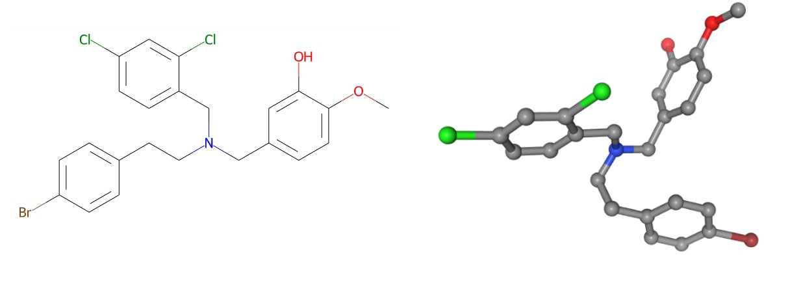
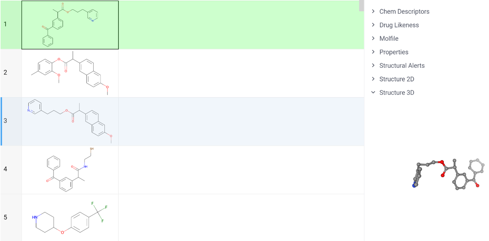
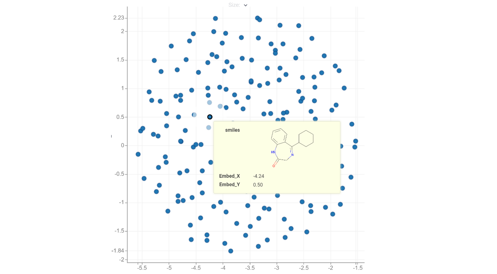
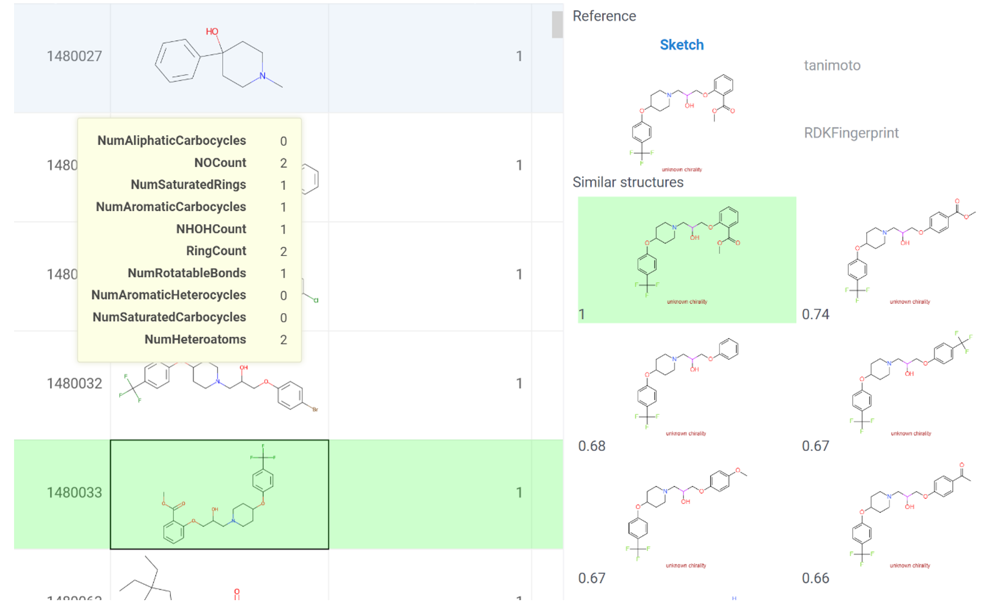
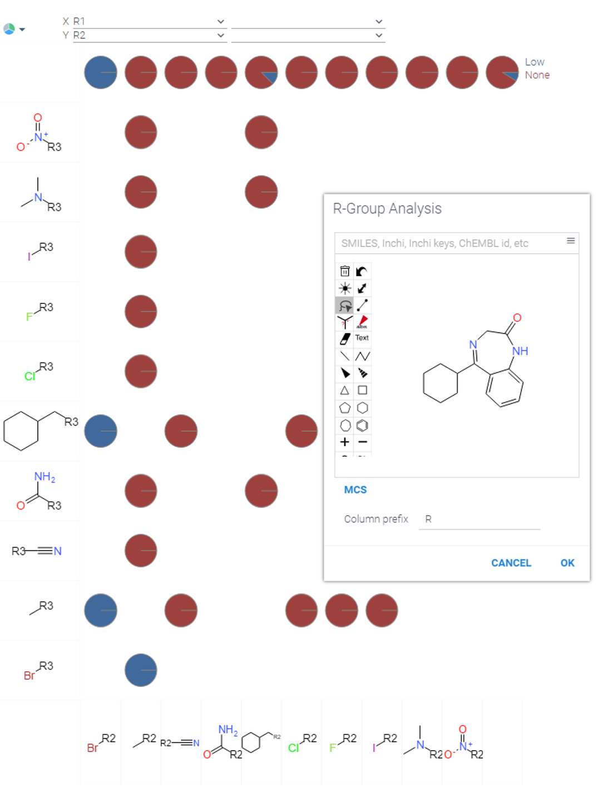
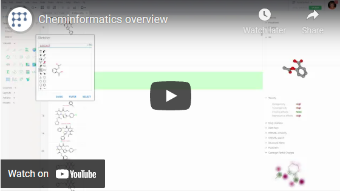

<!-- TITLE: Cheminformatics -->
<!-- SUBTITLE: -->

# Cheminformatics

[Wikipedia](https://en.wikipedia.org/wiki/Cheminformatics): Cheminformatics is the use of computer and informational
techniques applied to a range of problems in the field of chemistry. These *in silico* techniques are used, for example,
in pharmaceutical companies and academic settings in the process of drug discovery. These methods can also be used in
chemical and allied industries in various other forms.

Counterposed to *in vitro* (undertaken in glass without cells) and *in vivo* (undertaken in cell cultures, or organisms) biochemical experiments *in silico* was defined to imply a biochemical experiment performed via computational approaches (as silicon is the main component of modern CPU). Cheminformatics is a complex in silico discipline serving to handle chemical entities for several different purposes:
- developing methods for chemical data storage, and operating with it
- determination of structure-property and structure-activity relationships via modeling
- virtual screening to evaluate the most potent drug candidates.
- generation of possible chemical structures
- synthesis planning and synthetical routes prediction
- facilitation of chemists' work via visualization and reaction prediction
- molecular design, etc

Cheminformatics tends to consider a molecule structure as a sole chemical object that could be presented in plural data forms. More complex objects like mixtures, materials and reactions are also investigated but are related to molecular structures in each case.
Datagrok provides first-class support for small molecules, as well as most popular building blocks for cheminformatics. It understands several popular notations for representing chemical (sub)structures, such as SMILES and SMARTS. Molecules can be rendered in either 2D or 3D with different visualization options. They can be sketched as well. Chemical properties, descriptors, and fingerprints can be extracted. Predictive models that accept molecules as an input can be easily trained, assessed, executed, deployed, reused by other scientists, and used in pipelines or in info panels.
Several toxicity and drug-likeness prediction models are supported. Substructure and similarity search works out-of-the box for imported data and can be efficiently utilized for querying databases using Postgres chemical cartridge. To further explore collections of molecules, use advanced tools such as diversity search and similarity search.
Though it might seem that cheminformatics covers all molecular needs, it has its limitations. The applicability of this field is limited to small molecules and some types of peptides. It shows real power when it is combined with other *in silico* approaches including but not limited to:
* docking and molecular dynamics
* systems biology and pharmacology
* bioinformatics
* proteomics.

## Representaion

### Molecular graphs

Each cheminformatic problem is usually associated with a specific structure set and thus all structures should be presented in both forms convenient for researchers and computations. In these both cases the structure is usually associated with a graph with atoms in vertices and bonds as edges. Typically, chemists and other researchers use its graphical representations, planar and 3D.

## Importing molecular data

Simply [import the dataset](../../access/importing-data.md) as you normally would - by opening a file, querying a
database, connecting to a webservice, or by any other method. The platform is smart enough to automatically recognize
chemical structures.

One may expect planar representations to be the most convenient form for small molecules and use 3D only in cases when conformational properties of molecules are required which is an everyday need in adjacent areas like molecular modelling, macromolecular representations are either supposed to be in 3d. The generalizations of molecules with varied substitutes or chemical groups, also known as Markush structures which only describe a scaffold and could have any substitutions in R positions.

Such representations could have a great importance for monomer description with decomposed macromolecule or for description of chemical classes which is widely used in high throughput screening or umbrella patents. The scaffold concept is widely applied in medicinal chemistry. Scaffolds are mostly used to represent core structures of bioactive compounds. Although the scaffold concept has limitations and is often viewed differently from a chemical and computational perspective, it has provided a basis for systematic investigations of molecular cores and building blocks, going far beyond the consideration of individual compound series.

Learn more [here](functions/murcko-scaffolds.md).

Datagrok is sharpened to process chemical structures. The platform is smart enough to automatically recognize them, so Datagrok provides these representations as soon as it detects any molecule-associated type in every entity whether it is a table, tooltip, any other element.

### Chemical data storage and manipulation

As it was shown the most convenient form of molecular representation for human is molecular graph, and Datagrok indeed fulfills this convenience to its users. Mathematically, graphs are sets of vertices and edges, and could be processed by machines in different ways.
To store the whole information about the molecule, the [MOL notation](http://c4.cabrillo.edu/404/ctfile.pdf) is widely used. It contains atoms (vertices) and bonds (edges) of the molecule with all associated information as atom coordinates, charges, isotopes etc. Multiple MOL files are stored as an SDF where any other additional information could be added (e.g. experimental activity values). Being very convenient, MOL is also commonly used in the overwhelming majority of computational cheminformatics software. Very similar to MOL is [PDB notation](https://pdb101.rcsb.org/learn/guide-to-understanding-pdb-data/dealing-with-coordinates) commonly used for macromolecules and using the same ideas.
The tightest popular format for the storage is [SMILES string](https://www.daylight.com/dayhtml/doc/theory/theory.smiles.html). Special rules are used for such string generation. Datagrok uses SMILES to restore MOL files for subsequent processing. For chemical reactions, the modified strings of [SMIRKS notation](https://www.daylight.com/dayhtml/doc/theory/theory.smirks.html) are used.
MOL and SMILES are possibly the best formats for storing a single molecule. However, some applications require the notion of uncertain chemical structures (e.g. fragments that do not correspond to any real molecule). For such needs, logical expressions are essential, (e.g. carbon or oxygen atom, double or aromatic bond) and [SMARTS notation](https://www.daylight.com/dayhtml/doc/theory/theory.smarts.html) provides this option. One may say that SMARTS is the same thing as regular expressions in cheminformatics. Datagrok uses SMARTS for finding structural alerts, performing substructure search, R-group analysis.
Datagrok uses all variety of mentioned formats. To view and operate with chemical structures simply import the dataset as you normally would - by opening a file, querying a database, connecting to a webservice, or by any other method.

### Descriptors and fingerprints

Though molecular graph is an appropriate form of data for storage it is useless for the wide spectrum of cheminformatics applications especially machine learning procedures. For such applications, molecules are represented as a set of molecular descriptors or molecular fingerprints. Datagrok provides generation of different sets of descriptors and fingerprints. The objective of these representations is to satisfy linear algebra requirements applied in the majority of ML methods and provide a vector of values describing the molecule.
Fingerprints are a very abstract representation of certain structural features of a molecule represented as binary vectors. Similarity measures, calculations that quantify the similarity of two molecules, and screening, a way of rapidly eliminating molecules as candidates in a substructure search, are both processes that use fingerprints.
Descriptors and fingerprint feature in the following items:
*A variety of different descriptors and fingerprints could be derived from a single molecular graph
* They are invariant to numberings in a molecule
* In most case they could be interpretated in terms of chemical or physical properties
* Reactions, mixtures of compounds, nanoparticles could also be represented as descriptors

Descriptors and fingerprints are frequently used for proceeding similar chemical structures. These principles yield in similarity search and diversity search. In combination with clustering and self-organizing maps, methods such as stochastic proximity embedding allow to reduce dimensionality of used vectors and to separate the most significant features of the molecule. It helps us to visualize the chemical space in 2D maps in the problems of molecular data mining, and compound activity prediction.

Datagrok supports the following descriptor sets: Lipinski, Crippen, EState, EState VSA, Fragments, Graph, MolSurf, QED.
See [molecular descriptors](descriptors.md) for more details and a demo about descriptors.

Datagrok supports the following fingerprints: RDKFingerprint, MACCSKeys, AtomPair, TopologicalTorsion, Morgan/Circular. See [molecular fingerpints](fingerpints.md) for more details and a demo about fingerprints.

## Descriptor based tools

Groups of molecules united in a dataset represent a part of the chemical space. This space considers molecules as points and is estimated to have more than 1060 molecules real or possible as was formulated by Lipinski and Hopkins. In the practical point of view each molecular dataset defines a local chemical space which could be interpreted as a vector (linear) space based on molecular descriptors. In these terms the structure could be compared as vectors. This leads to similarity estimation for each pair of molecules in a dataset.

### Chemical space maps

Multy-dimensional vector spaces and molecular similarities for each molecular pair are hard to imagine and for analytical purposes we visualize the chemical space of entire dataset with the use of planar maps. Being a 2D projection of descriptor vectors such maps reduce dimensionality of initial vector space and place structures close if they are similar and far if not, so distance between two points is determined by their similarity.
We have implemented a tool called “Chemical space” that helps scientists to analyze a collection of molecules in terms of molecular similarity. This tool is based on applying different distance metrics (such as Tanimoto) to fingerprints. The choice of appropriate descriptors/fingerprints and distance metrics shows the different planar representations of the explored dataset.

### Similarity search

“Similarity search” is another analytical tool based on descriptors/fingerprints. It allows to readily find all molecules that have a similar structure and contrary to chemical space visualization the similarities are used here for direct investigation.

Datagrok’s “Similarity Search” finds structures similar to the specified one. Options for descriptors/fingerprints and metrics selection are present to get expected results for specified cases.

See [Similarity Search](similarity-search.md) for a demo about this tool.

### Diversity search

The other use of direct similarity values is to find the most diverse structures in the dataset.
“Diversity Search” tool finds 10 most distinct molecules. These structures could be used to estimate the variety of chemical classes presented in the dataset.
Both “Similarity search” and “Diversity search” tools can be used together as a collection browser. 'Diverse structures' window shows different classes of compounds present in the dataset; when you click on a molecule representing a class, similar molecules will be shown in the 'Similar structures' window.

See [Diversity Search](diversity-search.md) for a demo about this tool.

### Structure-property predictions

Some descriptors have a strong relation to the real physical and chemical properties of the molecule. It opens a route to calculate such properties with direct calculations or using the quantitative structure-property relationship (QSPR) models.
Datagrok provides the following properties: formula, drug likeness, acceptor count, donor count, logP, logD, polar surface area, rotatable bond count, stereo center count. One may develop his own QSPR model using provided descriptors/fingerprints and all powers of Datagrok machine learning abilities.

Learn more about [predictive modeling for cheminformatics](chem-predictive-modeling.md) and a demo of building and applying a model.

## Molecular graph based tools

Descriptors and fingerprints are handful for various computations, but their application is limited by a number of specific tasks. Operating with native molecular graphs could benefit in additional insights and greatly increases the pool of supported tools in Datagrok making it possible to quickly handle and filter large amounts of chemical data.

### Subgraph tools

As it was already mentioned Datagrok automatically detects supported chemical data notations to show the structure in each element possible. It can also handle special chemical queries for subgraphs. That makes use in chemical datasets filtering as a subgraph may not be related to existing structure (e.g. query can have a single aromatic atom or bond). Each time the filter is applied such query detects a subgraph in the structures containing it and Datagrok highlights queried substructures in the subset after filtering. Such queries could be simply drawn in the sketcher or applied as SMARTS strings.
The other side of subgraph analysis is most common substructure (MCS). MCS problem is of great importance in multiple aspects of cheminformatics. It has diverse applications ranging from lead prediction to automated reaction mapping and visual alignment of similar compounds. MCS feature is integrated to several Datagrok tools, notably with sketching options or could be called separately.

### R-groups

R-Group Analysis is a common function in chemistry. Typically, it involves R-group decomposition, followed by the visual analysis of the obtained R-groups. This analysis uses the graph of selected scaffold to find all entries in the dataset that obtain such scaffold and get all substitutes for each molecule. Datagrok's chemically-aware Trellis Plot is a natural fit for such an analysis.

See [R-group analysis](r-group-analysis.md) for more details and a demo about this analysis.

### Structure generations

Combining two subgraphs leads to a new graph. The molecule generating abilities in Datagrok are capable for generating in structures based on selected scaffold thus enriching the possible chemical space for the investigation.

### Virtual reactions

Chemical reactions are one of the most commonly ways in the real-world to get new structures, but not all structures could be synthesized. To estimate the possibility of new structure synthesis and possibly estimate the complexity of such synthesis Datagrok uses the virtual synthesis. This feature applies a specified reaction to two columns containing molecules. The output table contains a row for each product produced by applying the reaction to the inputs. Each row contains the product molecule, index information, and the reactant molecules that were used.
Virtual reaction is an alternative to structure generation as it provides a set of structures that higher chances to exist in reality than simply generated structures. Together with structure generation it provides a way of enriching the explored chemical space.

In Datagrok it applies a specified reaction to two columns containing molecules. The output table contains a row for each product produced by applying the reaction to the inputs. Each row contains the product molecule, index information, and the
reactant molecules that were used.

'Do Matrix Expansion': If checked, each reactant 1 will be combined with each reactant 2 yielding the combinatorial
expansion of the reactants. If not checked, reactants 1 and 2 will be combined sequentially, with the longer list
determining the number of output rows.

Corresponding function: #{x.demo:demoscripts:TwoComponentReaction}

See details [here](functions/reactions.md).

## Virtual screening

Possibly most proficient application of cheminformatics is a search of new structures that could be considered as potential drugs. Not only cheminformatics is applied for this complex process though it is never processed without it. Here we describe Datagrok’s powers to support virtual screening using special tools aimed for this purpose.

### Dataset curation

All described methods are implemented in different analysis pipelines and assume that descriptors and graphs describe a real molecule perfectly. Data-associated errors lead to biases in descriptors, wrong interpretations of modeling outputs, and irrelevance of the whole work. The most sensitive cases are duplicated vectors in the training set, and errors derived from the incorrect structure representation. Thus, curation of chemical data is usually integrated to analysis pipeline.
To assure the quality of subsequent analysis and predictive models development, Datagrok provides convenient tools for chemical dataset curation. This curation assumes that one might modify the dataset for specific purposes and process the situations when equal chemical entities have different representations. The latter interferes with the representation of the molecule in descriptor space and may lead to inconsistent analysis results and non-robust models.
Curation tools include, but are not limited to:
* kekulization
* normalization
* neutralization
* tautomerization
* selection of the main component

See [Chemical dataset curation](chem-curate.md) for more details, and a demo with curation examples.

References:

* [Chemical structures curation in cheminformatics](https://pubs.acs.org/doi/10.1021/ci100176x)

### Biological data driven filtering

Drug design tasks are essentially related not only to chemical information but to a wide spectrum of biological issues. Biological aspect of the process limits the chemical space that could be used for drug discovery purposes. Datagork provides the following tools to filter the explored dataset:

Toxicity - predicts the following toxicity properties: mutagenicity, tumorigenicity, irritating effects, reproductive effects.

See details [here](info-panels/toxicity-risks.md)

Drug likeness - a score that shows how likely this molecule is to be a drug. The score comes with an interpretation of how different sub-structure fragments contribute to the score.

See details [here](info-panels/drug-likeness.md)

Structural alerts – drug specific structural alerts that in most cases could lead to severe toxicity.

See details [here](info-panels/structural-alerts.md)

### QSAR modeling

Pharmaceutical needs demand wide use of cheminformatics methods for chemical datasets exploration analysis and following modelling studies. These datasets are always accompanied with experimental values (e.g. measured biological activity of a compound). One of the most common task is evaluation of structure-activity relationships, which are essential in drug development as they contribute in hit compound identification and lead compound optimization. (Q)SAR studies are performed to find possible leads in the screening datasets
In contrast to the physical predictive models, machine learning predictive models do not have any intrinsic knowledge about the physical and biological processes. Instead, they use techniques such as random forests or deep learning to discern mathematical relationships between empirical observations of small molecules and extrapolate them to predict chemical, biological and physical properties of novel compounds.

Datagrok enables machine learning predictive models by using chemical properties, descriptors, and fingerprints as features, and the observed properties as results when building predictive models. This lets researchers build predictive models that can be trained, assessed, executed, reused by other scientists, and used in pipelines.
Datagrok enables machine learning predictive models by using chemical
[properties, descriptors](#chemical-properties-and-descriptors), and [fingerprints](#fingerprints)
as features, and the observed properties as results when
[building predictive models](../../learn/data-science.md#predictive-modeling). This lets scientists build predictive
models that can be trained, assessed, executed, reused by other scientists, and used in pipelines.

Learn more about [predictive modeling for cheminformatics](chem-predictive-modeling.md) and a demo of building and applying a model.

References:

* [Machine learning in chemoinformatics and drug discovery](https://www.sciencedirect.com/science/article/pii/S1359644617304695)

### What chemical space to screen?

The developed model is able to get the possible hits from screened dataset but one of the most important tasks is to ensure that screened set satisfy the screening needs. The described above tools can highly enrich the screening dataset with structures generation or performing the virtual reactions. Additionally, Datagrok provides the access to freely available databases. DrugBank structures are available to search the potent hit among existing drugs for drug repurposing aims. Data from ChEMBL and PubChem could also be accessed to analyze structure from different biochemical and phenotypic assays as well as collections of synthesizable compounds.

## Sum of technologies

### Visualizations and convenience

#### Chemically-aware viewers

Many viewers, such as
[grid](chemically-aware-viewers.md#grid),
[scatter plot](chemically-aware-viewers.md#scatter-plot),
[network diagram](chemically-aware-viewers.md#network-diagram),
[tile viewer](chemically-aware-viewers.md#tile-viewer),
[bar chart](chemically-aware-viewers.md#bar-chart), form viewer, and
[trellis plot](chemically-aware-viewers.md#trellis-plot)
will recognize and render chemical structures.

#### Molecule sketcher

Sketch a molecule using the built-in editor, or retrieve one by entering a compound identifier. The following compound
identifiers are natively understood since they have a prefix that uniquely identifies source system: SMILES, InChI,
InChIKey, CHEMBL, MCULE, comptox, and zinc. The rest of the 30+ identifier systems can be referenced by prefixing source
name followed by colon to the identifier, i.e. 'pubchem:11122'.

#### Molecule identifier conversions

Grok lets users easily and efficiently convert molecule identifiers between different source systems, including
proprietary company identifiers.

Supported sources are:
chembl, pdb, drugbank, pubchem_dotf, gtopdb, ibm, kegg_ligand, zinc, nih_ncc, emolecules, atlas, chebi, fdasrs,
surechembl, pubchem_tpharma, pubchem, recon, molport, bindingdb, nikkaji, comptox, lipidmaps, carotenoiddb,
metabolights, brenda, pharmgkb, hmdb, nmrshiftdb2, lincs, chemicalbook, selleck, mcule, actor, drugcentral, rhea

To map the whole column containing identifiers, use #{x.ChemMapIdentifiers} function.

IUPAC name is located in the "Properties" panel.

In order to retrieve a single structure by an identifier, it might be handy to use
[Sketcher](sketcher.md)

### Technologies integrated

#### In-memory substructure search

To search for molecules within the table that contain specified substructure, click on the molecule column, and press
Ctrl+F. To add a substructure filter to [column filters](../../visualize/viewers/filters.md), click on the
'☰' icon on top of the filters, and select the molecular column under the 'Add column filter' submenu.

#### Most common substructure

The maximum common substructure (MCS) problem is of great importance in multiple aspects of cheminformatics. It has diverse applications ranging from lead prediction to automated reaction mapping and visual alignment of similar
compounds.

To find MCS for the column with molecules, run `Chem | Find MCS` command from column's context menu. To execute it from
the [console](), use `chem:findMCS(tableName, columnName)` command.

#### Accessing cheminformatics tools for a single molecule

Chemical intelligence tools are natively integrated into the platform, so in most cases the appropriate functionality is automatically presented based on the user actions and context. For instance, when user clicks on a molecule, it becomes a current object, and its properties are shown in the [property panel](../../overview/navigation.md#properties). Click on a molecule to select it as a current object. This will bring up this molecule's properties to the property panel. The following panels are part of the 'chem' plugin:
- Identifiers - all known identifiers for the specified structure (UniChem)
- Molfile – get a specified molecule .mol file
- Structure 2D – gets a planar molecular representation
- Structure 3D – gets a 3 dimensional molecular representation
- Gasteiger Partial Charges – use it to get a representation with partial charges highlight
- Chem descriptors – get the specified descriptors for a structure
- Properties – get a list of calculated or predicted physical and chemical properties
- Toxicity – drug design related feature to predict the toxicity
- Structural alerts – drug design related feature to highlight fragments in structures that might greatly increase the toxicity and other problematic structural features
- Drug likeness – drug design related feature to get a score that shows how likely this molecule is to be a drug. The score comes with an interpretation of how different sub-structure fragments contribute to the score.

In addition to these pre-defined info panels, users can develop their own using any
[scripting language](../../compute/scripting.md) supported by the Grok platform. For example,

# {x.demo:demoscripts:GasteigerPartialCharges}.

#### Accessing cheminformatics tools for a molecule column

To see chemically-related actions applicable for the specified column, right-click on the column, and look under `Current column | Chem` and `Current column | Extract`. Alternatively, click on the column of interest, and expand the 'Actions' section in the property panel.

- Descriptors – calculates specified descriptors for the whole dataset and adds them to the table
- Fingerprints – calculates specified fingerprints for the whole dataset and adds them to the table
- To InchI – extracts InchI identifiiers for the whole dataset and adds them to the table
- To inchI Key – extracts InchI keys for the whole dataset and adds them to the table
- Find MCS – adds the most common substructure to the dataset

As always, it is a good idea to search for functionality using the smart search (Alt+Q), or by opening the registry of available functions Help | Functions.

#### Accessing cheminformatics tools in the Top-Menu

To see chemically-related actions applicable for the table that includes molecules right-click the top-menu button Chem.
- Sketcher – calls a sketcher for the filtering purposes, double-right-click on the structure to call the sketcher for structure modification.
- Chemical space – renders a planar map for dataset chemical space. Options are provided for fingerprints and metrics.
- Similarity search – performs similarity search and adds a view with the most similar structures from the dataset with similarity values. Options are provided for fingerprints and metrics.
- Diversity search – performs diversity search and adds a view with 10 most unsimilar structures from the dataset. Options are provided for fingerprints and metrics.
- R-groups analysis – performs R-group analysis, adds the found groups to the table and shows the Trellis plot.
- Activity cliffs – performs the search of activity cliffs in the dataset versus data column with property or activity.
- Curate – performs dataset curation chemical structures.
- Mutate – performs structural generation.

### Cheminformatics engine

In addition to being a general-purpose extensible platform for scientific computing, Datagrok provides multiple options for developing cheminformatics solutions on top of it. Depending on your needs, use one or more of the following ones, or come up with your own solution.

#### Openchemlib.js

OpenChemLib.JS is a JavaScript port of the OpenChemLib Java library. Datagrok currently uses it for some of the cheminformatics-related routines that we run in the browser, such as rendering of the molecules, and performing in-memory substructure search.
Here is an example of manipulating atoms in a molecule using openchemlib.js.

#### Rdkit in python

RDKit in Python are Python wrappers for RDKit, one of the best open-source toolkits for cheminformatics. While Python scripts get executed on a server, they can be seamlessly embedded into Datagrok via Scripting.
Here are some RDKit in Python-based cheminformatics-related scripts in the public repository.

#### Rdkit in webassembly

Recently, Greg Landrum, the author of RDKit, has introduced a way to compile its C++ code to WebAssembly , thus allowing to combine the performance and efficiency of the carefully crafted C++ codebase with the ability to run it in the browser. This approach fits perfectly with Datagrok's philosophy of performing as much computations on the client as possible, so naturally we've jumped on that opportunity!

#### Database substructure and similarity search

Efficient substructure and similarity searching in a database containing information about molecules is a key
requirement for any chemical information management system. This is typically done by installing a so-called chemical
cartridge on top of a database server. The cartridge extends server's functionality with the molecule-specific
operations, which are made efficient by using chemically-aware indexes, which are often based on molecular fingerprints.
Typically, these operations are functions that can be used as part of the SQL query.

Datagrok provides mechanisms for the automated translation of queries into SQL statements for several commonly used
chemical cartridges. We support the following ones:

1) [RDKit Postgres cartridge](https://www.rdkit.org/docs/Cartridge.html)
2) [JChem cartridge](https://docs.chemaxon.com/display/docs/JChem+Cartridge)  (todo)

See [DB Substructure and similarity search](db-substructure-similarity-search.md) for details.

#### Public datasets deployed on our servers

* [ChEMBL](https://ftp.ebi.ac.uk/pub/databases/chembl/ChEMBLdb/latest/) (Postgres)
* [UniChem](https://ftp.ebi.ac.uk/pub/databases/chembl/UniChem/) (Postgres)

## Functions

The following cheminformatics-related [functions](../../overview/functions/function.md) are exposed:

* \#{x.ChemSubstructureSearch}
* \#{x.ChemFindMCS}
* \#{x.ChemDescriptors}
* \#{x.ChemGetRGroups}
* \#{x.ChemFingerprints}
* \#{x.ChemSimilaritySPE}
* \#{x.ChemSmilesToInchi}
* \#{x.ChemSmilesToCanonical}
* \#{x.ChemMapIdentifiers}

Lot of chemical analysis is implemented using [scripting](../../compute/scripting.md) functionality:

* \#{x.ChemScripts:ButinaMoleculesClustering}
* \#{x.ChemScripts:FilterByCatalogs}
* \#{x.ChemScripts:GasteigerPartialCharges}
* \#{x.ChemScripts:MurckoScaffolds}
* \#{x.ChemScripts:SimilarityMapsUsingFingerprints}
* \#{x.ChemScripts:ChemicalSpaceUsingtSNE}
* \#{x.ChemScripts:TwoComponentReaction}
* \#{x.ChemScripts:ChemicalSpaceUsingUMAP}
* \#{x.ChemScripts:USRCAT}

# Performance

| Function                              | Molecules | Execution time, s |
|---------------------------------------|-----------|-------------------|
| ChemSubstructureSearch                | 1M        | 70                |
| ChemFindMcs                           | 100k      | 43                |
| ChemDescriptors (201 descriptor)      | 1k        | 81                |
| ChemDescriptors (Lipinski)            | 1M        | 164               |
| ChemGetRGroups                        | 1M        | 233               |
| ChemFingerprints (TopologicalTorsion) | 1M        | 782               |
| ChemFingerprints (MACCSKeys)          | 1M        | 770               |
| ChemFingerprints (Morgan/Circular)    | 1M        | 737               |
| ChemFingerprints (RDKFingerprint)     | 1M        | 2421              |
| ChemFingerprints (AtomPair)           | 1M        | 1574              |
| ChemSmilesToInChI                     | 1M        | 946               |
| ChemSmilesToInChIKey                  | 1M        | 389               |
| ChemSmilesToCanonical                 | 1M        | 331               |

# Videos

See also:

* [Descriptors](descriptors.md)
* [Diversity search](diversity-search.md)
* [Similarity search](similarity-search.md)
* [Fingerprints](fingerprints.md)
* [Similarity SPE](similarity-spe.md)
* [Info panels](../../discover/info-panels.md)
* [GrokCompute](../../develop/admin/infrastructure.md#grok-compute)

