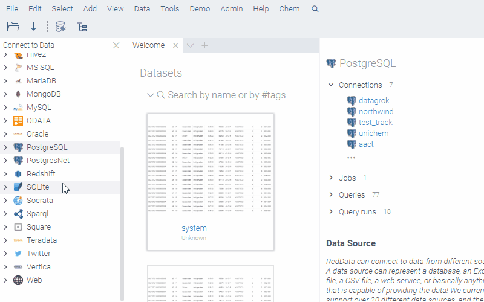

<!-- TITLE: Database substructure and similarity search -->
<!-- SUBTITLE: -->

# Database substructure and similarity search

Efficient substructure and similarity searching in a database containing information about molecules is a key
requirement for any chemical information management system. This is typically done by installing a so-called chemical
cartridge on top of a database server. The cartridge extends server's functionality with the molecule-specific
operations, which are made efficient by using chemically-aware indexes, which are often based on molecular fingerprints.
Typically, these operations are functions that can be used as part of the SQL query.



## Chemical cartridge

Datagrok provides mechanisms for the automated translation of queries into SQL statements for several commonly used
chemical cartridges. We support the following ones:

1) [RDKit Postgres cartridge](https://www.rdkit.org/docs/Cartridge.html)
2) [JChem cartridge](https://docs.chemaxon.com/display/docs/JChem+Cartridge)  (todo)

Here are some of the examples of substructure and similarity searches against ChEMBL using RDKit cartridge. These
examples are regular [Grok queries](../../access/data-query.md), meaning that they can be easily created, managed, and
used from within the platform.

Substructure search:

```
--name: @pattern substructure search
--connection: chembl
--input: string pattern {semType: Substructure}
--input: int maxRows = 1000
 select molregno,m as smiles from rdk.mols where m@>@pattern
 limit @maxRows
```

Similarity search:

```
--name: @pattern similarity search
--connection: chembl
--input: string pattern {semType: Substructure}
--input: int maxRows = 1000
select fps.molregno, cs.canonical_smiles as smiles
from rdk.fps fps
join compound_structures cs on cs.molregno = fps.molregno
where mfp2%morganbv_fp(@pattern)
limit @maxRows
```

See also:

* [Queries](../../access/data-query.md)
* [Functions](../../access/data-query.md)
