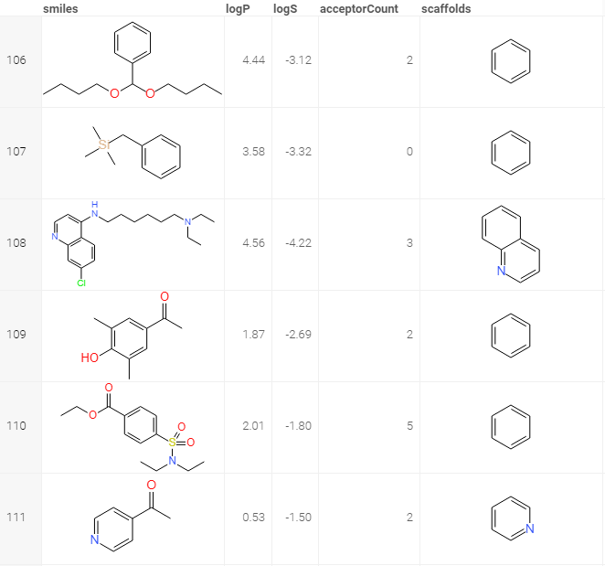

<!-- TITLE: Murcko Scaffolds -->
<!-- SUBTITLE: -->

# Murcko scaffolds

The scaffold concept is widely applied in medicinal chemistry. Scaffolds are mostly used to represent core structures of
bioactive compounds. Although the scaffold concept has limitations and is often viewed differently from a chemical and
computational perspective, it has provided a basis for systematic investigations of molecular cores and building blocks,
going far beyond the consideration of individual compound series.

The most traditional way to define a scaffold is the Markush structure proposed by Markush. Markush structures are
usually used in patent applications to define chemical series, but they may be too generic to highlight the important
structural features essential for pharmaceutical activity. Another scaffold representation is the Murcko framework
proposed by Bemis and Murcko. This method employs a more systematical way to dissect a molecule into four parts: ring
systems, linkers, side chains, and the Murcko framework that is the union of ring systems and linkers in a molecule.

To convert a column with molecules to Murcko scaffolds, use #{x.ChemMurckoScaffolds} function.

Here is how the resulting scaffolds look like:

See also:

* [Cheminformatics](../cheminformatics.md)

References:

* [rdkit.Chem.Scaffolds.MurckoScaffold module](http://rdkit.org/docs/source/rdkit.Chem.Scaffolds.MurckoScaffold.html)
* [Computational Exploration of Molecular Scaffolds in Medicinal Chemistry](http://europepmc.org/abstract/MED/26840095)
* [Comparative analyses of structural features and scaffold diversity for purchasable compound libraries](https://www.ncbi.nlm.nih.gov/pmc/articles/PMC5400773/)
