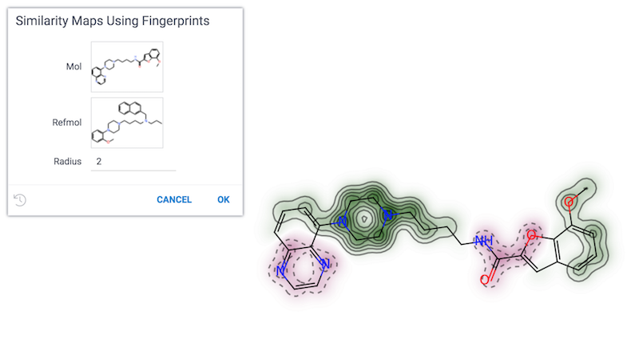

<!-- TITLE: Similarity Maps Using Fingerprints -->
<!-- SUBTITLE: -->

# Similarity Maps Using Fingerprints

Similarity maps are a way to visualize the atomic contributions to the similarity between a molecule and a reference molecule.

See also:

* [Cheminformatics](../cheminformatics.md)

References:

* [RDKit Generating Similarity Maps Using Fingerprints](https://www.rdkit.org/docs/GettingStartedInPython.html#generating-similarity-maps-using-fingerprints)
* [Similarity maps - a visualization strategy for molecular fingerprints and machine-learning methods](https://jcheminf.biomedcentral.com/articles/10.1186/1758-2946-5-43)
