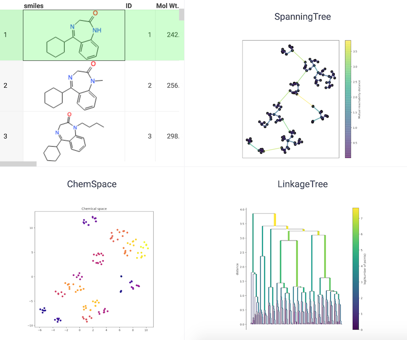

<!-- TITLE: Chemical Space Using tSNE -->
<!-- SUBTITLE: -->

# Chemical Space Using tSNE

t-distributed Stochastic Neighbor Embedding (tSNE) is a tool to visualize high-dimensional data. 
It converts similarities between data points to joint probabilities and tries to minimize the 
Kullback-Leibler divergence between the joint probabilities of the low-dimensional embedding and 
the high-dimensional data. t-SNE has a cost function that is not convex, i.e. with different 
initializations we can get different results.

See also:

* [Cheminformatics](../cheminformatics.md)

References:

* [RDKit](https://www.rdkit.org)
* [tSNE](https://scikit-learn.org/stable/modules/generated/sklearn.manifold.TSNE.html)
