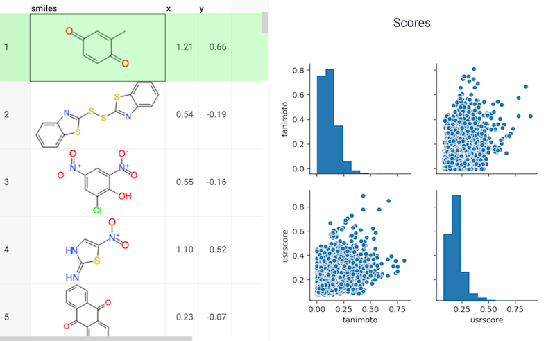

<!-- TITLE: USRCAT -->
<!-- SUBTITLE: -->

# USRCAT

Ligand-based virtual screening using molecular shape is an important tool for researchers 
who wish to find novel chemical scaffolds in compound libraries. The Ultrafast Shape Recognition (USR) 
algorithm is capable of screening millions of compounds and is therefore suitable for usage 
in a web service. The algorithm however is agnostic of atom types and cannot discriminate compounds
with similar shape but distinct pharmacophoric features. To solve this problem, an extension of 
USR called USRCAT, has been developed that includes pharmacophoric information whilst retaining 
the performance benefits of the original method.

The USRCAT extension is shown to outperform the traditional USR method in a retrospective virtual 
screening benchmark. Also, a relational database implementation is described that is capable of 
screening a million conformers in milliseconds and allows the inclusion of complex query parameters.

See also:

* [Cheminformatics](../cheminformatics.md)

References:

* [RDKit](https://www.rdkit.org)
* [USRCAT](https://www.ncbi.nlm.nih.gov/pmc/articles/PMC3505738/)
