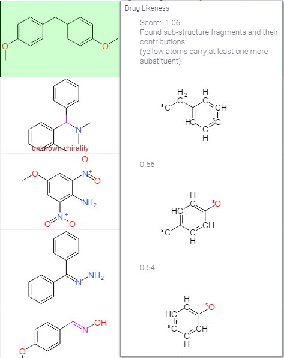

<!-- TITLE: Drug Likeness -->

## Drug Likeness

From [openmolecules](http://www.openmolecules.org/properties/properties.html#druglikeness): 
_There are many approaches around that assess a compound's druglikeness partially based on 
topological descriptors, fingerprints of MDL struture keys or other properties as cLogP 
and molecular weights. Our approach is based on a list of about 5300 distinct substructure 
fragments with associated druglikeness scores. The druglikeness is calculated with the 
following equation summing up score values of those fragments that are present in the 
molecule under investigation:._

`d = sum(Vi)/sqrt(n)`

The occurrence frequency of every one of the fragments was determined within the collection of 
traded drugs and within the supposedly non-drug-like collection of Fluka compounds. All 
fragments with an overall frequency above a certain threshold were inverse clustered in order 
to remove highly redundant fragments. For the remaining fragments the druglikeness score was 
determined as the logarithm of the quotent of frequencies in traded drugs versus Fluka chemicals.

## Drug score

The drug score combines druglikeness, cLogP, logS, molecular weight and toxicity risks in one 
handy value that may be used to judge the compound's overall potential to qualify for a drug. 
This value is calculated by multiplying contributions of each of the individual properties by 
the first of these equations:

ds is the drug score. si are contribution values calculated directly from cLogP, logS, 
molweight and druglikeness (pi) by the second equation. This equation describes a spline 
curve with contributions ranging from 0 to 1 depending on the respective property value. 
Inversion point and slope of the curve are determined by parameters a and b, which are 
(1, -5), (1, 5), (0.012, -6) and (1, 0) for cLogP, logS, molweight and druglikeness, 
respectively. ti are the four contributions reflecting the four types of toxicity risks. 
The ti values used are 1.0, 0.8 and 0.6 for no risk, medium risk and high risk , respectively.

Calculated by [openchemlib](https://github.com/Actelion/openchemlib).

