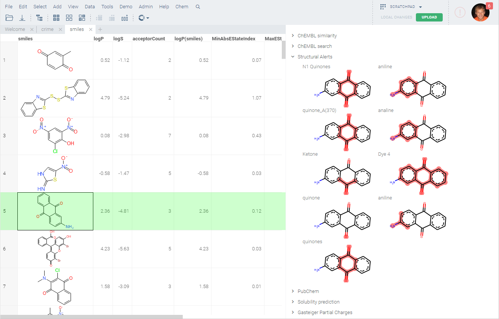

Structural alerts are widely accepted in chemical toxicology and regulatory decision support as a simple and transparent
means to flag potential chemical hazards or group compounds into categories for read-across.

Currently, the following rule sets are taken into account: BMS, Dundee, Glaxo, Inpharmatica, LINT, MLSMR, PAINS, and
SureChEMBL. In total, they contain
[1,251 substructures in the SMARTS format](https://raw.githubusercontent.com/PatWalters/rd_filters/5f70235b387baa39669f25d95079e5dfec49a47c/rd_filters/data/alert_collection.csv)
. Presence of any of these substructures triggers a structural alert shown on the info panel; the substructure is
highlighted.

See also:

* [Cheminformatics](../cheminformatics.md)

References:

* [Alarms about structural alerts](https://www.ncbi.nlm.nih.gov/pmc/articles/PMC5423727/)
