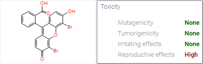

<!-- TITLE: Toxicity risks -->

# Toxicity risks

From [openmolecules](http://www.openmolecules.org/properties/properties.html#tox):
_The toxicity risk assessment tries to locate substructures within the chemical structure being indicative of a toxicity
risk within one of four major toxicity classes. Risk alerts are by no means meant to be a fully reliable toxicity
prediction. Nor should be concluded from the absence of risk alerts that a particular substance would be completely free
of any toxic effect._

The prediction process relies on a precomputed set of structural fragment that give rise to toxicity alerts in case they
are encountered in the structure currently drawn. These fragment lists were created by rigorously shreddering all
compounds of the RTECS database known to be active in a certain toxicity class (e.g. mutagenicity). During the
shreddering any molecule was first cut at every rotatable bonds leading to a set of core fragments. These in turn were
used to reconstruct all possible bigger fragments being a substructure of the original molecule. Afterwards, a
substructure search process determined the occurence frequency of any fragment (core and constructed fragments)
within all compounds of that toxicity class. It also determined these fragment's frequencies within the structures of
more than 3000 traded drugs. Based on the assumption that traded drugs are largely free of toxic effects, any fragment
was considered a risk factor if it occured often as substructure of harmful compounds but never or rarely in traded
drugs.

Toxicity risks are predicted from precompiled fragment lists using a previously published algorithm.

Calculated by [openchemlib](https://github.com/Actelion/openchemlib).

References:

* [von Korff, M.; Sander, T. Toxicity-indicating structural patterns. J. Chem. Inf. Model. 2006, 46, 536−44](https://pubs.acs.org/doi/full/10.1021/ci050358k)
