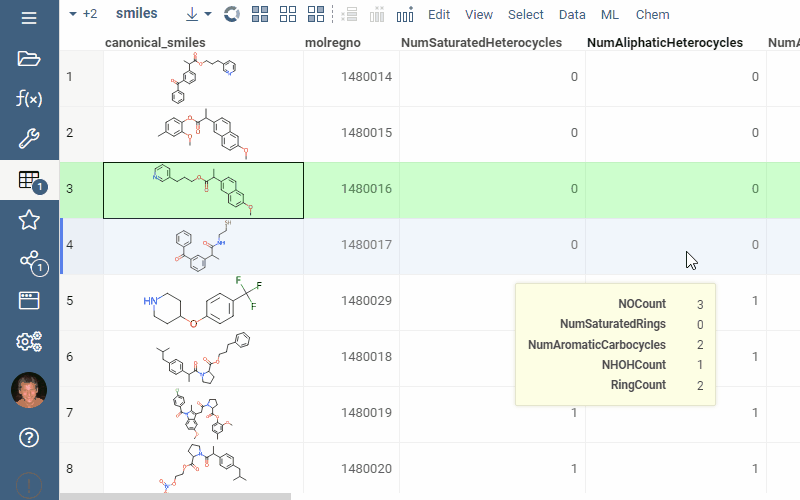
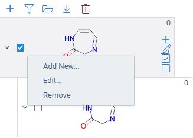

Scaffold tree organizes molecular data sets by arranging molecules into 
a tree hierarchy based on their scaffolds. This hierarchy can then be used 
for filtering or selecting the corresponding rows in the dataset.

To open Scaffold Tree, open a dataset with molecules and then select **Chem | Scaffold Tree** 
from the top menu.

A hierarchy can be either generated automatically, or sketched manually.
When Scaffold Tree is initially created, a tree is generated automatically. You can also 
sketch the tree manually, or modify the automatically generated one.

## Anatomy of the scaffold tree

A scaffold tree consists of scaffolds and orphan nodes.
Each scaffold should contain its parent scaffold as a substructure.
Orphans are molecules that contain the parent scaffold, but do not contain
any of the sibling scaffolds. This is best illustrated by a picture:

## Automatic generation

Click **Generate** to automatically generate a scaffold tree. This is a 
computationally intensive step that might take up to a minute.

The hierarchy is created by iterative removal of rings from more complex scaffolds 
using chemically meaningful set of rules, until a single, root ring is obtained.

For tree generation, we use a derivative of the open-source
[ScaffoldGraph](https://github.com/UCLCheminformatics/ScaffoldGraph) library
developed by Oliver Scott.

## Manual sketching

Move the mouse cursor on top of the molecule to see additional controls, or right-click
on the molecule for additional commands:

Use the following to manually sketch a tree, or modify the automatically generated one:
* To clear the tree, click on the red "Trash" icon in the toolbar
* To add a new root node, click on the "+" icon in the toolbar. A molecular sketcher will appear.
* To add a new scaffold under the exising one, click on the "+" icon next to the scaffold
  Alternatively, right-click on the molecule, and select **Add New** 
* To delete a scaffold along with its children, right-click and select **Remove** 
* To edit a scaffold, click on the **Edit** icon next to the scaffold.
  Alternatively, right-click on the molecule, and select **Edit...**. A molecular sketcher will appear.

## Filtering

Scaffold tree can be used for filtering the molecules in your dataset: 

* To filter exclusively by a particular scaffold, left-click on the molecule. The checkbox
  before the molecule gets checked, and any other checkboxes get unchecked. This is useful
  for quick navigation in the dataset. 
* To toggle whether a particular scaffold passes the filter, click on the checkbox.
  Its state gets changed, but no other checkboxes change. This way, you can make two
  or more scaffolds pass the filter.
* To clear all filters, click on the **Filter** icon on the toolbar above.

Scaffold tree also works together with [filters](../../visualize/viewers/filters.md), each one
filtering out rows that do not pass the filter. 

## Selecting and highlighting

To highlight rows matching a particular scaffold, hover the mouse over the scaffold. This state
is indicated on many viewers, including scatter plot, histogram, pie chart, bar chart, and others.

* To select rows matching a particular scaffold, click on the "check" icon next to the scaffold.
* To deselect rows matching a particular scaffold, click on the "uncheck" icon next to the scaffold.

See filtering, selecting, and highlighting in action:

## Saving and loading

A scaffold tree gets saved as part of the [layout](../../visualize/view-layout.md), or as part
of the dashboard. In addition, you can manage scaffold trees manually:

* To save a scaffold tree, click on the **Download** icon on the toolbar. The "scaffold-tree.tree"
  file be downloaded to your local drive.
* To load a previously saved tree, click on the **Open** icon on the toolbar, and select 
  the previously saved file.