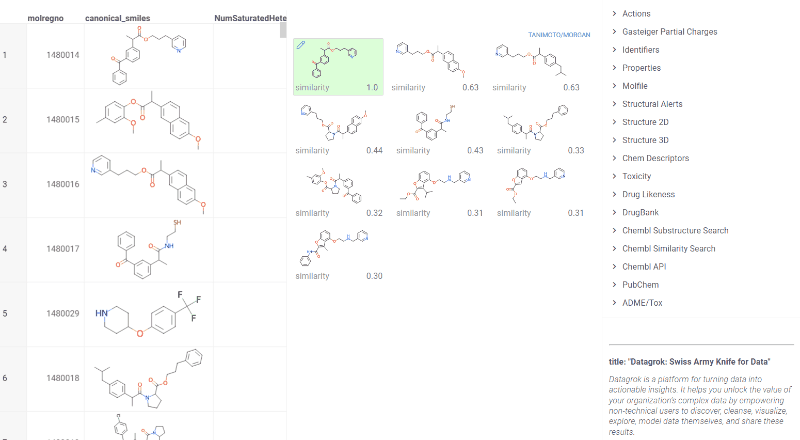
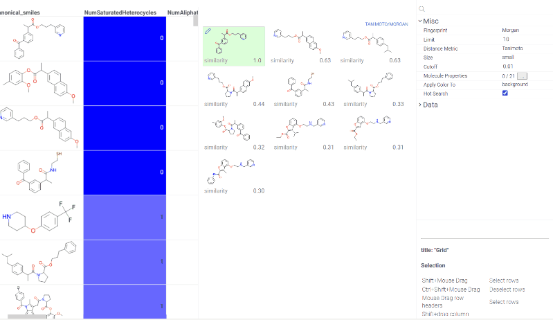

We have implemented few tools that help scientists analyze a collection of molecules in terms of molecular similarity.
Both tools are based on applying different distance metrics
(such as Tanimoto) to fingerprints.

* [Similarity Search](similarity-search.md) - finds structures similar to the specified one
* [Diversity Search](diversity-search.md) - finds N most distinct molecules

These tools can be used together as a collection browser. 'Diverse structures' window shows different classes of
compounds present in the dataset; when you click on a molecule representing a class, similar molecules will be shown in
the 'Similar structures' window.

To run Similarity search select Chem | Similarity search from the top menu.

To change target molecule select the row with required molecule in the initial dataframe. Similarities will be recalculated.
Target molecule can be also changed using `edit` button in the top left corner of the molecule pane.

Use property panel to change search metrics like similarity cutoff, fingerprints type or distance metric.

You can add any fields from your dataframe to similarity panes by selecting columns from `Molecule Properties` field. If color coding is applied to a selected column it will be saved on a similarity pane. To apply highlighting to background or text use `Apply Color To` field. Ability to add fields to similarity panes simplifies analysis since multiple molecules characteristics can be easily assessed at once.

## Videos

[Molecular similarity and diversity](https://www.youtube.com/watch?v=wCdzD64plEo)

See also:

* [Diversity search](diversity-search.md)
* [Descriptors](descriptors.md)
* [Molecular fingerprints](fingerprints.md)
* JS API: [Similarity search](https://public.datagrok.ai/js/samples/domains/chem/similarity-search)
