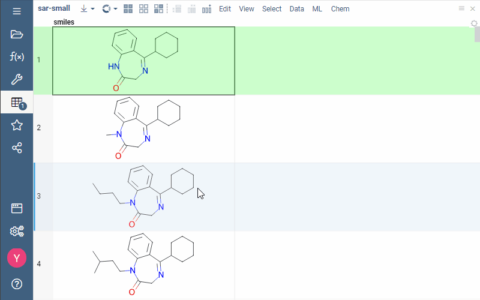
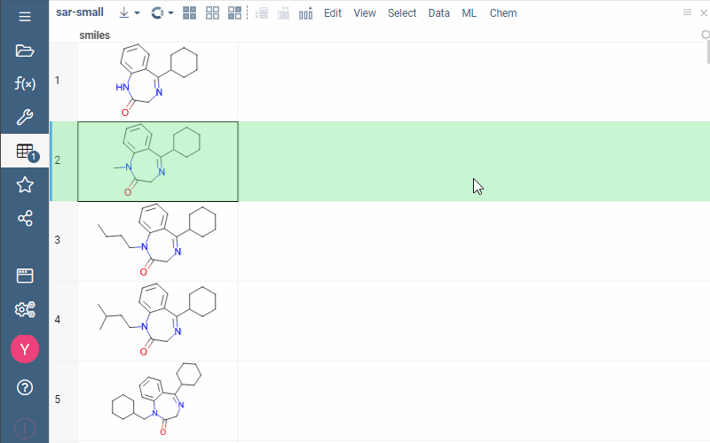
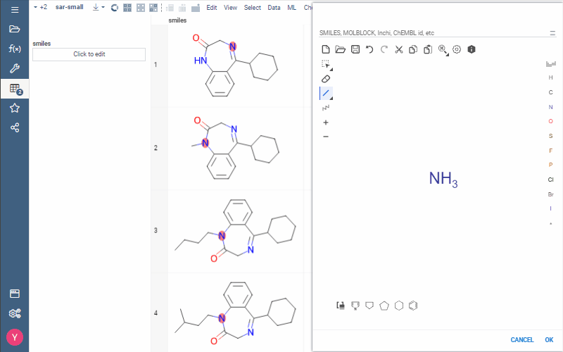
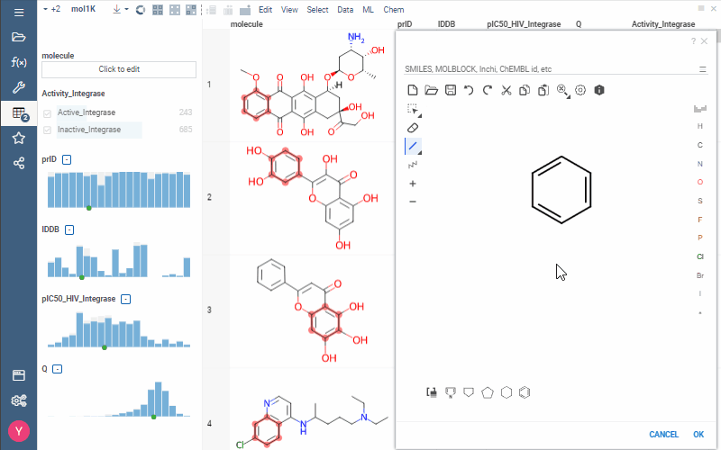

import Tabs from '@theme/Tabs';
import TabItem from '@theme/TabItem';

Substructure search is a technique of finding molecules or compounds that contain the query substructure.  
You can set the query substructure by either drawing it in [sketcher](sketcher.md) or just selecting a molecule in your dataset.

## Data sources

Datagrok's substructure search supports several data sources: uploaded datasets, public databases, and relational databases.

### Uploaded datasets

In uploaded datasets, you can run substructure search in three ways:

```mdx-code-block
<Tabs>
<TabItem value="First way" default>
```

1. Right-click a molecule. **Context menu** opens.
2. Click **Current Value** > **Use as filter**. Filtered molecules contain the highlighted query substructure.



```mdx-code-block
</TabItem>
<TabItem value="Second way" default>
```

1. On the **Sidebar**, hold the pointer over the **Tables** section and click the <i class='fa fa-filter'></i> **Filter icon**.
2. Find a column with molecules, click **Click to edit**.
3. Sketch a query substructure. Filtered molecules contain the highlighted query substructure.


```mdx-code-block
</TabItem>
<TabItem value="Third way" default>
```

1. On the **Top menu**, click **Chem** > **Sketcher**.
2. Sketch a query substructure.
3. Click **Filter** or **Select**.



```mdx-code-block
</TabItem>
</Tabs>
```

### Public databases

  We support substructure search for 3 public databases: PubChem, Drugbank, and ChEMBL. You can access ChEMBL by either API or our internal backup.

  To run substructure search in public databases:

  1. In info panels, go to **Databases**.
  2. Open the **PubChem/Drugbank/ChEMBL** tab.
  3. Open the **Substructure search** tab.

<!-- GIF, but not all the public DBs work -->

### Relational databases

  Chemical cartridges on our platform let you run substructure search in relational databases.

  To run substructure search in relational databases:

  1. On the **Sidebar**, go to **Data** > **Databases**.
  2. Select a database containing column(s) with molecules.
  3. Create a [data query](../../access/data-query.md) or use an existing one. Your data query must include the query substructure paramater. For example:

      ```$sql
      --input: string pattern {semType: Substructure}
      select molregno,m as smiles from rdk.mols where m@>@pattern::qmol
      ```
     <!-- поменять запрос на более базовый -->

  4. Run the query. In the **Pattern Substructure Search** window, click **Click to edit** and sketch your query substructure.

  

## Advanced options

Datagrok extends substructure search functionality with multiple advanced options:

* Sketcher-based orientation of the matched molecules

  When you sketch a molecule in sketcher, matched molecules in the grid adjust to a sketcher's molecule orientation.

  

* Explicit hydrogen search support

  When you want to explicitly show the presence of a hydrogen in your query substructure, just sketch a single bond with a hydrogen.

  

* Optional atoms search

  You can specify a list of multiple atoms matching the particular position in a molecule.

  To do that:

    1. Right-click the position in a molecule, select **Atom properties**.
    2. Expand the **Change to** list, select the **List/NOT List** option.
    3. In the **Elements** field, enumerate desired atoms and separate them by comma.
    4. Click **OK**.

  <!-- Не фильтруется (датасет mol1k)-->

* Extended toolset for aromaticity search

  In the query substructure, you can sketch a query aromatic bond that allows either an aromatic or a single bond in this particular position of a molecule.

  

* Multicolumn filtering

  You can filter rows by applying separate filters to multiple columns.

  <!-- не центрируются структуры в Click to Edit -->