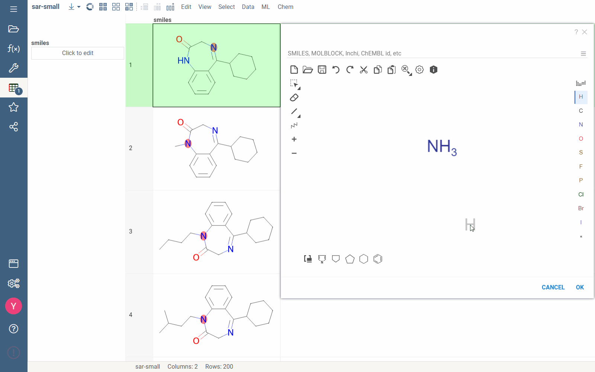
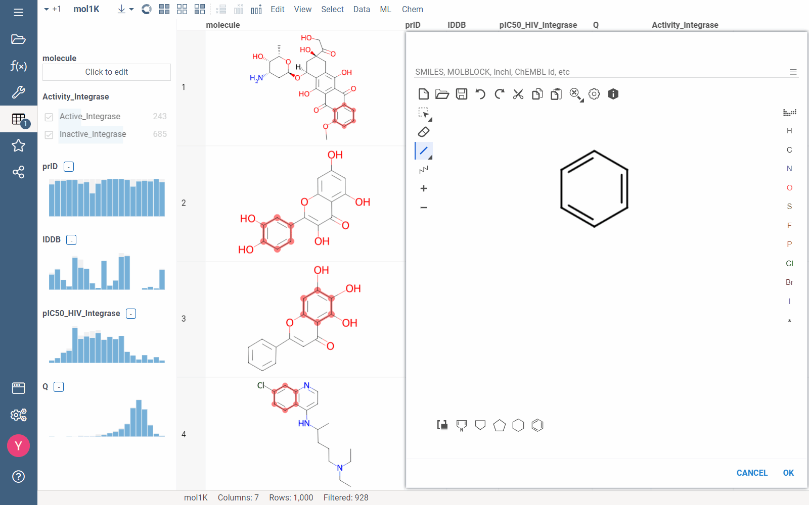
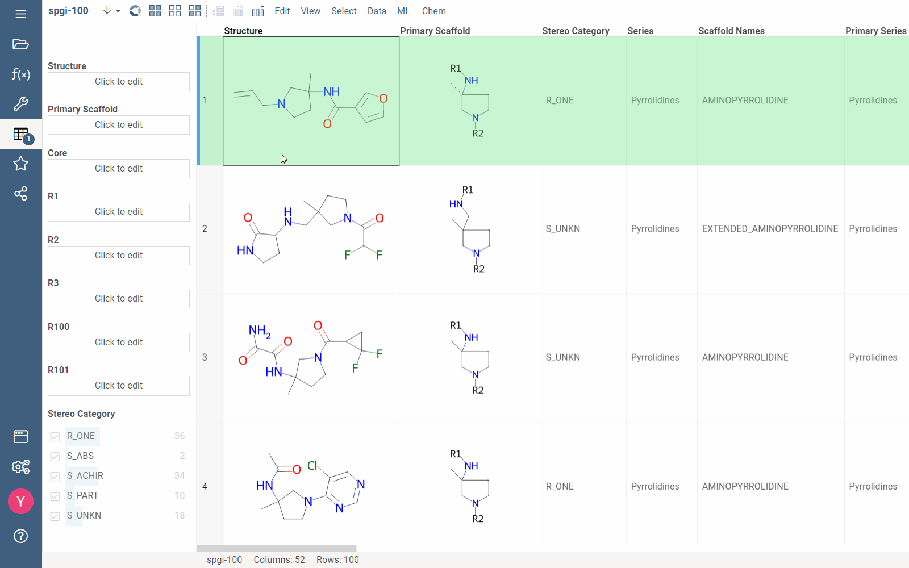
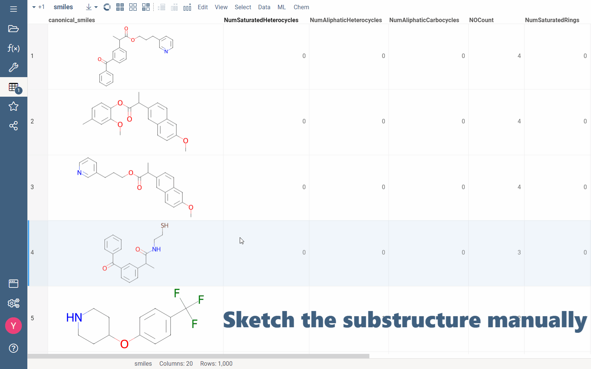
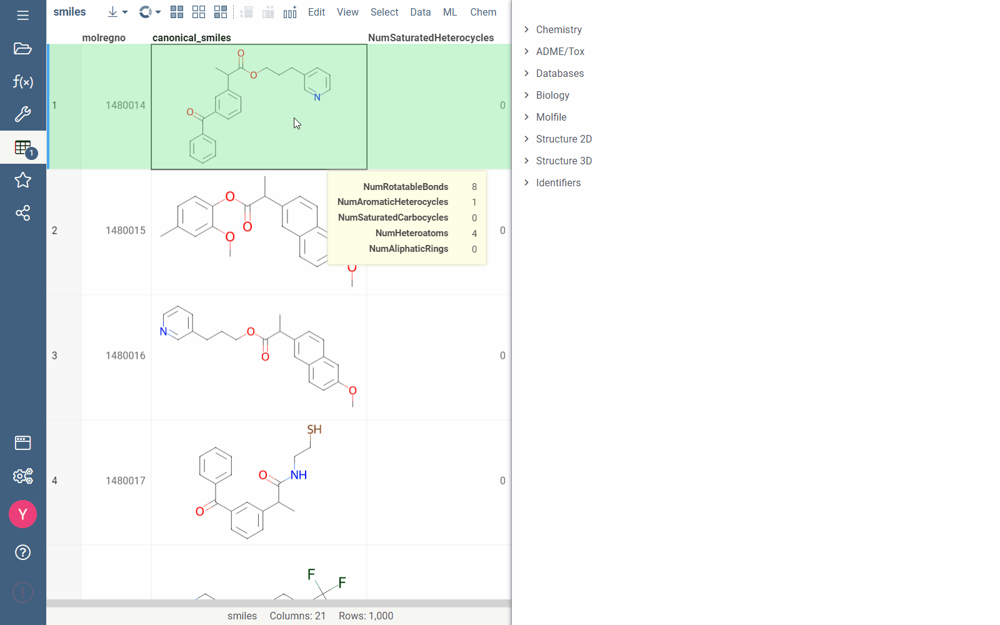

import Tabs from '@theme/Tabs';
import TabItem from '@theme/TabItem';

You can use a substructure search to filter your dataset and display molecules that contain a specific fragment (query substructure). Unlike the [similarity search](similarity-search.md), substructure search returns molecules that have the entire fragment, rather than just similar parts.

Substructure search is commonly used to analyze hits and establish a preliminary [structure-activity relationship](link_to_future_article).

You can define the query substructure by either [sketching it manually](sketcher.md) or selecting a molecule from your dataset:

* To manually sketch a substructure, use the <i class='fa fa-filter'></i> **Filter** icon on the **Toolbox**, find a column with molecules, then click **Click to edit** area. Draw the query substructure, then click **Filter** or **Select**.

  :::note

  Drawing the query substructure, you can use some extended functionality:

  <details>

  <summary>Extended functionality</summary>

  <ul>
  <li> Explicit hydrogen search support
    <div></div><br></br>
    Explicitly show the presence of a hydrogen in your query substructure by sketching a single bond with a hydrogen.</li>
    <div></div><br></br>

    

    <div></div><br></br>

  <li> Aromaticity search</li>

  <div></div><br></br>

  Sketch a query aromatic bond that allows either an aromatic or a single bond in this particular position of a molecule.
  <div></div><br></br>

  
  <div></div><br></br>

  <li> Optional atoms search </li>
  <div></div><br></br>

  In Marvin sketcher, you can specify a list of multiple atoms matching the particular position in a molecule.

  To do that, in Marvin sketcher, right-click the position in a molecule, select **Atom properties**. Expand the **Change to** list > **List/NOT List**. In the **Elements** field, enumerate desired atoms and separate them by comma, then click **OK**.
  <!-- Doesn't work properly yet -->

  <div></div><br></br>
  <li> Multicolumn filtering </li>
  <div></div><br></br>

  You can filter rows by applying separate filters to multiple columns.
  <div></div><br></br>

  

  </ul>
  </details>
  :::

* To use an existing molecule, right-click it and select **Current Value** > **Use as filter**. To modify the selected substructure, click it to open the sketcher and make edits.



:::tip

You can also use the [**Scaffold Tree viewer**](scaffold-tree.md) to filter your dataset by scaffolds - core substructures arranged in the hierarchy.

:::

## Substructure search queries in databases

Besides uploaded datasets, Datagrok's substructure search is also available in public and relational databases.

### Public databases

  Our platform supports a substructure search in 3 public databases: PubChem, Drugbank, and ChEMBL. You can access ChEMBL by either API or our internal backup.

  To run substructure search in public databases, choose the molecule in the grid. In **Info Panels**, go to **Databases** > **PubChem/Drugbank/ChEMBL Substructure Search** tab.



### Relational databases

  Chemical cartridges on our platform let you run substructure search in relational databases.

  To run substructure search in relational databases:

  1. On the **Toolbar**, go to **Data** > **Databases**.
  2. Select a database containing column(s) with molecules.
  3. Create a [data query](../../access/data-query.md) or use an existing one. Your data query must include the query substructure paramater (`pattern` parameter in the example below).
      <details>
      <summary> Data query example </summary>
      <div>

      ```$sql
      --input: string pattern {semType: Substructure}
      select molregno,m as smiles from rdk.mols where m@>@pattern::qmol
      ```

      </div>
      </details>
  4. Run the query. In the **Pattern Substructure Search** window, click **Click to edit** area and sketch your query substructure.

  

<!-- * Sketcher-based orientation of the matched molecules

  When you sketch a molecule in sketcher, matched molecules in the grid adjust to a sketcher's molecule orientation.

   -->