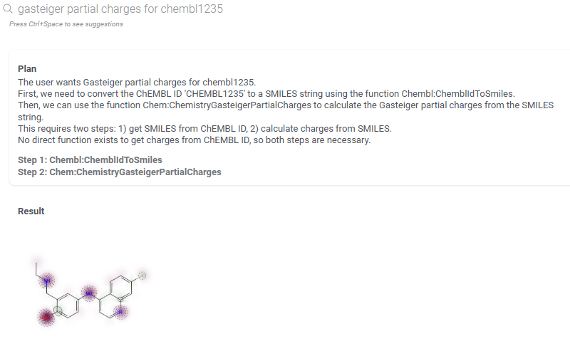
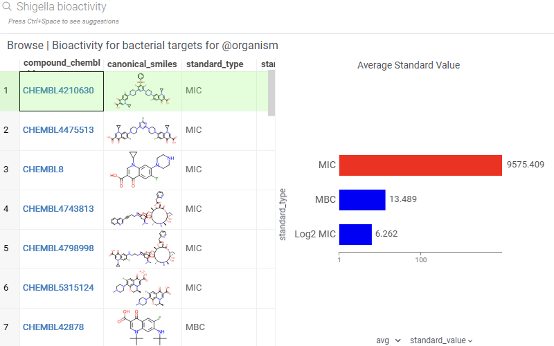
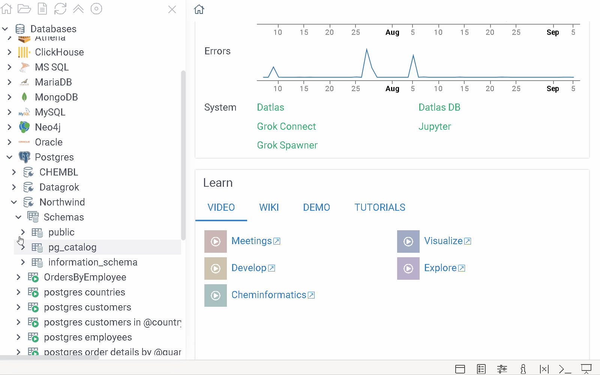
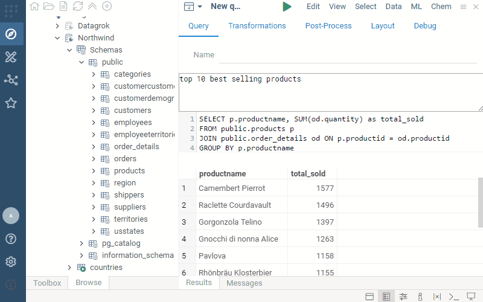
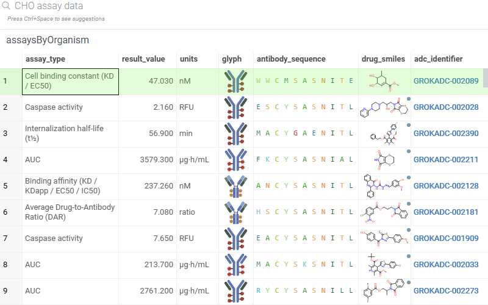
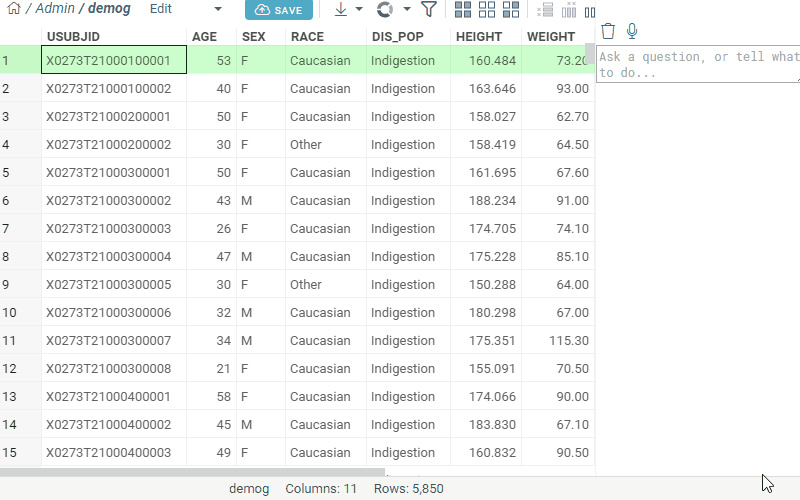

# AI in Datagrok

Datagrok provides first-class AI capabilities that enhance data exploration, analysis, 
application development, and user experience across the entire platform. 
AI operates on top of Datagrok’s unified introspectable architecture, which exposes data, 
functions, viewers, widgets, schemas, and UI state in a structured way. 
This enables accurate natural-language control, automated workflows,
permissions and governance, and context-aware assistance throughout the platform.

---

## Overview

AI in Datagrok spans multiple layers:

- Smart Assistant 
- AI-assisted querying and database exploration
- AI-assisted visualizations
- Context-aware suggestions, insights, and actions
- Vibe-coded app generation
- AI-driven UI navigation
- Help and troubleshooting

---

# Smart Assistant / NLP-driven UI

The Smart Assistant enables users to interact with datasets, molecules, sequences, 
viewers, dashboards, notebooks, and databases using natural language. It interprets user 
intent and converts it into Datagrok operations.

The assistant can be operated via voice input, optimized for quick interactions and 
hands-free workflows, as well as for presentations.

## Natural-language queries

Users can issue free-form commands such as:

- “Which compounds have high toxicity risk and low solubility”
- “Show molecules with IC50 < 10 nM and Lipophilicity < 3”
- “Average height by race”
- “Cluster these compounds on similarity”

AI translates these into operations such as filters, computed columns, cheminformatics transforms, 
clustering, or visualizations.

## Search integration

The global search bar uses AI to classify the intent behind the query:

- Identifier lookup (e.g., CHEMBL IDs)
- Entity lookup
- Platform question
- Action request
- Database question

It selects the correct action pattern and executes or suggests follow-up actions.

## Reasoning and function chaining

AI uses Datagrok’s unified function model to:

- Filter applicable functions based on current context
- Generate multi-step function chains
- Fill parameters via reasoning or context
- Execute with a confirmation step when appropriate

Example: “Show the chemical space, color by activity, then add regression line”.

## Context-aware suggestions

Semantic types (molecule, sequence, plate, ID, assay, gene) guide contextual suggestions such as:

- “Would you like to run an ADMET prediction model”
- “Try clustering these compounds on similarity”
- “Convert sequences to molecules and compute descriptors”

## Auto-narrative insights

For dashboards and result sets, AI generates textual insights:

- Cluster descriptions
- Highlighted outliers
- Summary statistics
- Observations specific to chemical or biological data

## Domain-specific helpers

- Molecule processing (salt stripping, standardization)
- Sequence-to-molecule transformations
- Activity summaries
- Plate analysis

---

# Self-guided AI-assisted Database Exploration

Datagrok supports multiple AI-driven approaches to working with databases. These approaches can be mixed or used
independently depending on data governance requirements and user expertise.

## 1. Database identifiers

You can register the identifier patterns using the regular expression 
(for instance, `CHEMBL\\d+` for CHEMBL identifiers) and point it to the database column
where it comes from. Datagrok then would recognize these identifier everywhere (even within
a sentence), and give you a way to drill down and see the associated information on that,
automatically following the foreign keys defined in the database schema. This is a very
powerful tool that lets users get the data with minimum setup. It's also integrated with 
the smart assistant:

Learn more
- [User Group Meeting 19: Database Identifiers](https://youtu.be/4_NS3q7uvjs?t=2910)
- For developers: [registering identifier patterns](https://datagrok.ai/help/develop/how-to/grid/register-identifiers)

## 1. Parameterized SQL with metadata annotations

You can create curated SQL queries with:

- Parameter descriptions
- Expected query and value patterns
- Optional parameter transformations  
  (e.g., resolve compound names to SMILES before query execution)

AI maps user intent to the closest SQL template and fills parameters safely.

## 2. Visual query builder

The visual query builder benefits from AI through schema-aware suggestions:

- Intelligent join recommendations
- Column relevance ranking
- Guided aggregations and pivots
- Type-aware filters
- Query metadata inspection

The final result is always a clean, parameterized SQL query.

## 3. Fully AI-driven ad-hoc querying

Users can write English-language queries directly over a schema. AI will:

- Infer the tables and relationships
- Construct the SQL
- Generate suitable visualizations
- Provide follow-up exploration suggestions

Example queries:

- “Find all binding data for thrombin and show compounds in chemical space with pChEMBL filters”
- “Northwind sales by country”

## 4. Integrated routing layer

All approaches unify under a single routing engine that:

- Classifies intent
- Evaluates which database access mode is appropriate
- Executes or suggests next steps

# Help and Documentation Assistance

The AI system is integrated with Datagrok’s wiki, enabling question-driven documentation exploration similar to DeepWiki:

- “How do I run UMAP on sequences”
- “How do I use lasso selection on a scatter plot”
- “How do I convert sequence columns to molecules and calculate their masses”

AI retrieves relevant documentation sections or synthesizes an answer based on the wiki.

---

# Automatic Troubleshooting

When errors occur in scripts, queries, workflows, or viewers, AI can:

- Analyze stack traces
- Identify common causes
- Provide fixes or alternatives
- Link to documentation
- Suggest improved patterns

This uses a combination of internal logs, semantic metadata, and known error patterns.

---

# Vibe-coded Apps

Users can describe an app in natural language and AI generates:

- Layout and UI structure
- Functional code using the Datagrok JS API
- Event wiring
- Dataflows and computation logic
- Integration with plugins such as Chem, Bio, MolTrack

Example:  
“I want a sketcher on the left, predicted ADME properties on the right, and when 
I press SUBMIT the molecule should be registered in MolTrack.”

---

# Agents

Agents are long-running, context-aware processes that can:

- Perform multi-step tasks
- Monitor datasets
- Trigger workflows
- Collaborate with users through memory and iterative refinement

They operate through the same unified function and context model.

---

# Driving the UI and Visualizations

Widgets in Datagrok expose:
 Applicable functions
- Properties
- Named events
- Parent-child hierarchy

AI uses this to understand the interface and execute commands such as:

- “Zoom in on the scatter plot”
- “Close the histogram”
- “Color by age”

The interpretation layer converts natural-language prompts into `Func()` objects for predictable, reviewable execution.

---

# User Interface Integration

AI capabilities are available through:

- Global search
- Voice-controlled search
- “Visualize” button on tables
- “AI Query” button on database connections
- AI side panel (chat-style UI, similar to Cursor)
- Context panels offering intelligent suggestions

---

# Models

Datagrok uses a multi-tiered model strategy:

- Regex-based intent parsing for fast, obvious cases
- Client-side Gemini Nano for classification and triage
- Server-side LLMs (ChatGPT, enterprise-provided models) for advanced reasoning

Enterprise users can plug in their own model endpoints.

---

# Examples

### Function Chaining
- ADME properties for aspirin
- Gasteiger charges for CHEMBL identifiers
- Convert sequences to SMILES
- Convert SMILES to HELM
- Multi-step visualizations

### Database Queries
- Compounds active against specific targets
- Shigella bioactivity
- PK for LEVOFLOXACIN
- Assay details for specific targets

### Visualizations
- Create scatter plot, zoom in, add regression, color by metadata
- Distribution plots per compound class

### Identifiers
- CHEMBL IDs
- Sequence-to-molecule transformations
- Target summaries (organism, synonyms, related targets)
