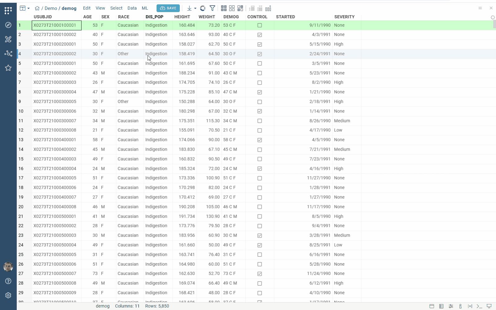
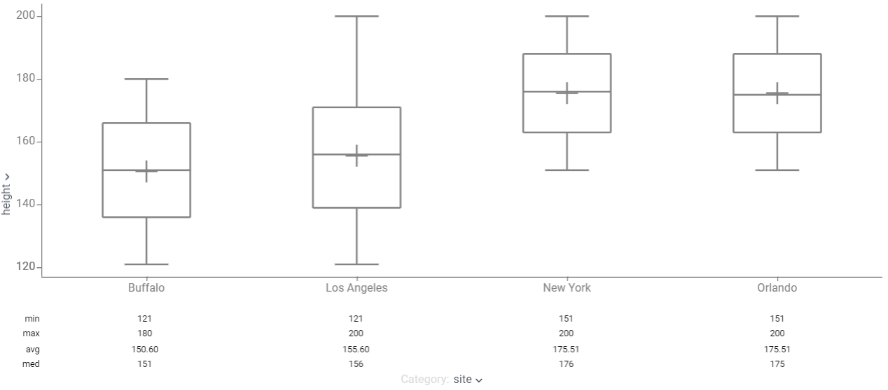
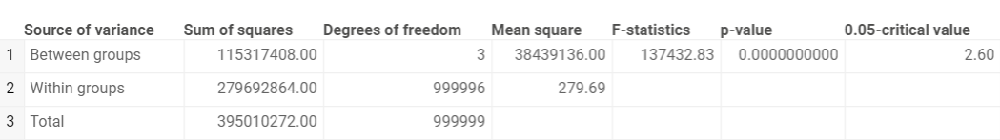
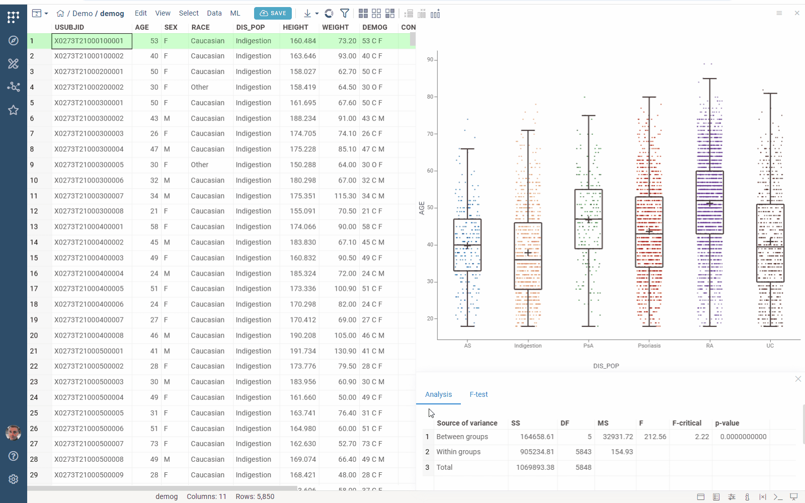

Analysis of variance ([ANOVA](https://en.wikipedia.org/wiki/Analysis_of_variance)) determines whether the examined factor has a significant impact on the studied feature.

1. Open a table
2. Run **Top Menu > ML > Analyze > ANOVA...**. A dialog opens.
3. In the dialog, specify
   * the column with factor values (in the `Category` field)
   * the column with features values (in the `Feature` field)
   * the significance level (in the `Alpha` field)
4. Click `Run` to execute. The following analysis appears:

The box plot shows the distribution of values by categories:

The `Analysis` tab presents a table with ANOVA computations:

Click the `F-test` tab and explore the null hypothesis testing:

See also:

* [Statistical hypothesis testing](https://en.wikipedia.org/wiki/Statistical_hypothesis_testing)
* [One-way ANOVA](https://en.wikipedia.org/wiki/One-way_analysis_of_variance)
* [Box plot](https://datagrok.ai/help/visualize/viewers/box-plot)
