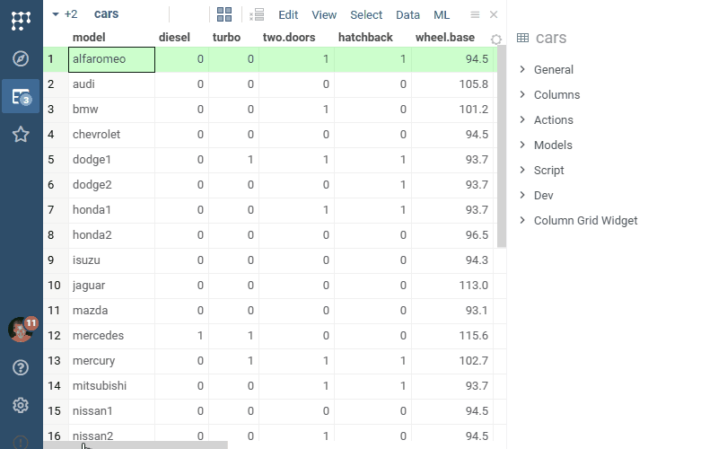

Clustering is the task of grouping a set of objects in such a way that objects in the same group
(called a cluster) are more similar (in some sense or another) to each other than to those in other groups (clusters).

## Algorithm

Clustering algorithm is based on **k-means clustering**. It aims to partition _n_ observations into
_k_ clusters in which each observation belongs to the cluster with the nearest mean, serving as a prototype of the
cluster. This results in a partitioning of the data space into _Voronoi cells_.

## Usage

* Open table
* Run from menu: **ML** | **Cluster** | **Cluster...**
* Select numerical feature columns that will be used for clustering
* Select number of required clusters. Integer number 1..n
* Set **"Show scatter plot"** to open scatter plot after clustering
* Run clustering

## Notes

* Works only with numerical data
* Previously added scatterplot gets reused if possible, otherwise a new one is open

See also:

* [Cluster analysis](https://en.wikipedia.org/wiki/Cluster_analysis)
* [k-means clustering](https://en.wikipedia.org/wiki/K-means_clustering)

Sample:

* [Cluster](https://public.datagrok.ai/js/samples/domains/data-science/cluster)
