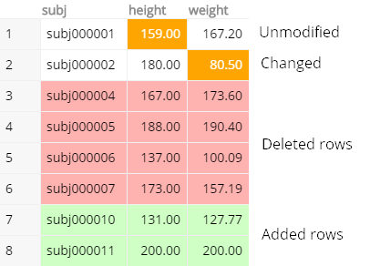
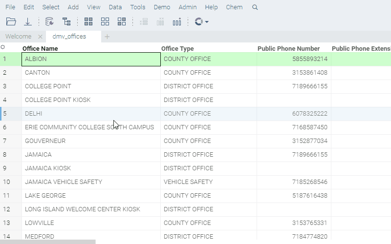

<!-- TITLE: Compare Tables -->
<!-- SUBTITLE: -->

# Compare Tables

Compares the content of two tables.

First, select two tables to compare. After that, select key columns in both table; this establishes
the way rows in the first column are mapped to the rows in the second column. Use 'Value Columns'
section to specify the columns to compare.

Once comparison is done, use the color-coded interactive spreadsheet to identify values, rows, and
columns that were added, removed, and changed.

### Videos

<iframe width="560" height="315" src="https://www.youtube.com/embed/rUHFwO1iQUg" frameborder="0" allow="accelerometer; autoplay; encrypted-media; gyroscope; picture-in-picture" allowfullscreen></iframe>

See also:
* [JS API: Compare Tables](https://public.datagrok.ai/js/samples/data-frame/compare-tables)

