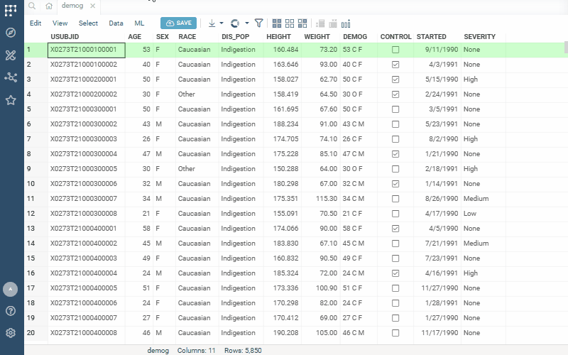
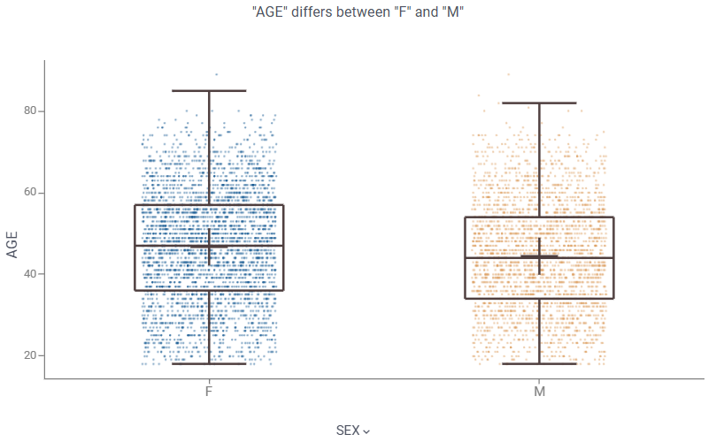
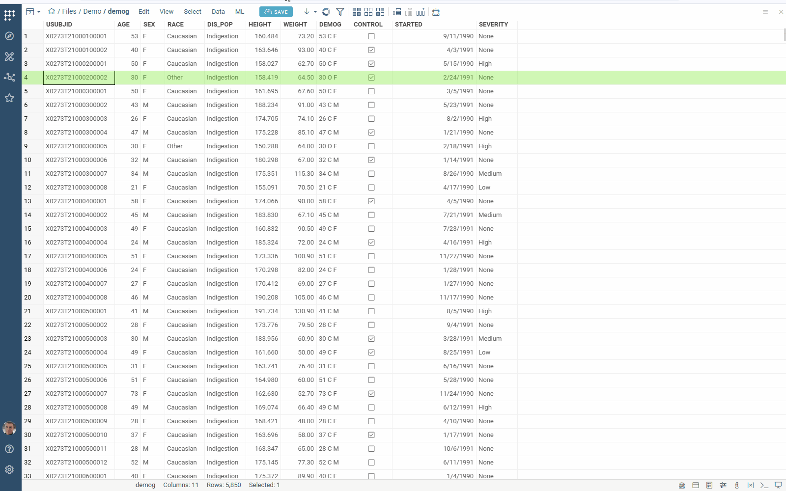
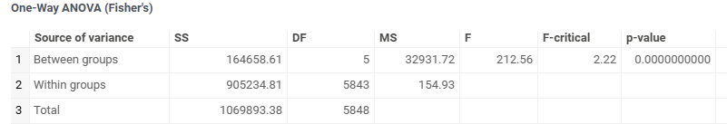
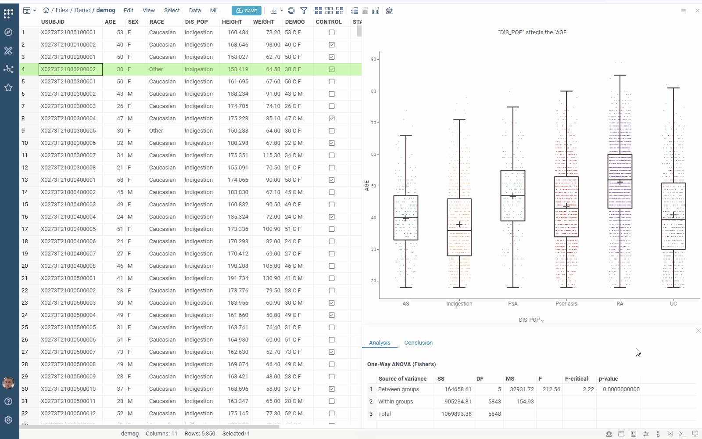

Group comparison capabilities let you check whether the average of a numeric feature differs between two or more groups, telling you how large the difference is and how confident you can be that it's real. Choose the method that matches your comparison:

* [T-test](#t-test): two groups.
* [ANOVA](#anova): three or more groups.
* [Control comparisons](#control-comparisons): each group against one designated control.

## T-test

The two-sample [t-test](https://en.wikipedia.org/wiki/Student%27s_t-test)
determines whether the mean of a feature differs between two groups.

1. Open a table.
2. Run **Top Menu > ML > Analyze > Group Comparison > T-test...**. A dialog opens.
3. In the dialog, specify:
   * the column defining the two groups (in the `Category` field)
   * the column with feature values (in the `Feature` field)
   * the significance level (in the `Alpha` field)
   * the analysis method (in the `Method` field): `Welch` or `Student`
4. Click `Run` to execute. A box plot and an `Analysis`/`Conclusion` tab control appear.

>Datagrok supports two two-sample t-test methods:
>
>* **Welch** (default) - robust to unequal variances across groups. Recommended unless you have strong reason to assume equal variances.
>* **Student** - classical t-test. More powerful when variances are equal, but
>  unreliable otherwise. You can't run the analysis if group variances differ
>  significantly - switch to Welch in that case.

The box plot shows the distribution of values by categories:

The `Analysis` tab reports the t-statistic, degrees of freedom, p-value, mean
difference with its confidence interval, and effect size (Cohen's d and
Hedges' g). The `Conclusion` tab presents the null hypothesis testing.

## ANOVA

Analysis of variance ([ANOVA](https://en.wikipedia.org/wiki/Analysis_of_variance))
determines whether the examined factor has a significant impact on the studied
feature.

1. Open a table.
2. Run **Top Menu > ML > Analyze > Group Comparison > ANOVA...**. A dialog opens.
3. In the dialog, specify:
   * the column with factor values (in the `Category` field)
   * the column with feature values (in the `Feature` field)
   * the analysis method (in the `Method` field): `Welch` or `Fisher`
   * the significance level (in the `Alpha` field)
4. Click `Run` to execute. The following analysis appears:

>Datagrok supports two one-way ANOVA methods:
>
>* **Welch** (default) - robust to unequal variances across groups. Recommended unless you have strong reason to assume equal variances.
>* **Fisher** - classical ANOVA. More powerful when variances are equal, but
>  unreliable otherwise. You can't run the analysis if group variances differ
>  significantly - switch to Welch in that case.

The `Analysis` tab presents a table with ANOVA computations:

>The Fisher and Welch methods show different columns:
>
>* **Fisher**: sums of squares (SS), degrees of freedom (DF), mean squares (MS),
>  F-statistic, critical F-value, and p-value - split into Between groups,
>  Within groups, and Total.
>* **Welch**: F-statistic, numerator df (k − 1), Welch–Satterthwaite denominator
>  df (fractional), critical F-value, and p-value - Welch's test has no SS/MS
>  decomposition by design.

Click the `Conclusion` tab to explore the null hypothesis testing:

## Control comparisons

ddd

See also:

* [Box plot](../visualize/viewers/box-plot.md)
