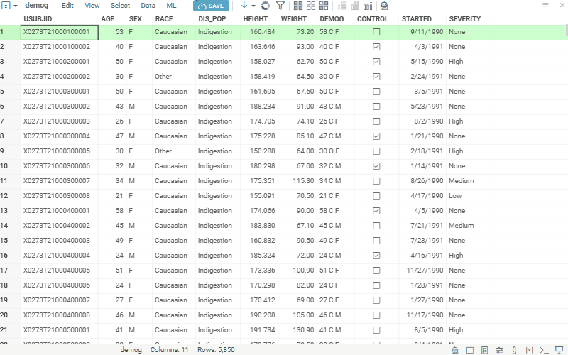

Group comparison capabilities let you check whether the average of a numeric feature differs between
groups, telling you how large the difference is and how confident you can be that it's real. Choose
the method that matches your comparison:

* [T-test](#t-test): two groups.
* [ANOVA](#anova): three or more groups.
* [Control comparisons](#control-comparisons): several groups, each against one shared control.

## T-test

The two-sample [t-test](https://en.wikipedia.org/wiki/Student%27s_t-test)
determines whether the mean of a feature differs between two groups. For three or more groups, use [ANOVA](#anova) instead.

1. Open a table.
2. Run **Top Menu > ML > Analyze > Group Comparison > T-test...**. A dialog opens.
3. In the dialog, specify:
   * the column defining the two groups (in the `Category` field)
   * the column with feature values (in the `Feature` field)
   * the significance level (in the `Alpha` field)
   * the analysis method (in the `Method` field): `Welch` or `Student`
   * whether to add the results table (the `Full report` checkbox, on by default)
4. Click `Run`. You get:
   * a **box plot** showing the distribution of values by category
   * a **results table** (when `Full report` is on) reporting the t-statistic, degrees of freedom, p-value, mean difference with its confidence interval, and effect size (Cohen's d and Hedges' g)

## ANOVA

Analysis of variance ([ANOVA](https://en.wikipedia.org/wiki/Analysis_of_variance))
determines whether the examined factor has a significant impact on the studied
feature.

1. Open a table.
2. Run **Top Menu > ML > Analyze > Group Comparison > ANOVA...**. A dialog opens.
3. In the dialog, specify:
   * the column with factor values (in the `Category` field)
   * the column with feature values (in the `Feature` field)
   * the analysis method (in the `Method` field): `Welch` or `Fisher`
   * the significance level (in the `Alpha` field)
   * whether to add the results table (the `Full report` checkbox, on by default)
4. Click `Run`. You get:
   * a **box plot** showing the distribution of values by category
   * a **results table** (when `Full report` is on) with the ANOVA computations

## Control comparisons

[Control comparisons](https://en.wikipedia.org/wiki/Dunnett%27s_test) test each group against a
single control, correcting for the multiple comparisons. Use them in dose-response or toxicology
studies, where every treatment is compared with one reference group.

1. Open a table.
2. Run **Top Menu > ML > Analyze > Group Comparison > Control Comparisons...**. A dialog opens.
3. In the dialog, specify:
   * the column defining the groups (in the `Category` field)
   * the reference group every other group is compared against (in the `Control` field)
   * the column with feature values (in the `Feature` field)
   * the significance level (in the `Alpha` field)
   * the analysis method (in the `Method` field): `Dunnett` or `Holm-Welch`
   * whether to add the results table (the `Full report` checkbox, on by default)
4. Click `Run`. You get:
   * a **box plot** showing the distribution of values by category
   * a **results table** (when `Full report` is on) with one row per group compared against the control

See also:

* [Box plot](../visualize/viewers/box-plot.md)
