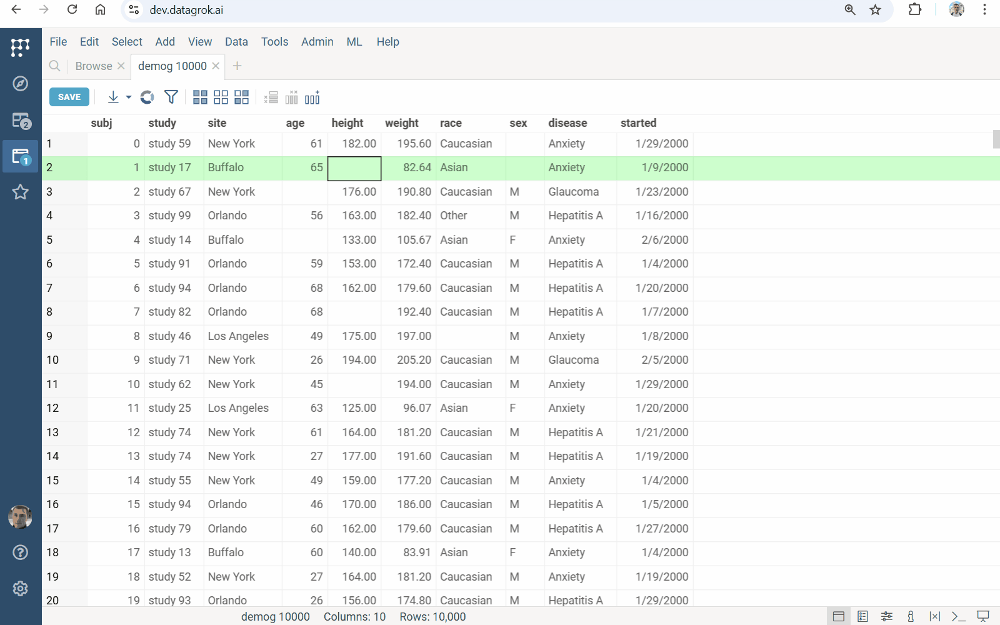

Use [imputation](https://en.wikipedia.org/wiki/Imputation_\(statistics\)) to fill in missing values in a dataframe.

## The k-NN method

The k-nearest neighbors ([k-NN](https://en.wikipedia.org/wiki/K-nearest_neighbors_algorithm)) imputation method replaces missing values by finding the *k* most similar (nearest) observations based on a distance metric. For each missing value in a dataset, it finds the *k* closest data points with non-missing values. Then, it calculates the average (for numerical data) or mode (for categorical data) of these neighbors’ values and imputes this result for the missing entry.

1. On the **Top Menu**, select **ML > Impute Missing Values...**. A dialog opens.
2. In the dialog, specify the columns with missing values you want to impute (in the `Impute` field) and the columns that should be used for finding neighbors (in the `Using` field). You can also select a distance metric, neighbor count, and decide whether to replace missing values or create a new column with imputed results.
3. Click **Run** to execute.

See also:

* [Statistical functions](https://datagrok.ai/help/transform/functions/stats-functions)
