Multivariate analysis (MVA) models a response variable from many predictors at once, including predictors that correlate with each other.

Partial least squares regression ([PLS regression](https://en.wikipedia.org/wiki/Partial_least_squares_regression)) is a particular type of MVA. It constructs a linear model using **latent factors**: combinations of the predictors that maximize the covariance with the response variable. This balances two goals — summarizing the variation of the predictors and correlating with the response — which makes PLS work where the predictors are numerous or collinear and multiple regression breaks down.

## Regress and analyze

1. Open a table.
2. On the Top Menu, select `ML | Analyze | Multivariate Analysis...`. A dialog opens.
3. In the dialog, specify
   * the column with response variable (in the `Predict` field)
   * the columns with the predictors (in the `Using` field)
   * the number of `Components`, i.e. latent factors (too many fit the noise)
   * whether to extend the predictors with their squares and pairwise products (in the `Quadratic` field)
   * `Names` of data samples

   The dialog lists only numeric columns without missing values.

4. Press `Run` to execute. You get
   * the [Observed vs. Predicted](#observed-vs-predicted) scatterplot comparing the response to its prediction
   * the [Scores](#scores) scatterplot reflecting data samples similarities and dissimilarities
   * the [Loadings](#loadings) scatterplot showing how strongly the latent factors describe each feature
   * the [Regression Coefficients](#regression-coefficients) bar chart presenting parameters of the obtained linear model
   * the [Variable Importance](#variable-importance) bar chart ranking the features by their contribution
   * the [Explained Variance](#explained-variance) bar chart measuring how well the latent factors fit source data

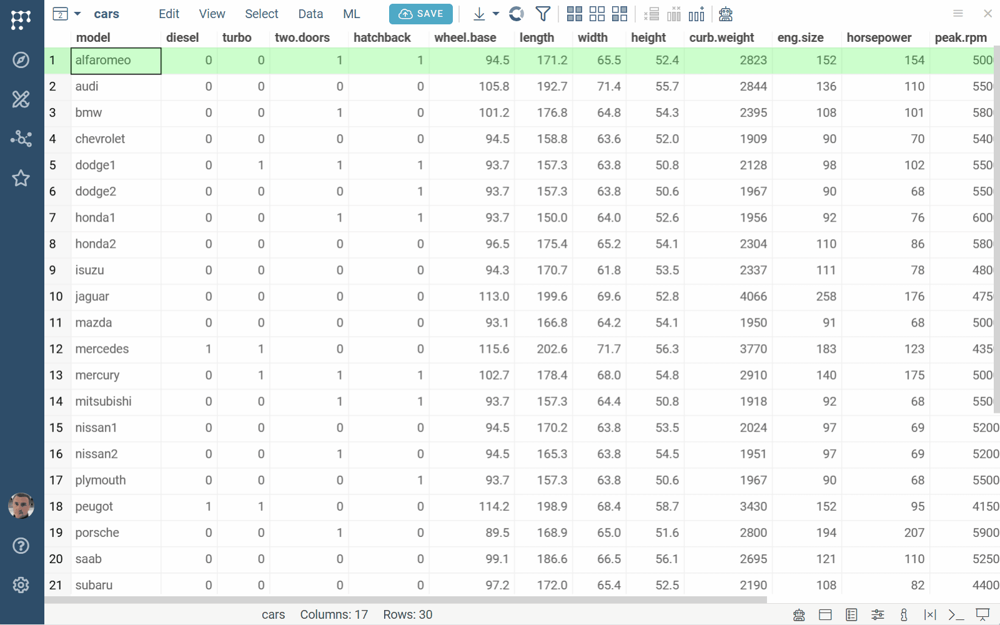

### Observed vs. Predicted

The **Observed vs. Predicted** scatterplot compares the response variable to its prediction. The [coefficient of determination](https://en.wikipedia.org/wiki/Coefficient_of_determination) `r2` indicates the goodness of fit on the training data:

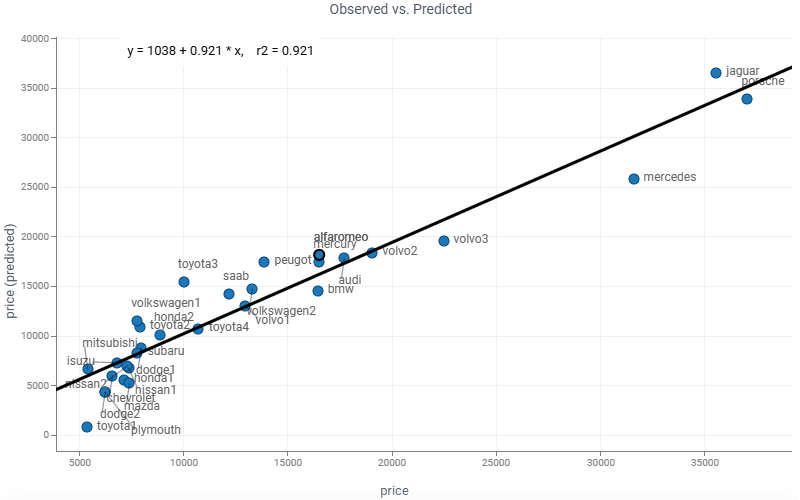

Combine it with the [Scores](#scores) scatterplot to explore data samples:

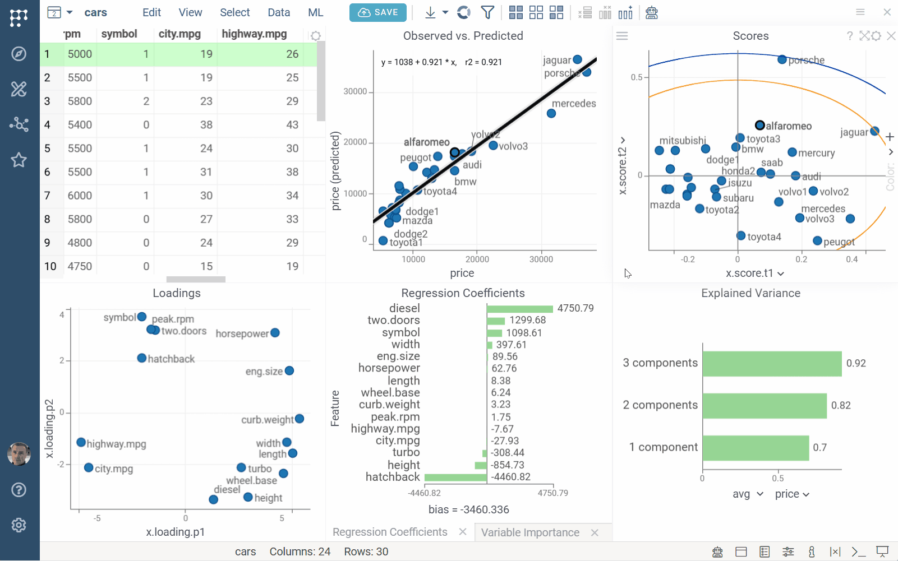

### Scores

The **Scores** scatterplot shows the values of the latent factors for each observation:

* T-scores, computed from the predictors
* U-scores, computed from the response variable.

Plot two T-scores against each other to explore the observations: nearby points are similar samples, and clusters, trends, or outliers show up as patterns. Plot a T-score against the matching U-score to check the model: points along a straight line mean the linear model fits, a curved pattern points to a nonlinear relationship.

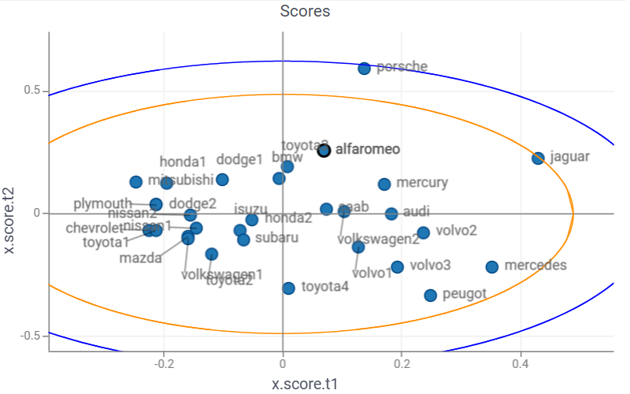

Combine it with the [Observed vs. Predicted](#observed-vs-predicted) scatterplot to explore data samples:

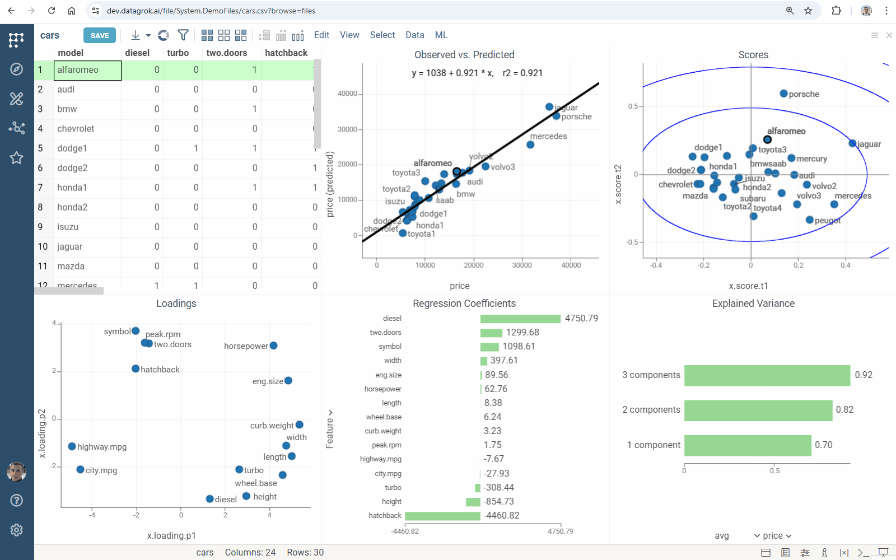

### Loadings

The **Loadings** scatterplot shows how strongly each latent factor describes each feature. Features far from the origin are described well, features grouped together correlate with each other.

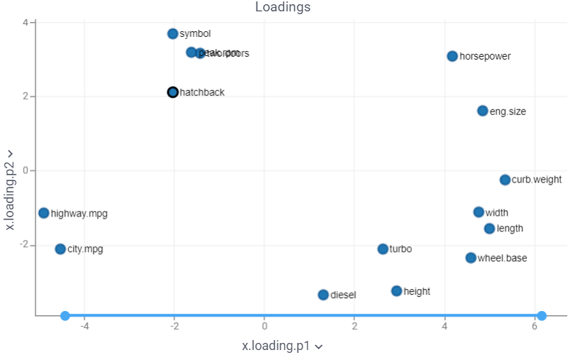

### Regression coefficients

The **Regression Coefficients** bar chart presents parameters of the obtained linear model and the bias term.

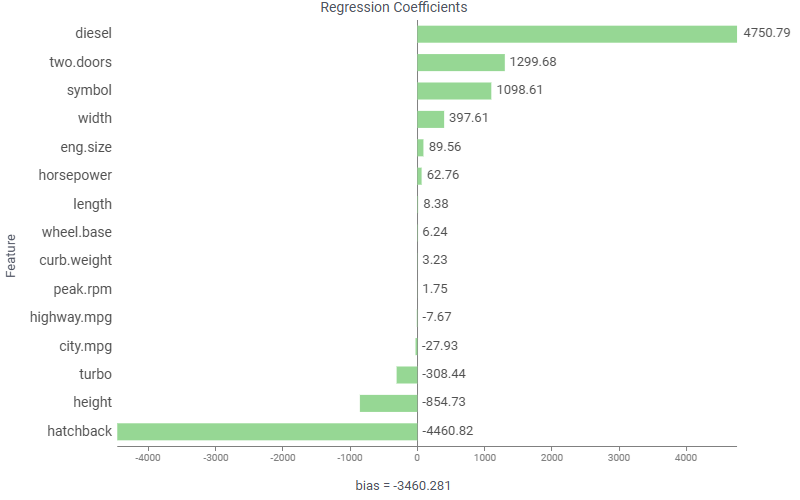

Tooltip for the prediction column header shows the model formula:

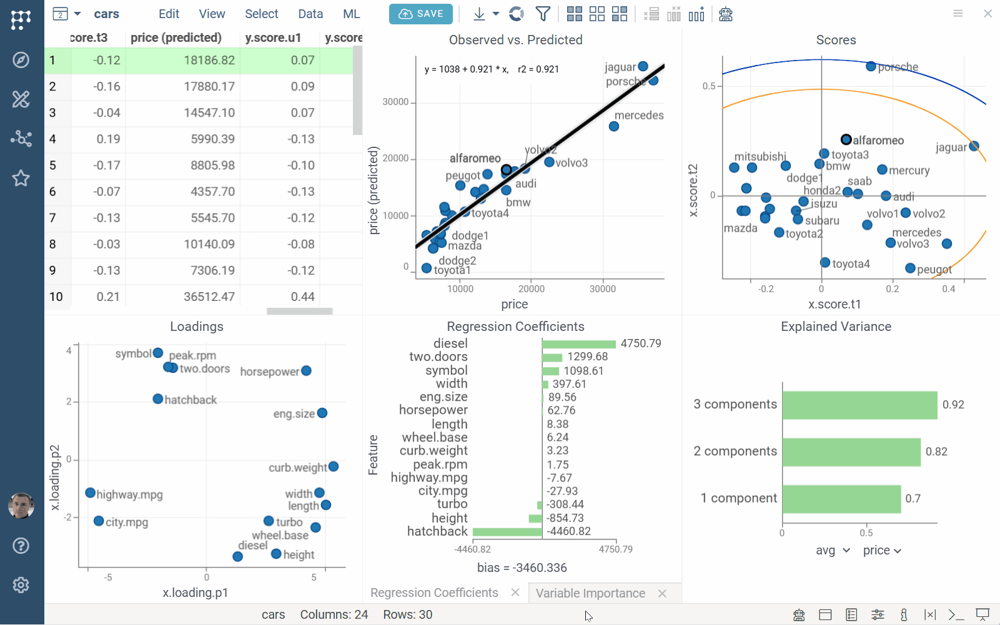

Coefficients depend on the units of their features. To compare features, use the [Variable Importance](#variable-importance) bar chart.

### Variable importance

The **Variable Importance** bar chart shows the variable importance in projection (VIP): how much each feature helps the model explain the response. VIP is computed on standardized data, so you can compare features measured in different units.

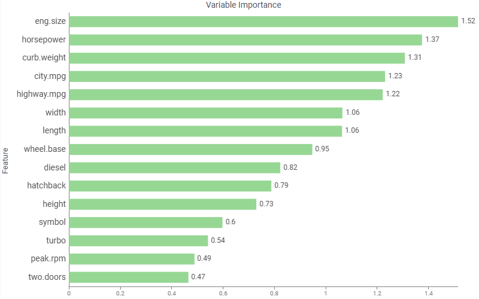

Read the scores as follows:

| VIP score | Interpretation                             |
|-----------|--------------------------------------------|
| > 1       | Contributes more than an average predictor |
| 0.8-1     | Borderline                                 |
| < 0.8     | Weak, a candidate for removal              |

### Explained variance

The **Explained Variance** bar chart shows the share of variance the latent factors explain, added up over the components.

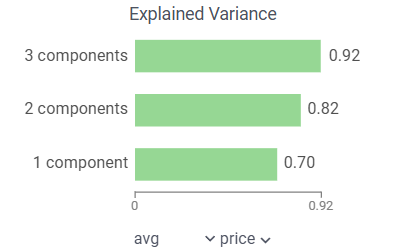

Values run from zero to one, and closer to one means a better fit.

## PLS components

Compute the predictors representation by the latent factors:

1. Open a table.
2. On the Top Menu, select `ML | Analyze | PLS...`. A dialog opens.
3. In the dialog, specify
   * the column with response variable (in the `Predict` field)
   * the columns with the predictors (in the `Using` field)
   * the number of `Components`, i.e. latent factors (too many fit the noise)
   * whether to extend the predictors with their squares and pairwise products (in the `Quadratic` field)

PLS builds its components using the response variable, while [PCA](dim-reduction.md#pca) ignores it. With the same number of components, PLS therefore captures more of the response, as the [coefficient of determination](https://en.wikipedia.org/wiki/Coefficient_of_determination) `r2` shows:

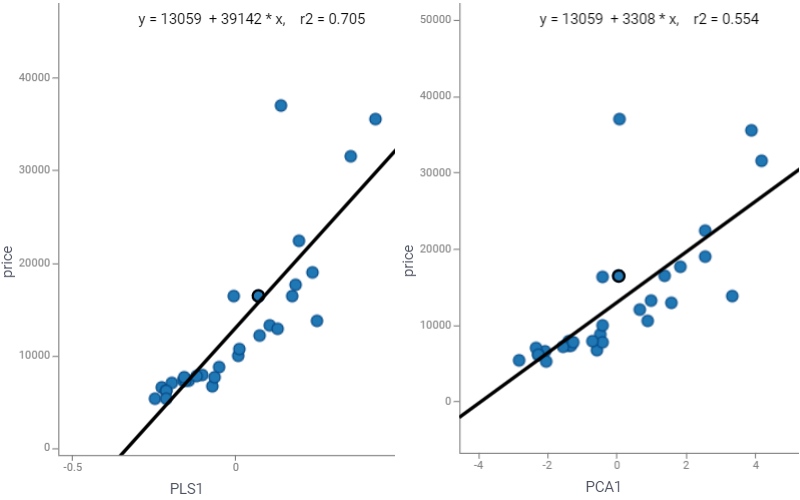

## See also

* [Dimensionality reduction](dim-reduction.md)
* [Analysis of variances](group-comparison.md#anova)
* [Tutorial](https://public.datagrok.ai/apps/tutorials/Tutorials/MachineLearning/MultivariateAnalysis)
