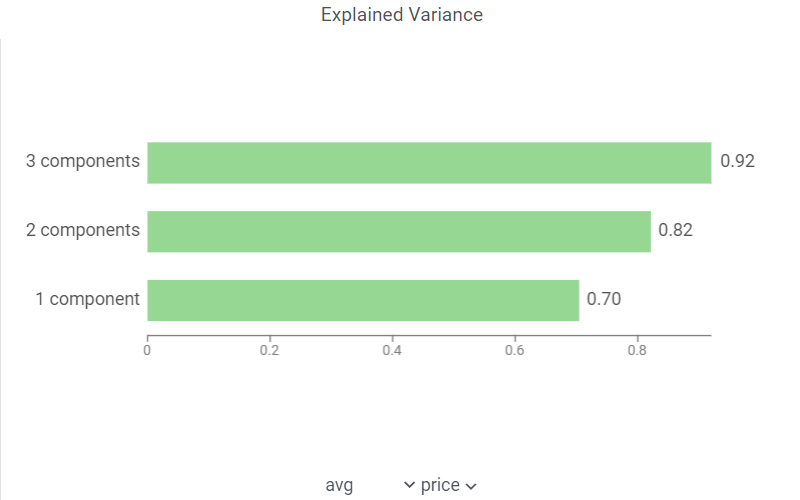
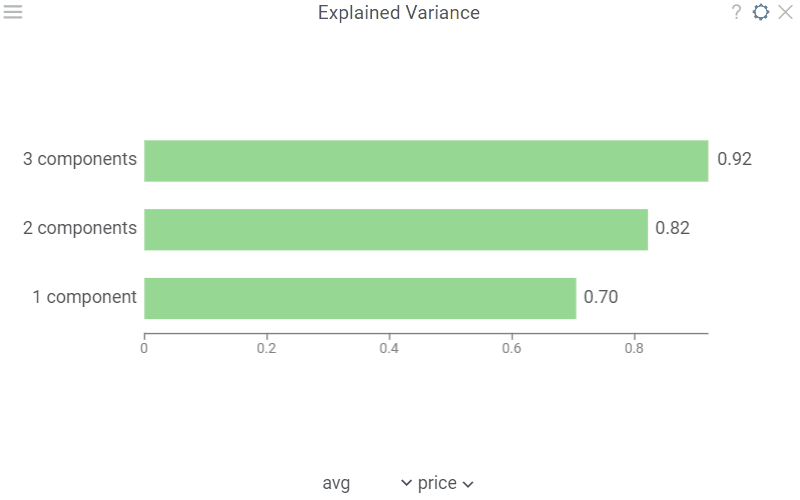

Bar chart with explained variance of variables by PLS-components, cumulative sum by each of components:

Use it to explore how well the latent components fit source data: closer to one means better fit.

