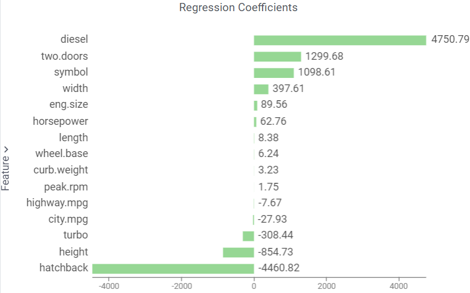

The **Regression Coefficients** bar chart presents parameters of the obtained linear model (used with the original data scale):

Combine it with the the [Loadings](https://datagrok.ai/help/explore/multivariate-analysis/plots/loadings) scatterplot to explore features:

