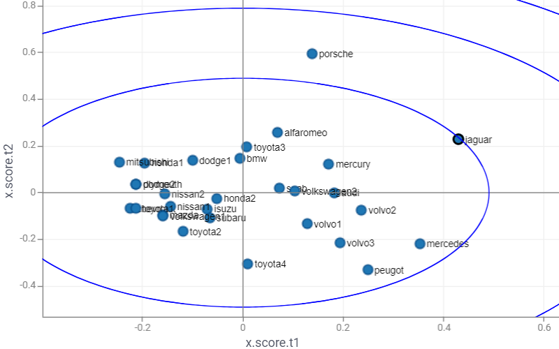
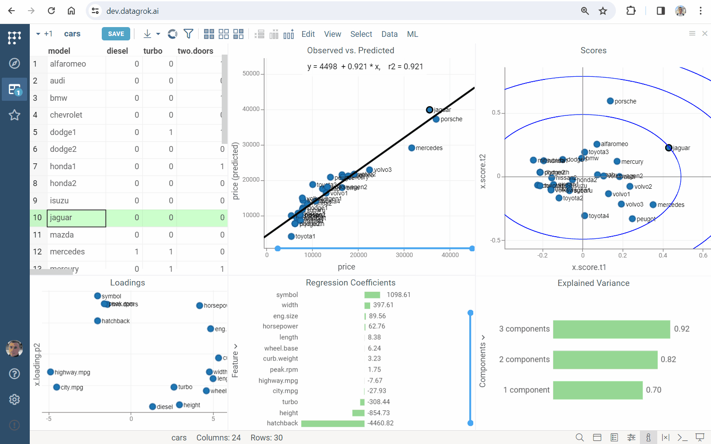

The **Scores** scatterplot shows the values of the latent factors for each observation in the dataset:

* the predictors (T-scores)
* the response variable (U-scores).

It indicates correlations between observations (how observations related to each other, occurrence groups or trends).

Combine it with the the [Observed vs. Predicted](https://datagrok.ai/help/explore/multivariate-analysis/plots/predicted-vs-reference) scatterplot to explore data samples:

