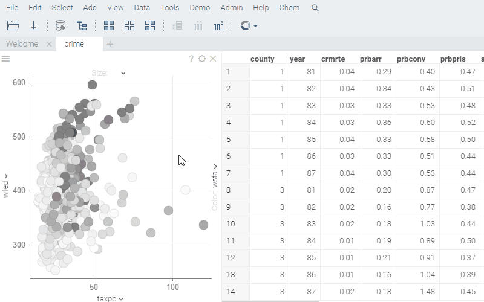

<!-- TITLE: Select Random Rows -->
<!-- SUBTITLE: -->

# Select Random Rows

Selects the specified number of rows randomly.

Either type the desired number of rows to select, use the slider, or click on a link indicating the
proportion of rows to select.

This functionality is commonly used for sampling. Click on the _keyboard_arrow_down_ icon in order
to access the following commands:

  * #{x.CmdExtractSelectedRows}
