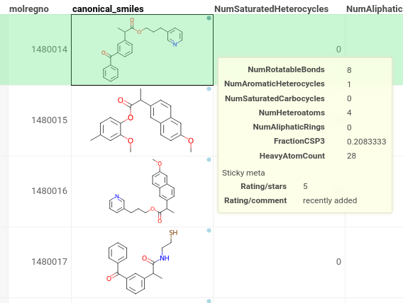
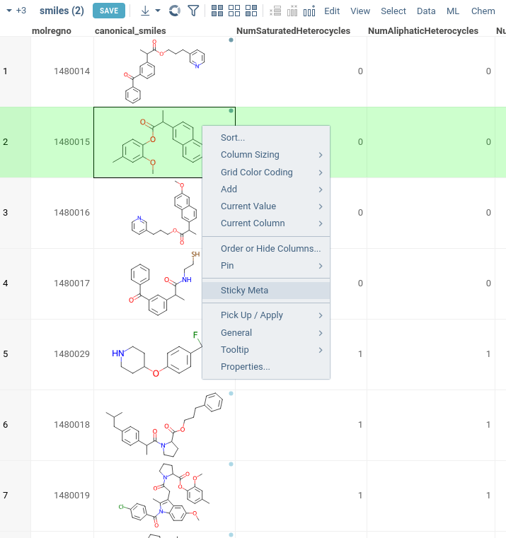
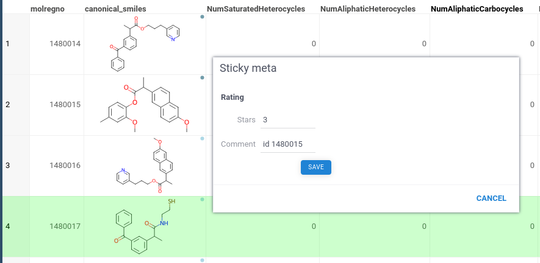
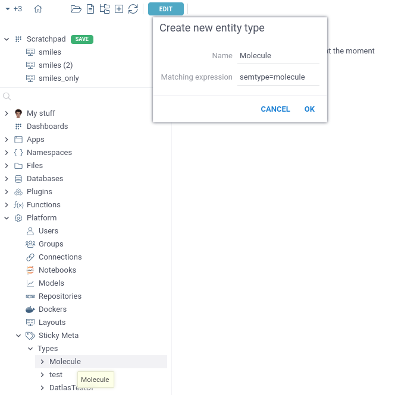
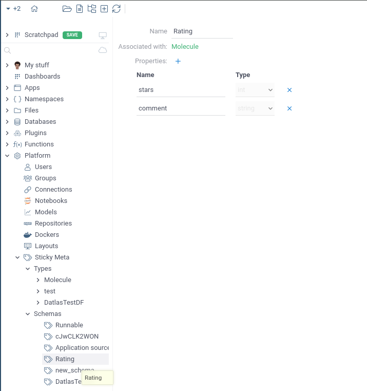
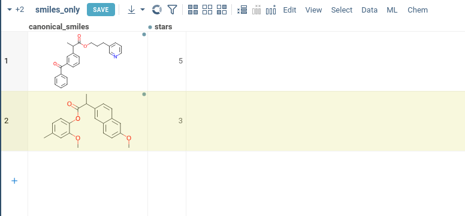

## Overview

Datagrok has a concept of entities. Among other features, it enables each internal object (dataset, connection, query, function, user, group, etc) to be associated with the arbitrary metadata. Sticky meta extends this functionality to external objects. With Sticky meta, it is possible to link an external object with metadata and access it from anywhere in the platform. Sticky meta works as a no-code database, allowing building lightweight solutions right in the Datagrok platform. 

<!-- Use case 1:

Use case 2: -->

For example, you might be working with experiments data for molecules, where you found some anomalies. Experiments data might come from different datasources, in bunch of formats and be stored in several projects across Datagrok. With sticky meta, you can put a metadata `isAnomaly: true` on molecules with unusual results for expriment A. This metadata will be automatically fetched for all the molecules for table of expetiment B. You will be able to find, if anomalies correlated, without extra columns or complex table join.

## Cell augmentation

Datagrok checks dataframes for presence of objects that can store sticky meta. For each column, it matches set of tags with existing entity types: if there is a match, every cell in a column is considered as an entity with potential sticky meta.

Every cell with sticky meta has special circle in top right corner. It also has information about sticky meta values in the tooltip.

## Sticky meta editor

For every cell, that is indicated as a sticky meta keeper, it is possible to assign metadata. From tableviews, you can right-click on such cell, and select "Sticky meta" command, that will open a Sticky meta editor. The same action is available from context panel as well.

Sticky meta editor shows all metadata fields, that are currently linked with object of that type. They show current meta of a given entity, if it exists. In any case, you are free to modify data or add new meta.

||||
|:--:|:--:|:--:|
|  |  |  |

## Sticky columns

In sticky meta editor, each field has a "plus" icon, that allows exporting this metadata as a column. We call such columns sticky, because they are linked with an entity from corresponding row and their values are synced with metadata.

### Background synchronization

Each sticky column is linked with a reference column, where an entity is stored. So, if a value in a sticky column is updated, sticky column automatically saves metadata to database.

### In-grid fetching metadata

Every time grid with sticky columns is opened, Datagrok fetches updated metadata from the database. It means that every time you open a project with sticky columns, they will have new values, in case sticky meta was updated by another user or in different project.

### Filtering

Of course, you can filter by sticky columns, as with any other column. But in case you don't want to create a column, you can add filter panel inside filter menu. For that, you need to select reference column and click Sticky meta icon. After that, you can select filters for meta values.

## Configuring Sticky meta

To specify metadata, that is used as Sticky meta, go to "Platform/Sticky Meta" section. It has configutration of schemas and types, that Datagrok uses for specification.

|||
|:--:|:--:|
| | |

### Schemas

We use schemas to describe a set of values that entity might have (for example, schema Experiment that has author string field and date datetime field). Entities can share schemas: molecules can store information about the experiment as well as data frame with report.

Each property that can be assigned to an entity, is strongly typed and shown in platform using type-compatible editor.

### Associated types

To specify, which entities can have specific meta, we link schema with types. User-defined types have a set of tags specified, that an object needs to have to be considered an instance of respective type. In most cases, this condition applies to dataframe columns, and values in columns, that pass the filter, are considered keys to entities.

For example, you might have one broad type with matching expression `semtype=molecule`. It will be applied for every Molecule semantic value. To select more precise set, you can use and-condition on tags: `type=id,belongs=molecule,private=true`.

### Associating objects with sticky meta 

Different entities for sticky meta are identified differently. System entities are identified using their ID. Rest of entities, that you reference in dataframe, are identified through their handle, which is a string value of a column, passed through special functions, having `metadata: canonicalizer`.

## Sticky meta with internal entities

You can add Schemas to any Datagrok object: Function, Notebook, or Data Connection. Their types can be added to schema as well.

<!-- It means that it is linked with column of original entity. Updates of this column will lead to updates of metadata for corresponding entity. 

If there is a cell with a special indicator opened in table viewer, it is possible to add sticky values to it. Just right-click the cell, select Sticky meta, and set sticky values you need. These values are assigned to this cell content and are accessible all over the platform.

## Sticky columns

While working with table that has objects, that can storre sticky meta, sticky values can be exported into columns. Updates done in these columns will directly update sticky meta assigned to object in corresponding row. You can edit multiple values with Batch Edit as well.

## Other system objects

You can add Schemas to any Datagrok object: Function, Notebook, or Data Connection. Just add their type to desired schema. -->
