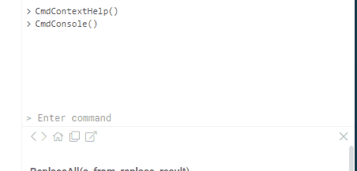

<!-- TITLE: Console -->
<!-- SUBTITLE: -->

# Console

Use console to call [functions](../entities/function.md) 
and record [macros](../entities/function.md#macros).

To open: **Tools | Console**, or press "~" (tilde)

## Controls

|             |              |
|-------------|--------------|
| "~" (tilde) | Open console |
| Tab         | Complete command |
| Up/Down     | Previous/next command |

Two icons on top let you clear the console, or open [variables view](../views/variables-view.md).
Clicking on the function name will bring up its details in the [property panel](property-panel.md).



## Command examples

```
KNN(["WIDTH", "HEIGHT"])
```
Run KNN command with the specified parameters

```
KNN
```
Edit parameters of the KNN command

```
KNN?
```
Get help for the KNN command

```
SelectRows("demog", IsNull("HEIGHT"))
```
Select rows with empty values in the "HEIGHT" column

```
ExtractRows("demog", IsNull("HEIGHT"))
```
Extract rows with empty values in the "HEIGHT" column


## Macros

Whenever a function is executed, it gets logged in the console. Simply copy-and-paste it
to execute it again. This can also be used in data transformations and data pipelines.


 

See also:
  * [Scripting](scripting.md)
  * [Variables view](../views/variables-view.md)
  * [Grok scripting](grok-script.md)
  * [Scripting plugin](../features/scripting.md)
