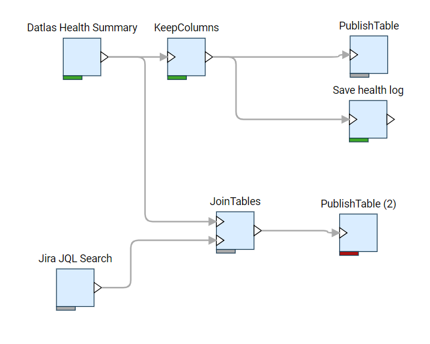

<!-- TITLE: Job Editor -->
<!-- SUBTITLE: -->

# Job Editor

Use job editor to define data flows and transformation by drag-and-dropping 
[functions](../entities/function.md), connecting outputs to inputs, and editing
function parameters.

See also: 

* [Functions](../entities/function.md)
* [Console](../features/console.md)
