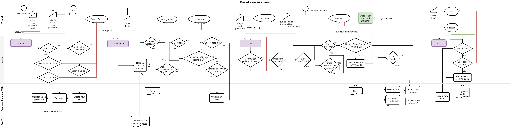
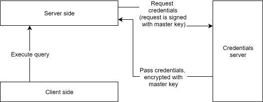
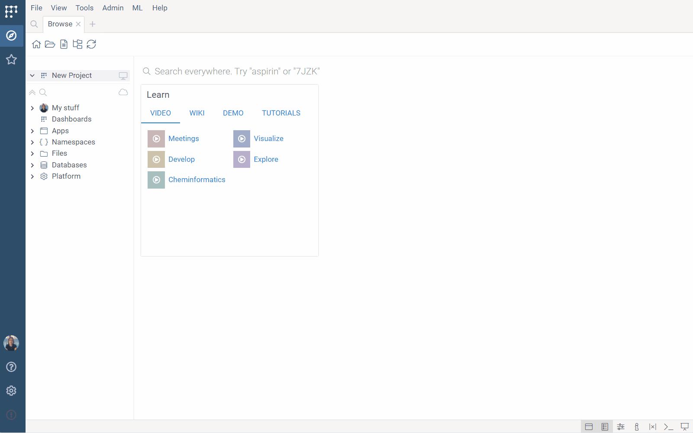

```mdx-code-block
import IntAuth from '../img/settings-internal-auth.png';
```

Datagrok provides robust security through its authentication, authorization, and credential management systems. These features control access to functionalities and data within the platform, ensuring that only authorized users can operate within their granted permissions.

## Authentication

_Authentication_ is verification of identity by providing credentials. Datagrok supports the following authentication methods:

* **Internal (login/password)**: Sign in with a username and password
* **OAuth**: Sign in using Google, Facebook, GitHub, or OpenID accounts
* **Single Sign-On (SSO)**: Custom SSO for enterprise customers
* **OpenID**: Sign in using OpenID providers like Azure AD 

You can enable all methods separately or combined. After successful
authentication, Datagrok issues a session token for subsequent API calls,
ensuring continuous secure access during the session.

To set up authentication, go to **Sidebar > Settings (<FAIcon icon="fa-solid fa-gear"/>) > Users and Sessions**. For detailed instructions, see [Configure authentication](../../deploy/complete-setup/configure-auth.md).

:::danger

If you disable the login/password authentication (for example, after
setting up the SSO), the platform will no longer accept logging in with the username/password, so 
be careful to not lock yourself out and make sure SSO works.We recommend to check that SSO works by signing into Datagrok
using incognito mode before disabling the login/password authentication. 

If you don't provide a functional alternative before disabling the login/password authentication, 
this may require a platform redeployment to regain access.


:::

### Login-password authentication

Datagrok uses a user name and password to authenticate users. Passwords are
salted with random data and encrypted with the 1024xSHA-256 algorithm, ensuring
they cannot be read from the system.

When a user logs in, the user name and password pair is passed to the server. If
the password hash matches the stored hash, a session token is generated. Every
subsequent API call must be made with the `Authorization: token` HTTP header,
where `token` is the session token. This token becomes invalid after logging out.

Datagrok doesn't store user passwords after login. If a user forgets their
password, the only way to regain access is to reset the password using the link
on the login form or for the Datagrok Administrator to reset the password. 



## Authorization 

_Authorization_ in Datagrok is based on [Role-Based Access Control (RBAC)](https://en.wikipedia.org/wiki/Role-based_access_control) and determines whether a specified user can execute a specified operation against a specified [entity](../../datagrok/concepts/objects.md). This is achieved by defining [user groups](users-and-groups.md#groups) and associating them with [permissions](#permissions) for different entities.


### Permissions

When you create an entity, only you (its author) can access it initially. To grant access to others, you need to [share it](../../datagrok/navigation/basic-tasks/basic-tasks.md#share) and assign permissions:

* **View**: User or group can see and open the entity
* **Edit**: User or group can edit entity attributes 
* **Delete**: User or group can delete the entity 
* **Share**: User or group can edit entity permissions

All permissions are grouped in two categories:
   * **Can view**: Includes only the **View** permission
   * **Can edit**: Includes all permissions, including _share_ and _delete_

Entity permissions are granted to [groups](users-and-groups.md#groups) rather
than individual users, which simplifies security administration. For
convenience, Datagrok automatically creates a "personal group" for every user in
the system, named after the user.

Permission sets assigned to a group are inherited by all members of the group.
Groups can be nested, allowing members of a child group to inherit permissions
set for a parent group. However, circular membership is forbidden.

:::note

To fully control access to external data sources (like [file shares](../../access/files/files.md) or
[databases](../../access/databases/databases.md)), you can also associate groups with
[credentials](#credentials-management-system)

:::

## Credentials management system

Datagrok provides a built-in credentials management system that securely stores
and protects data connection and plugin credentials. 

Credentials contain sensitive
information used to connect to data sources, such as login/password pairs for
databases or tokens and private keys for webservices.

Each credential is associated with a
[group](../access-control/users-and-groups.md#groups) and a
[connection](../../access/access.md#data-connection) or a plugin. When a user accesses the entity, the system automatically selects the appropriate credential based on
the user's group membership.


Depending on the connection, the call to the external service is performed
either on the server or the client side. For client-side calls, the credential
are retrieved from the server. Some connections, such as databases, are intended
to be accessible only from the server side. In such cases, set the
**Requires Server** flag to true (accessible via the **Edit...** command) to prevent
the retrieval of credentials by the client. 

### Credentials storage

To enhance security, all external credentials are stored in a separate database
and encrypted with a platform key generated during deployment. Even if one of
the systems is compromised, an attacker still won't be able to access the
credentials.



If your organization already uses a specialized credential vault like AWS
Secrets Manager, you can [configure Datagrok to use it](data-connection-credentials.md).

To store credentials in Datagrok's credentials storage programmatically, send a `POST` request to `$(GROK_HOST)/api/credentials/for/$(ENTITY_NAME)` with a raw body containing JSON, such as `{"login": "abc", "password": "123"}`, and headers `{"Authorization": $(API_KEY), "Content-Type": "application/json"}`. Take the API key from your profile page in Datagrok, e.g., [https://public.datagrok.ai/u](https://public.datagrok.ai/u).

See this sample: 

* [Open in public repository](https://github.com/datagrok-ai/public/blob/master/packages/ApiSamples/scripts/misc/package-credentials.js)
* [Open in Datagrok](https://public.datagrok.ai/e/ApiSamples:PackageCredentials).

To add credentials from the UI: 

1. From the context menu, select **Credentials...**. The **Manage credentials** dialog opens.
1. In the dialog, click the group and enter appropriate credentials in the fields provided.
       >_Note:_ The dialog only shows the [groups](users-and-groups.md#groups) you belong to. To assign credentials for the **All users** group, you must have permissions to edit the connection. To assign credentials for other groups, you must both have permissions to edit the connection and be that group's admin.
1. Click **OK**.


