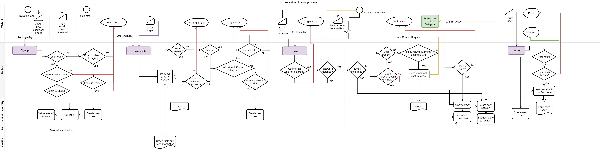
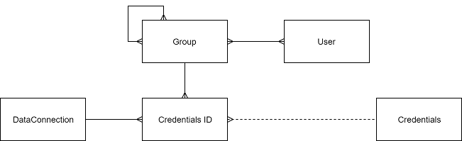
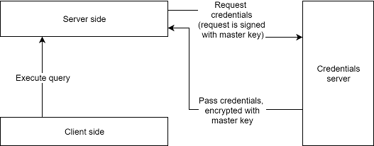
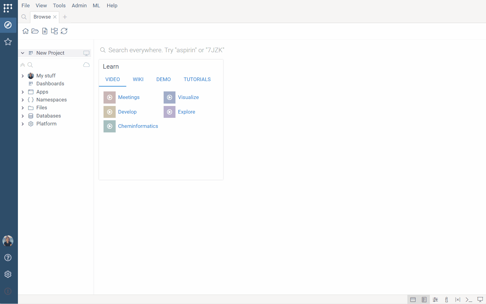

```mdx-code-block
import IntAuth from '../img/settings-internal-auth.png';
```

Datagrok provides robust security through its authentication, authorization, and credential management systems. These features control access to platform functionalities and data, ensuring that only authorized users can operate within their granted permissions.

## Authentication

_Authentication_ is verification of identity by providing credentials. Datagrok supports the following authentication methods:

* **Internal (login/password)**: Sign in with a [username and password](../../deploy/complete-setup/configure-auth.md#general-login-password-authentication)
* **OpenID Connect**: Sign in with [OpenID providers](../../deploy/complete-setup/configure-auth.md#openid-authentication) such as Microsoft Entra ID, Okta, or Google
* **SAML**: Sign in with a [SAML identity provider](../../deploy/complete-setup/configure-auth.md#saml-authentication)
* **LDAP**: Sign in with [LDAP or Active Directory](../../deploy/complete-setup/configure-auth.md#ldap-authentication) credentials
* **Google IAP**: Sign in behind [Google Identity-Aware Proxy](../../deploy/complete-setup/configure-auth.md#iap-authentication)
* **Key pair**: Sign in from the command line, scripts, and CI with [keypair authentication](keypair-authentication.md)

You can enable all methods separately or combined. With OpenID, Datagrok can also
[synchronize group membership](../../deploy/complete-setup/configure-auth.md#group-synchronization)
from the identity provider. After successful
authentication, Datagrok issues a session token for subsequent API calls,
ensuring continuous secure access during the session.

To set up authentication, go to **Sidebar > Settings (<FAIcon icon="fa-solid fa-gear"/>) > Users and Sessions**. For detailed instructions, see [Configure authentication](../../deploy/complete-setup/configure-auth.md).

:::danger

If you disable the login/password authentication (for example, after
setting up the SSO), the platform will no longer accept logging in with the username/password, so 
be careful not to lock yourself out and make sure SSO works. We recommend checking that SSO works by signing into Datagrok
using incognito mode before disabling the login/password authentication. 

If you disable login/password authentication without providing a functional alternative, 
you may need to redeploy the platform to regain access.


:::

### Login-password authentication

Datagrok uses a username and password to authenticate users. Passwords are
salted with random data and encrypted with the 1024xSHA-256 algorithm, ensuring
they cannot be read from the system.

When a user logs in, the username and password pair is passed to the server. If
the password hash matches the stored hash, a session token is generated. Every
subsequent API call must be made with the `Authorization: token` HTTP header,
where `token` is the session token. This token becomes invalid after logging out.

Datagrok doesn't store user passwords after login. If a user forgets their
password, they can reset it using the link on the login form, or a Datagrok Administrator can reset it.



## Authorization 

_Authorization_ in Datagrok is based on [Role-Based Access Control (RBAC)](https://en.wikipedia.org/wiki/Role-based_access_control) and determines whether a specified user can execute a specified operation against a specified [entity](../../datagrok/concepts/objects.md). This is achieved by putting users into [groups](users-and-groups.md#groups) and granting groups [permissions](#permissions).

### Groups and roles

Every permission is granted to a group. Users, groups, and roles are all ways of
putting people into groups:

| Concept            | What it is                                                                                     | Example                            |
|--------------------|------------------------------------------------------------------------------------------------|------------------------------------|
| **Personal group** | Created automatically for every user. Sharing something with a user grants it to this group     | `jdoe`                             |
| **Group**          | A set of users and other groups. Answers "*who* are these people?"                              | `Oncology Discovery`               |
| **Role**           | A group marked as a role. Holds permissions and is assigned to groups. Answers "*what* may they do?" | `Data Steward`, `Dashboard Author` |

A role nests and inherits exactly like a group does. The difference is how you
use it:

* **Groups collect people.** Let them mirror your organization. Ideally, they
  come from your identity provider through
  [group synchronization](../../deploy/complete-setup/configure-auth.md#group-synchronization).
* **Roles collect permissions.** Grant [global permissions](#global-permissions)
  and entity [permissions](#permissions) to a role, then assign the role to
  groups. Every member of those groups inherits what the role grants.

Group synchronization never matches roles, so a group created in the identity
provider can't grant itself a Datagrok role. To manage roles, see
[Roles](users-and-groups.md#roles).

The following table shows how permissions reach a user:

| Permission kind                            | Granted to            | Reaches a user through                                                          |
|--------------------------------------------|-----------------------|---------------------------------------------------------------------------------|
| [Global permission](#global-permissions)   | A group or role       | Membership in that group or role, directly or through nested groups             |
| [Entity permission](#permissions)          | A group or role, on an entity | The same membership, for that entity only                              |
| Entity permission on a [space](../../datagrok/concepts/project/space.md) | A group or role, on the space | The same membership, for everything the space contains         |

### Permissions

When you create an entity, only you (its author) can access it initially. To grant access to others, you need to [share it](../../datagrok/navigation/basic-tasks/basic-tasks.md#share) and assign permissions:

Common Entity Permissions

| Permission | Description                                    |
| ---------- | ---------------------------------------------- |
| **View**   | See and open the entity; read basic attributes |
| **Edit**   | Modify entity attributes                       |
| **Delete** | Delete the entity                              |
| **Share**  | Change entity permissions                      |

Data Connection Permissions

| Permission                | Description                              |
| ------------------------- | ---------------------------------------- |
| **Data Connection Query** | Execute any query on the data connection |
| **Get Schema**            | Read database schema                     |
| **List Files**            | List files on the file connection        |

Data Connection Write Permissions (**Write access**)

| Permission         | Description                                                            |
| ------------------ | ---------------------------------------------------------------------- |
| **Add Rows**       | Insert rows, including bulk inserts, into tables on the data connection |
| **Change Values**  | Update existing values on the data connection                          |
| **Remove Rows**    | Delete rows on the data connection                                     |
| **Truncate Table** | Empty a table on the data connection                                   |

Data Connection Schema Permissions (**Schema changes**)

| Permission       | Description                                              |
| ---------------- | -------------------------------------------------------- |
| **Create Table** | Create tables on the data connection                     |
| **Alter Schema** | Add, rename, or drop columns, keys, and indices          |
| **Drop Table**   | Drop tables on the data connection                       |

Data Query Permissions

| Permission             | Description       |
| ---------------------- | ----------------- |
| **Execute Data Query** | Execute the query |

Table Permissions

| Permission          | Description     |
| ------------------- | --------------- |
| **Read Table Data** | Read table data |

Domain Schema Permissions

| Permission | Description                                               |
| ---------- | --------------------------------------------------------- |
| **Extend** | Add user-defined tables and columns to this domain schema |

When you share an entity, permissions are grouped as follows:
* **View and use**: The **View** permission and all entity-specific use permissions, such as **Execute Data Query** or **Data Connection Query**
* **Write access**: The data connection write permissions listed above
* **Schema changes**: The data connection schema permissions listed above
* **Full access**: All permissions

Entity permissions are granted to [groups and roles](#groups-and-roles) rather
than individual users, which simplifies security administration. For
convenience, Datagrok automatically creates a "personal group" for every user in
the system, named after the user.

Permission sets assigned to a group are inherited by all members of the group.
Groups can be nested, allowing members of a child group to inherit permissions
set for a parent group. However, circular membership is forbidden.

:::note

To fully control access to external data sources (like [file shares](../../access/files/files.md) or
[databases](../../access/databases/databases.md)), you can also associate groups with
[credentials](#credentials-management-system)

:::

### Global Permissions

Global permissions define system-wide capabilities in Datagrok. They can be assigned to roles, users, or groups.
These permissions control what users can create, administer, or view across the entire platform.

To edit global permissions, you need the **Edit Global Permissions** permission. Go to
**Settings** > **Global Permissions**, or select a group or role and, on the **Context Panel**,
expand **Global Permissions** and click **MANAGE**.

Permission for admin actions:

| Permission                   | Description                                                            |
| ---------------------------- | ---------------------------------------------------------------------- |
| **Create User**              | Create a new user from Users list or with API                          |
| **Edit User**                | Edit a user from Users list or with API                                |
| **Edit Group**               | Edit any user group, add or remove members                             |
| **Edit Global Permissions**  | Edit this list of permissions                                          |
| **Edit Settings**            | Edit client and group settings, and push group defaults                |
| **Start Admin Session**      | Ability to temporarily disable permissions check                       |
| **Edit Plugins Settings**    | Change Datagrok server-side settings                                   |
| **Publish Package**          | Install a package or deploy with Datagrok tools                        |
| **Delete Comments**          | Delete comments in any chat inside Datagrok                            |
| **Admin System Connections** | Edit system data connections such as System:AppData or System:Datagrok |
| **Admin Sticky Meta**        | Ability to set up Sticky Meta                                          |
| **Admin Keys**               | Manage server cryptographic keys: create, rotate, move, revoke, delete |
| **Admin Sync**               | Manage cross-instance sync pairs and run entity sync                   |
| **Admin Url Aliases**        | Create, re-point, and delete URL aliases                                |
| **Create Repository**        | Register a new package repository                                      |
| **Create Group**             | Create a new user group                                                |
| **Create Role**              | Create a new user role                                                 |

Permissions to create entities: 

| Permission                     | Description                                   |
| ------------------------------ | --------------------------------------------- |
| **Save Entity Type**           | Create or edit Entity Type for Sticky Meta    |
| **Create Entity**              | Create any entity within Datagrok             |
| **Create Script**              | Create a script                               |
| **Create Security Connection** | Create a connection that provides credentials |
| **Create Database Connection** | Create a connection to a database             |
| **Create File Connection**     | Create a file share                           |
| **Create Data Query**          | Create a new data query                       |
| **Create Dashboard**           | Create a new dashboard                        |
| **Create Space**               | Create a new space                            |
| **Create Domain Schema**       | Create a user-managed domain database schema  |

General permissions: 

| Permission              | Description                                                              |
| ----------------------- | ------------------------------------------------------------------------ |
| **Invite User**         | Invite a new user by email, explicitly or by sharing something           |
| **Share With Everyone** | Share something with someone the user has no common groups or roles with |
| **Send Email**          | Send email to any user using group emails                                |

Permissions to show or hide nodes in Browse Panel:

| Permission                      | Description                                            |
| ------------------------------- | ------------------------------------------------------ |
| **Browse File Connections**     | Show Files section in Browse Panel                     |
| **Browse Database Connections** | Show Databases section in Browse Panel                 |
| **Browse Apps**                 | Show Apps section in Browse Panel                      |
| **Browse Spaces**               | Show Spaces section in Browse Panel                    |
| **Browse Dashboards**           | Show Dashboards section in Browse Panel                |
| **Browse Plugins**              | Show Plugins and Repositories sections in Browse Panel |
| **Browse Functions**            | Show Functions section in Browse Panel                 |
| **Browse Queries**              | Show Queries section in Browse Panel                   |
| **Browse Scripts**              | Show Scripts section in Browse Panel                   |
| **Browse Open API**             | Show Open API section in Browse Panel                  |
| **Browse Users**                | Show Users section in Browse Panel                     |
| **Browse Groups**               | Show Groups section in Browse Panel                    |
| **Browse Roles**                | Show Roles section in Browse Panel                     |
| **Browse Models**               | Show Predictive Models section in Browse Panel         |
| **Browse Dockers**              | Show Dockers section in Browse Panel                   |
| **Browse Layouts**              | Show Layouts section in Browse Panel                   |
| **Browse Shared Data**          | Show Shared Data in Browse Panel                       |

The **Browse** permissions only show or hide sections of the **Browse** tree. They don't
restrict access to the entities themselves. Entity permissions do.

#### Defaults on a new instance

On a new instance, the **All users** group gets these global permissions, so every user can
work right away:

* **Create Entity**, **Create Script**, **Publish Package**, **Invite User**, **Share With Everyone**
* **Create Database Connection**, **Create File Connection**, **Create Data Query**, **Create Dashboard**, **Create Space**
* All **Browse** permissions

All other global permissions go to the **Administrators** role. This suits a small team. For an
enterprise rollout, review these defaults and move the ones your policy restricts, such as
**Create Database Connection** or **Share With Everyone**, from **All users** to dedicated roles.

You can set Datagrok global permissions as part of `GROK_PARAMETERS`. To get the template JSON, go to the `/settings` view and click the `{}` button near the server settings section.
Add any parameter to the `settings` map of `GROK_PARAMETERS`, respecting the hierarchy.

See also: [Configuration](../../deploy/configuration.md)

## Credentials management system

Datagrok provides a built-in credentials management system that securely stores
and protects data connection and plugin credentials. 

Credentials contain sensitive
information used to connect to data sources, such as login/password pairs for
databases or tokens and private keys for web services.

Each credential is associated with a
[group](../access-control/users-and-groups.md#groups) and a
[connection](../../access/access.md#data-connection) or a plugin. When a user accesses the entity, the system automatically selects the appropriate credential based on the user's group membership.



Depending on the connection, the call to the external service is performed
either on the server or the client side. For client-side calls, the credentials
are retrieved from the server. Some connections, such as databases, are intended
to be accessible only from the server side. In such cases, set the
**Requires Server** flag to true (accessible via the **Edit...** command) to prevent
the client from retrieving credentials.

### Credentials storage

To enhance security, all external credentials are stored in a separate database
and encrypted with a platform key generated during deployment. Even if one of
the systems is compromised, an attacker still won't be able to access the
credentials.



If your organization already uses a specialized credential vault like AWS or GCP
Secrets Manager, you can [configure Datagrok to use it](data-connection-credentials.md).

To store credentials in Datagrok's credentials storage programmatically, send a `POST` request to `$(GROK_HOST)/api/credentials/for/$(ENTITY_NAME)` with a raw body containing JSON, such as `{"login": "abc", "password": "123"}`, and headers `{"Authorization": $(TOKEN), "Content-Type": "application/json"}`. For scripts and CI, get the token with
[keypair authentication](keypair-authentication.md#ci-and-automation) rather than a personal developer key.

See this sample: 

* [Open in public repository](https://github.com/datagrok-ai/public/blob/master/packages/ApiSamples/scripts/misc/package-credentials.js)
* [Open in Datagrok](https://public.datagrok.ai/e/ApiSamples:PackageCredentials).

To add credentials from the UI: 

1. Open the editor: for a data connection, right-click it and select **Edit...**, then open the **Credentials** tab.
   For a package or a Docker container, right-click it and select **Credentials...**.
1. Select the group and enter the credentials in the fields provided.
       >_Note:_ Only the [groups](users-and-groups.md#groups) you belong to are listed. To assign credentials for the **All users** group, you must have permissions to edit the connection. To assign credentials for other groups, you must both have permissions to edit the connection and be that group's admin.
1. Click **OK**.


