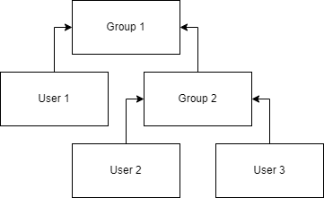
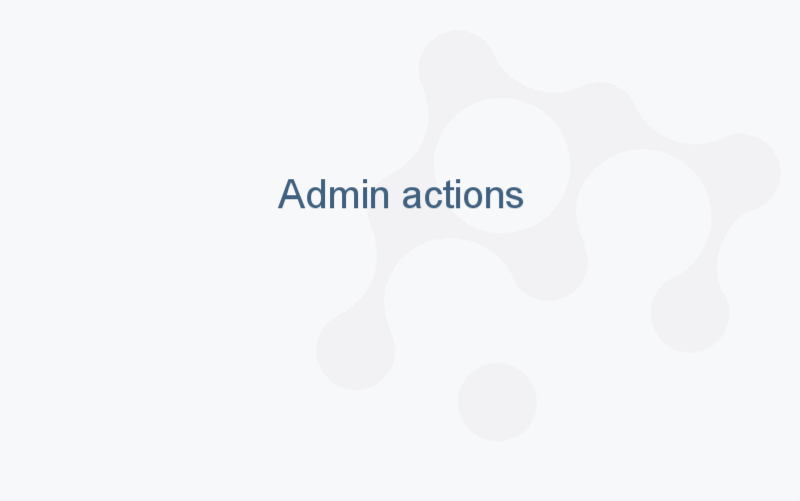

```mdx-code-block
import NewUser from '../img/create-new-user-dialog.png';
import NewServiceUser from '../img/create-new-service-user-dialog.png';
import InviteUser from '../img/invite-a-friend-dialog.png';
```

## Users

A _user_ represents the identity of a person, and is used for [group](#groups) and role
management. To view or manage users, open the [Users View](https://public.datagrok.ai/users?) (**Sidebar > Browse (<FAIcon
icon="fa-solid fa-compass"/>) > Platform > Users**).

A user is an [entity](../../datagrok/concepts/objects.md). This means a common set of
operations apply to it, like getting its URL or using it as a parameter in the
[audit record](../audit/audit.md). Like with other entities, you can [search](../../datagrok/concepts/objects.md#entity-search) for users using its [parameters](../../datagrok/concepts/objects.md#parameters).

<details>
<summary>User entity parameters</summary>

| Field       | Description                                            |
|-------------|--------------------------------------------------------|
| ID          |                                                        |
| name        |                                                        |
| login       |                                                        |
| email       |                                                        |
| createdOn   |                                                        |
| updatedOn   |                                                        |
| group       | [Group](#groups) object: User personal security group |
| author      | [User](#users) object                                 |
| starredBy   | [User](#users) object                                 |
| commentedBy | [User](#users) object                                 |

</details>

### Adding users

To create a new user: 
1. On the **Sidebar**, click **Browse (<FAIcon icon="fa-solid fa-compass"/>) > Platform > Users**.
1. Click the **NEW** button and select the option you want:

   * **New User...**: Select this option to create a user without sending an invitation to sign up. This option is typically used to create the initial admin users who can later invite other users to sign up via URL or email invitation, or add users using services like OAuth or OpenID.
     <details>
     <summary>Instructions</summary>
     1. In the **New User** dialog, enter the user's name, email, and login.
     
     1. Click **OK** to create a user.
     </details> 

   * **New Service User...**: Choose this option to create an account for scripts and integrations. To sign in as a service user, give it a key pair (see [Keypair authentication](keypair-authentication.md#ci-and-automation)).
     <details>
     <summary>Instructions</summary>
     1. In the **New Service User** dialog, enter the login for the service user.
     
     1. Click **OK** to create the service user.   
     </details>

   * **Invite a Friend...**: Select this option to email an invitation to sign up to the platform.
     <details>
     <summary>Instructions</summary>
     1. In the **Invite User** dialog, enter the email address of the user you want to invite.
     
     1. Click OK to send the invitation.
     </details>

To manage users, in the **Users View**, find the user you want, and right-click it to access available actions.

To create users and service users, you need the **Create User** [global permission](access-control.md#global-permissions).
To invite users, you need the **Invite User** permission.

### Disabling accounts

To disable a user account, go to **Browse** > **Platform** > **Users**, right-click the user,
and select **Disable...**. You need the **Edit User** [global permission](access-control.md#global-permissions),
and you can't disable your own account. The disabled user can't log in, all their active sessions
end immediately, and they won't count toward the license. 

Nothing is deleted: the assets the user owns stay available and shared the same way.
The **Disable user** dialog lists them under **Owned entities**, so you can move them to a space,
one by one or all at once with **Move all to**. Turn on Admin mode first: otherwise, the dialog warns
**Admin mode is off.**, lists only the entities shared with you, and can't move them.
You can also [share](../../datagrok/navigation/basic-tasks/basic-tasks.md#share) 
the assets with others later.  

To restore access, right-click the user and select **Enable**. The user signs in with their existing credentials.

Currently, there is no way to permanently delete a user. We are planning 
to implement it in the future versions.

### Bulk and scripted management

For scripted user lifecycle management — bulk imports, syncing with an external
identity source such as Active Directory, or seeding a fresh server — use the
[`grok s` CLI](../../develop/server-management.md). It exposes `users save`,
`users block`, `groups save`, `groups add-members`, and `groups list-members`
as idempotent shell commands that talk to the platform's public REST API.

## Groups

A _group_ is a named collection of users that share permissions. To view 
or manage groups, open the [Groups View](https://public.datagrok.ai/groups?) (**Sidebar > Browse (<FAIcon
icon="fa-solid fa-compass"/>) > Platform > Groups**).

A _group_ is an [entity](../../datagrok/concepts/objects.md), which means a common set of
operations apply to it, like getting its URL or using it as a parameter in the
[audit record](../audit/audit.md). Like with other entities, you can [search](../../datagrok/concepts/objects.md#entity-search) for groups using the group's [parameters](../../datagrok/concepts/objects.md#parameters).

<details>
<summary>Group entity parameters</summary>

You can use these fields to filter groups with smart search:

| Field       | Description                                        |
|-------------|----------------------------------------------------|
| ID          |                                                    |
| name        |                                                    |
| isPersonal  |                                                    |
| parents     |                                                    |
| members     |                                                    |
| createdOn   |                                                    |
| updatedOn   |                                                    |
| user        | [User](#users) object: User, if group is personal |

</details>

### Group structure

Every user automatically forms their own group, but groups can also consist
of multiple users and other groups. This grouping mechanism lets you
create hierarchies that mirror your organization’s structure or security
requirements. For example:

* **Group 1** has members **User 1**  and **Group 2**
* **Group 2** has members **User 2** and **User 3**
* Because **Group 2** is a member of **Group 1**, **User 2** and **User 3** are also members of **Group 1**.



  > Note: Child groups inherit [permissions](access-control.md#permissions) of the parent group.

Regardless of group membership, any user can do the following actions with respect to a group:

* Chat with group members (right-click > **Chat**)
* Request membership (right-click > **Request membership**)
* [Share entities](../../datagrok/navigation/basic-tasks/basic-tasks.md)

### Group types

Datagrok automatically creates these groups upon deployment:

| Name               | Kind                               | Purpose                                                                                     |
|--------------------|------------------------------------|---------------------------------------------------------------------------------------------|
| **All users**      | Group                              | Contains every user and group. Its [permissions](access-control.md#defaults-on-a-new-instance) apply to everyone |
| **Administrators** | [Role](#roles)                     | Holds all global permissions that **All users** doesn't have                                |
| **Admin**          | Personal group of the `admin` user | Member of **Administrators**. The `admin` user and password come from the deployment script |
| **System**         | Internal service account           | Used by the platform itself. Member of **Administrators**. Don't modify                     |

Immediately after the deployment, sign in as the `admin` user to configure the
instance. To give other people administrator rights, add them, or a group they
belong to, to the **Administrators** role.

:::danger

Exercise caution when modifying the **Administrators** role. Removing its
permissions or members without a functional replacement may result in a loss
of all administrative capabilities on the platform.

:::

Global permissions control administrative operations such as creating users,
editing groups, and changing server settings. For the full list and the
defaults, see [Global permissions](access-control.md#global-permissions). To
edit them, go to **Settings** > **Global Permissions**, or select a group or
role and, on the **Context Panel**, expand **Global Permissions** and click
**MANAGE**.

### Roles

A _role_ is a group that holds permissions rather than people. Assign a role to
groups, and every member of those groups inherits what the role grants. To
learn when to use a group and when to use a role, see
[Groups and roles](access-control.md#groups-and-roles).

To view or manage roles, go to **Sidebar** > **Browse** (<FAIcon icon="fa-solid fa-compass"/>) > **Platform** > **Roles**.

* **Create a role**: On the **Top Menu**, click the **NEW ROLE...** button.
* **Grant permissions to a role**: Select the role and, on the **Context
  Panel**, expand **Global Permissions** and click **MANAGE**. Share entities
  with the role like with any group.
* **Assign a role to a group**: Right-click the group, select
  **Properties...**, and open the **Roles** tab.
* **See who has a role**: The role's **Assigned to** tab (in the
  **Properties...** dialog) and **Assigned to** pane (on the **Context Panel**)
  list the groups and users that have it.

[Group synchronization](../../deploy/complete-setup/configure-auth.md#group-synchronization)
from an identity provider never matches roles, so a group created in the
identity provider can't grant itself a role.

### Managing groups

The following actions are available from the group's context menu (available on right-click):

* **Properties...**: Opens the group editor with these tabs:
  * **Details**: The group's name and description
  * **Members**: Add or remove members, and mark group admins
  * **Roles**: Assign [roles](#roles) to the group
  * **Belongs to**: Add the group to other groups or remove it from them
* **Request membership**: Ask the group admins to add you
* **Chat**: Chat with group members
* **Delete**: Delete a group

You can also manage members from the **Context Panel**: expand **Members** and
click **MANAGE**.

#### Creating a group

Any user can create a group. To create a group:

1. Go to **Sidebar** > **Browse** (<FAIcon icon="fa-solid fa-compass"/>) > **Platform** > **Groups**. A **NEW GROUP...** button appears on the **Top Menu**.
1. On the **Top Menu**, click the **NEW GROUP...** button to open the **Create New Group** dialog.
1. In the dialog, fill out the group's name and, optionally, description.
1. Click **OK**.

Within a group, one or more members can be assigned as group admins. Group admins can:

* add and remove members
* approve and deny membership requests
* edit group name

If user is the only admin in group, they can't leave the group or revoke their admin privileges.

#### Adding users to a group

To add users to a group, you have two options:
1. **Manually add members** (right-click the group, select **Properties...**, and open the **Members** tab)
1. Invite users to sign up via URL

If you add a member by an email address that doesn't belong to any user yet,
Datagrok creates a new user with that email.

##### Inviting users via URL

Group administrators can invite users to join a particular group via URL. This
feature is useful for onboarding multiple users simultaneously or for tracking
signups after specific events such as webinars or collaborative projects.

To create an invitation link:

1. Go to **Sidebar** > **Browse** (<FAIcon icon="fa-solid fa-compass"/>) > **Platform** > **Groups**. A **Groups View** opens.
1. In the **Groups View**, right-click the group and select **Properties...** A dialog opens.
1. Click the **Gear (<FAIcon icon="fa-solid fa-gear"/>) icon** and enter or generate a password in the **Password** field. By default, the dialog displays an autogenerated password.
1. Copy the password and use it to create an invitation link as follows:

      `<instance URL>?groupPassword=<password>`

      For example:

      `public.datagrok.ai/?groupPassword=<password>`
    
1. Copy the URL and distribute to recipients.



Only the group administrator can create an invitation link.


