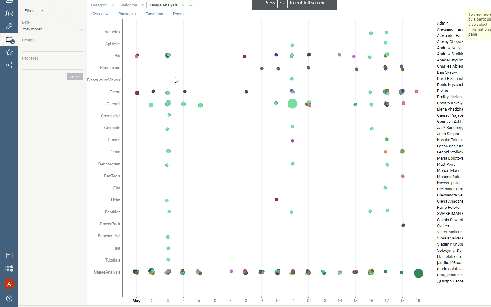
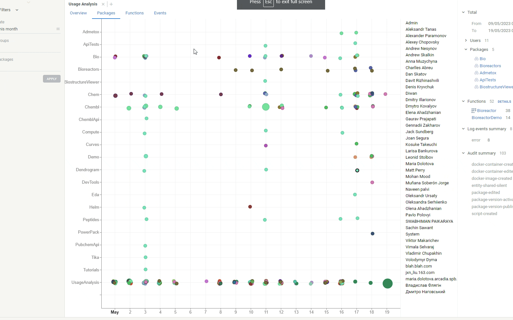

Datagrok provides a fit-for-purpose application called **Usage Analysis** for
monitoring and analyzing user activity. Built on top of Datagrok as a public
package and developed in our [public git repository](https://github.com/datagrok-ai/public/tree/master/packages/UsageAnalysis),
**Usage Analysis** is a testament to our belief in
[dogfooding](https://en.wikipedia.org/wiki/Eating_your_own_dog_food).

**Usage Analysis** offers comprehensive statistics and insights into the usage
patterns on Datagrok platform. By leveraging this app, you can better understand
how users interact with the platform and make data-driven decisions that enhance
user experience and optimize performance. 

To launch **Usage Analysis**:

1. On the [Browse tree](../../datagrok/navigation/views/browse.md), find **Usage Analysis** under **Apps**.
1. Right-click **Usage Analysis** and select **Run**.

:::note

Installing Usage Analysis adds the **Usage** widget on the [Home Page](../../datagrok/navigation/views/browse.md#home-page).

:::

## Features

The Usage Analysis app consists of several tabs, each providing unique insights
into platform usage:

1. **Overview**: Serves as the central hub for understanding the overall usage
   trends. It provides a holistic view of platform usage through, allowing you
   to:
   * View period-on-period changes in new and active users and and selected user
     activity
   * Track the number of unique users over time
   * Compare package usage and users by their activity.
1. **Packages**: Lets you analyze user activity across
   [plugins](../../datagrok/plugins.md). This data is visualized on a an
   interactive [scatterplot](../../visualize/viewers/scatter-plot.md), making it easy to identify the most popular packages and or find the ones that need attention.
1. **Functions**: Similar to the **Packages** tab in design, the **Functions** tab helps you analyze how users engage with specific [functions](../../datagrok/concepts/functions/functions.md). By analyzing this data, you can:
   * Identify the most frequently used functions
   * Pinpoint areas of high or low user engagement
   * Tailor Datagrok's functionalities accordingly
1. **Events**: Lets you drill down into platform events:
    * **Sources**: A [line chart](../../visualize/viewers/line-chart.md) visualizes
      the sources of events, with each event color-coded. Using this chart, you can
      identify where the majority of activities originate.
    * **User events**: A [scatterplot](../../visualize/viewers/scatter-plot.md) visualizes events specific to individual users, allowing you to track their activity history and understand their usage patterns better.
1. **Log**: A table lists all log events, which you can filter by user and source.
1. **Projects**: Provides insights into how users interact with projects on the platform:
    * **Scatterplot** shows a timeline of access events per project. The tooltip displays `access_count`, the number of times a project was opened.
    * **Unique Users Per Project**: A [barchart](../../visualize/viewers/bar-chart.md) displays the number of distinct users who accessed each project over the given period.
    * **Access Frequency Daily**: A table lists projects accessed more than once per day by at least one user:
       * **AVG Unique Users Daily** – the average number of such users per day
       * **Days Between Access** – the average time gap between project openings by different users.
<!--
1. **Tests**: Provides a holistic overview of automated test execution
1. **Errors**: Visualizes error events-->

### Native Datagrok capabilities

Like other Datagrok apps, **Usage Analysis** leverages many of Datagrok capabilities:
* [Global filters](../../visualize/viewers/filters.md): Interact with usage data by focusing your analysis on a specific date range, user groups, or packages.

   
* [Interactive viewers](../../visualize/viewers/viewers.md): Datagrok viewers are synchronized and interactive. Clicking a datapoint on a scatterplot or selecting a category on a bar chart, lets you drill down into details.

   
* [Context-driven details](../../datagrok/navigation/panels/panels.md#context-panel): When you
  interact with data, such as clicking a datapoint on a scatterplot, the
  **Context Panel** on the right updates with relevant details. For higher-level
  tabs, such as **Packages**, clicking a datapoint on a scatterplot not only
  displays relevant information in the **Context Panel** but also provides a
  seamless way to navigate to other tabs for more specific information.

   
