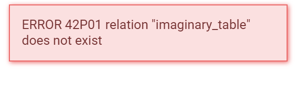
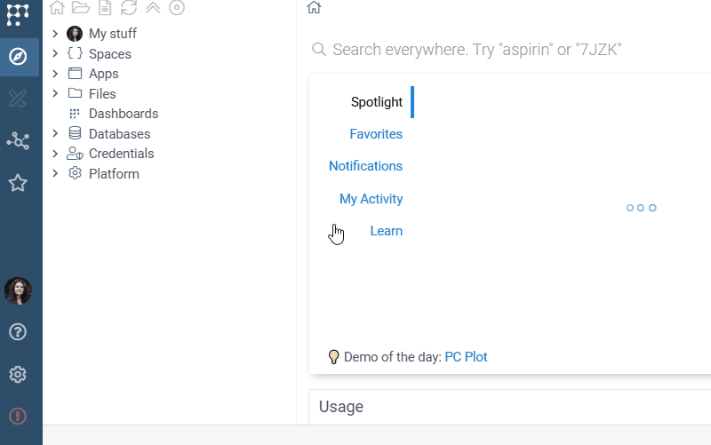
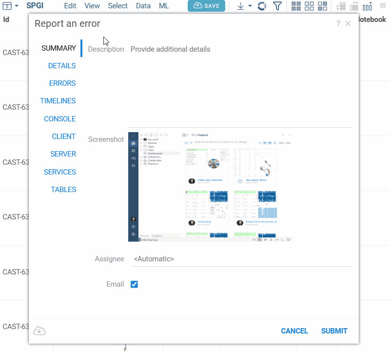
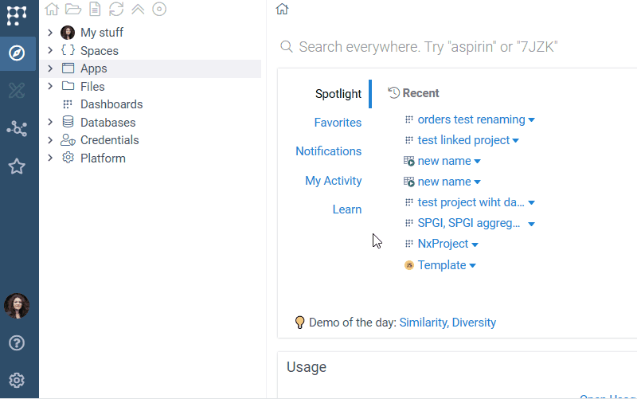
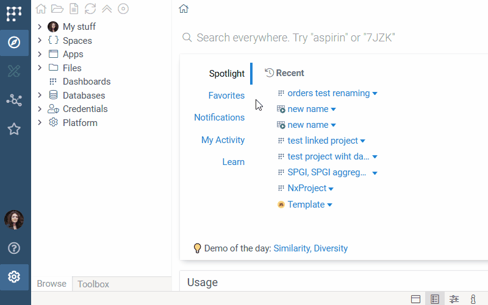

```mdx-code-block
import Tabs from '@theme/Tabs';
import TabItem from '@theme/TabItem';
```

Datagrok includes a built-in error reporting system that lets you report issues directly from the platform. It automatically collects logs, system state, and your actions, so you don’t need to do any manual reporting. Reports are sent to the Datagrok support team via email (see the [Configuring error reporting system](#configuring-error-reporting-system) section) and processed promptly to resolve issues quickly and efficiently.

## Full control over what you share

Before sending, you can review the report and remove any sensitive information.
By default, it includes metadata, general context, and a screenshot — no actual data.
You can remove the screenshot before sending.
For open tables, you can control the level of detail: include data, only metadata, or just the title, row and column count.

Sending reports helps keep Datagrok stable and convenient, while keeping your data safe.

## Report an error

1. Open the **Report an error** dialog in one of two ways:  
   - Hover over the **red message box** that appears when an error occurs and click the **Report** icon.  
   - Click the **red exclamation mark icon** in the **Sidebar**. 
   <details>
   <summary>See visual</summary>
   <Tabs groupId="exceptions">
  
   <TabItem value="handled" label="Error message">
  
    
  
   </TabItem>
  
   <TabItem value="unhandled" label="Sidebar icon">

    

   </TabItem>
   </Tabs>
   </details>
2. The **Report an error** dialog opens with diagnostic information already collected.  
3. Review the report. You can:
   - Add a short note describing what happened.  
   - Remove the screenshot if it contains sensitive information.  
   - Keep the **Email** checkbox selected to send the report to the specified email address(es) (see [Configuring error reporting system](#configuring-error-reporting-system)).
   - For each open table, choose what information to include in the report:  
     - data and metadata  
     - only metadata  
     - just the table’s title, row count, and column count (included by default)  
   - Review other information before submitting.  
4. Press **Submit** to send the report.  

:::note Note
If the **Email** checkbox is not selected, the report is stored internally and can be viewed in the **Reports** application (Browse > Apps > Admin > Reports) on your instance.
:::

:::note  If external sending is not configured
If external sending is not configured, you can save the report as a JSON file using the **Save as JSON** icon and share it with the support team at support@datagrok.ai.
:::



## Submit feedback

You can share suggestions, ask questions, provide usability comments,  
request new features, or report an issue through **Feedback**:

1. Open **Datagrok Logo Menu > Help > Feedback**.  
2. Write your message.  
3. Optionally, include logs.  
4. Click **OK**.  

<details>
<summary>See visual</summary>



</details>


## Auto-reports

You can enable the auto-reporting system to log internal errors automatically (see [Configuring error reporting system](#configuring-error-reporting-system)).  
This helps track recurring issues, monitor system stability, and analyze errors locally within your instance.  

Reports are **never sent externally** and can be viewed in the **Reports** application (Browse > Apps > Admin > Reports) on your instance.

## Configuring error reporting system

Administrators can configure error reporting under **Settings > Admin > Error reporting**:

- **Report email:** Specify one or more email addresses (comma-separated) to receive user-submitted reports. `feedback@datagrok.ai` is recommended.
- **Auto report errors:** Enable to automatic logging of internal exceptions.



## Other ways to provide feedback

- Ask questions or provide suggestions on the [community forum](https://community.datagrok.ai/).  
- Report plugin-related issues on [GitHub](https://github.com/datagrok-ai/public/issues) by creating an issue.  

