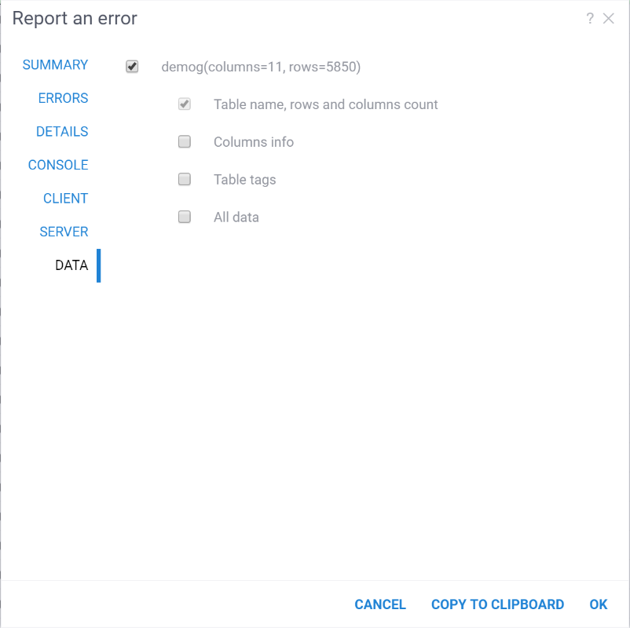

A bug report functionality is a critical feature in software development and maintenance. 
It allows users, testers, or developers to report issues they encounter while using the Datagrok.

## Exceptions

Exceptions are events that occur during the execution of the Datagrok that disrupt the normal flow of 
instructions. They can be categorized into two types: handled exceptions and unhandled exceptions.

### Handled exceptions

Handled exceptions are managed by the platform itself. Such exceptions are displayed in the special red message boxes.
They can be reported by hovering the mouse cursor over the message box and clicking 'Report' icon.

### Unhandled exceptions

These are exceptions that are not processed by the platform and are of particular interest,
because they are caused by errors in the Datagrok code. Exceptions of such a type are shown in
right-side panel under the **Settings** and can be reported by clicking on the exclamation mark icon.

## Report dialog

The report dialog consists of several tabs with information from various services and components with which the user 
interacted in the last few minutes. The dialog can be submitted as it is or some inputs and information can be edited.
User also can add opened tables to the report using **Data** tab. Also, only particular information can be included, 
but the title, rows and columns count will be added by default when the table is selected.

### Submitting report

When the report is submitted it will be sent to the Datagrok server and analyzed if there were reported similar exceptions.
If there weren't the report will be sent to the emails that are specified in the **Settings** > **Admin** > **Report email**.
The report in any case will be saved and available in the **User reports** tab of the [Usage Analysis](./usage-analysis.md) for 
further analysis by developers and administrators.
