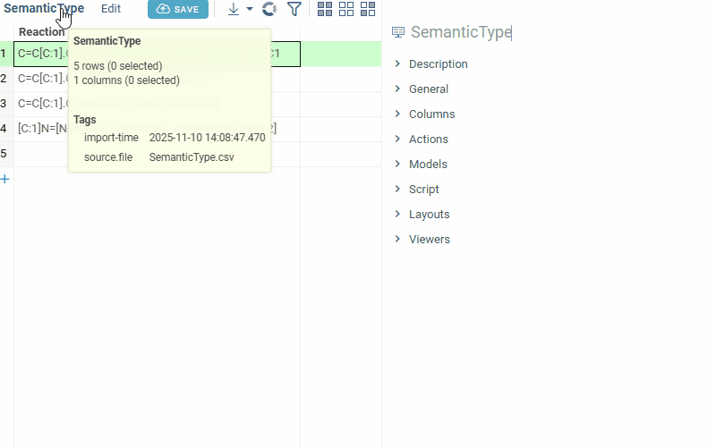
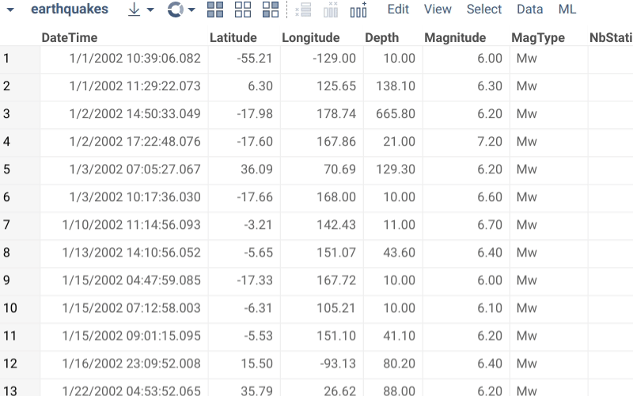

Unlike Excel, table columns in Datagrok are strongly-typed, meaning all cells are of one of the predefined data
types (`string`, `int`, `bigint`, `qnum`, `double`, `datetime`, `bool`). In addition to that, a column might also have
semantic type associated with it. Semantic type identifies the meaning of the data. For instance, a column could be of
the data type "string", but the semantic type would be "country".

Semantic types are used in several ways:

* **Rendering.** It is possible to define a custom renderer defined for the semantic type. For instance, in
  the `#{x.Demo:Smiles}` project strings with the semantic type "molecule" get rendered as chemical structures.
* **Viewers.** Some viewers, such as Map, use semantic type to determine whether a viewer can be visualized against
  specific datasets, as well as for the initial choice of columns to visualize.
* **Functions.** Function parameters could be annotated with the semantic type. This is used for automatic suggestions
  of applicable functions.
* **Predictive models.** Just like functions, semantic type annotations are used to determine whether or not a model is
  applicable to the dataset.

A column can have only one semantic type. It is stored in the [column tags](tags.md#quality) and can be either detected
automatically by semantic type detectors or set manually.

## Manually setting semantic types

Open the **Context Panel** and go to the **Details** tab to set the 'Semantic type' field.
Alternatively, open column properties (click a column and press F2, or right-click the column and select **Column Properties...**) and set the `quality` and `cell.renderer` [tags](tags.md).

## Automatic semantic type detection

Out of the box, the following semantic types are automatically detected based on the content:
| Semantic type           | Value             | Required plugins        |
|-------------------------|-----------------|------------------------|
| **Cheminformatics types** |                 |                        |
| Molecule                | `Molecule`        | [Chem](https://github.com/datagrok-ai/public/tree/master/packages/Chem)                   |
| Substructure | `Substructure`         | [Chem](https://github.com/datagrok-ai/public/tree/master/packages/Chem)                   |
| Chemical mixture (Mixfile format)       | `ChemicalMixture`  | [Chem](https://github.com/datagrok-ai/public/tree/master/packages/Chem)                   |
| **Bioinformatics types** |                 |                        |
| Macromolecule           | `Macromolecule`    | [Bio](https://github.com/datagrok-ai/public/tree/master/packages/Bio)                    |
| HELM                    | `HELM`             | [Bio](https://github.com/datagrok-ai/public/tree/master/packages/Bio)                    |
| Phylogenetic trees                  | `Newick`           | [Bio](https://github.com/datagrok-ai/public/tree/master/packages/Bio)                    |
| Molecule 3D             | `Molecule3D`       | [Biostructure Viewer](https://github.com/datagrok-ai/public/tree/master/packages/BiostructureViewer)     |
| PDB identifiers           | `PDB_ID`           | [Biostructure Viewer](https://github.com/datagrok-ai/public/tree/master/packages/BiostructureViewer)     |
| **General types**        |                 |                        |
| Text                    | `Text`             | -                      |
| Duration                | `Duration`         | -                      |
| Gender                  | `Gender`           | -                      |
| Money                   | `Money`            | -                      |
| Image                   | `Image`            | -                      |
| File                    | `File`             | -                      |
| URL                     | `URL`              | -                      |
| IP address              | `IP Address`       | -                      |
| **Contact information**  |                 |                        |
| Email           | `Email Address`    | -                      |
| Phone number            | `Phone Number`     | -                      |
| **Geographic data**      |                 |                        |
| City                    | `City`             | -                      |
| Country                 | `Country`          | -                      |
| State                   | `State`            | -                      |
| County                  | `County`           | -                      |
| Place name              | `Place Name`       | -                      |
| Zip code                | `Zip Code`         | -                      |
| Area code               | `Area Code`        | -                      |
| Street address          | `Street Address`   | -                      |
| Latitude                | `Latitude`         | -                      |
| Longitude               | `Longitude`        | -                      |
| **Specialized types**    |                 |                        |
| Curve data              | `fit`              | [Curves](https://github.com/datagrok-ai/public/tree/master/packages/Curves)                 |
| PNG images               | `rawPng`           | [Power Grid](https://github.com/datagrok-ai/public/tree/master/packages/PowerGrid)                 |
<!--| Chemical reaction       | 'ChemicalReaction' | [Chem](https://github.com/datagrok-ai/public/tree/master/packages/Chem)                   |-->

## Custom semantic types

Datagrok has been designed to be as extensible as possible, so naturally it is possible to define your own custom
semantic types, along with the type auto-detection functions, renderers, comparers, and so on. To do that, check
out [this article](../../develop/how-to/functions/define-semantic-type-detectors.md)
.

See also:

* [Metadata](../../datagrok/concepts/objects.md#metadata)
* [JavaScript development](../../develop/develop.md)
* [How to define semantic type detectors](../../develop/how-to/functions/define-semantic-type-detectors.md)
