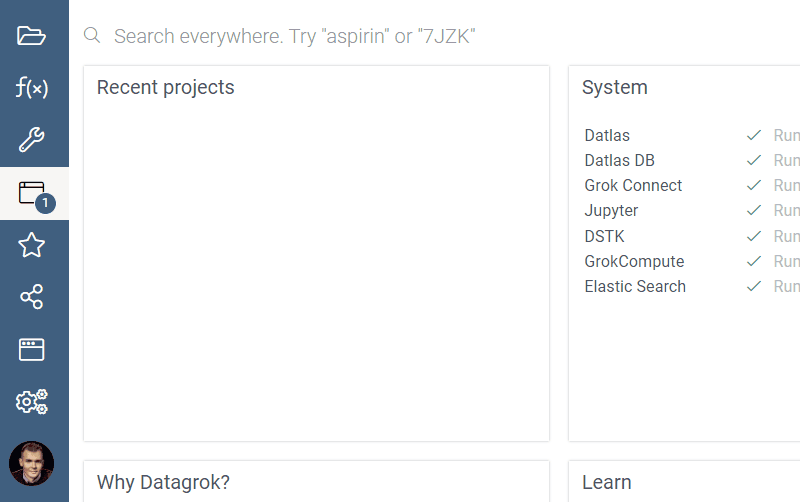
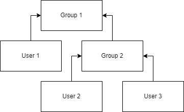
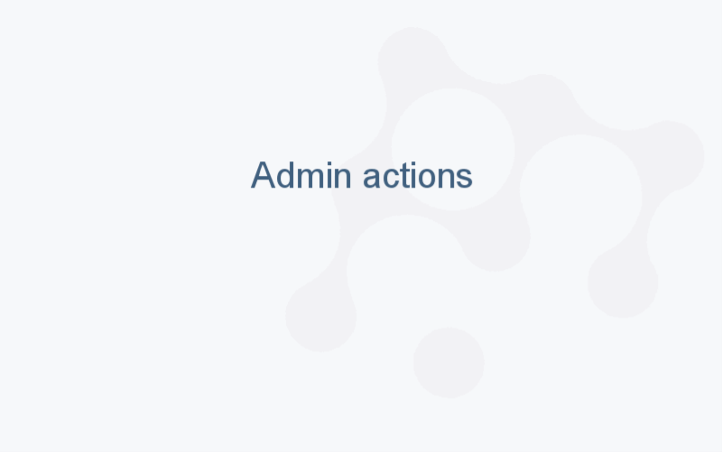

<!-- TITLE: User group -->
<!-- SUBTITLE: -->

# User group

Datagrok has a flexible mechanism for grouping users together:

A user can belong to more than one group. A group can be included in another group, which is useful for both reflecting
organization hierarchy and implementing role-based [security](security.md).

Example: **User 1** is member of **Group 1**. **User 2** and **User 3** are also members of **Group 1**, because they're
members of **Group 2**, which have membership in **Group 1**:

In addition to that, there are some actions that are applicable to user groups:

* Chat with the group of user
* Request membership
* Share entities

## Group admin

Within a group, one or more members can be assigned as admins. This means they can:

* add / remove members
* approve / deny membership requests
* edit group name

If user is the only admin in group, he / she can't leave group or revoke his / her admin privileges.

## Requesting a membership

To request a membership, right-click on a group and choose "Request membership". A request will be sent
to [group admin](group.md#group-admin). Once it is approved or declined, a notification will appear in the
[notification panel](user.md#profile). [Audit record](audit.md) is created for both request and a resolution.

## Granting membership via URL

Datagrok supports granting membership via URL. You can invite unlimited users
outside the Datagrok instance to join a particular group. You can also apply
this functionality to track a cohort of users who access the platform via a
specific link, for example, after watching a demo.

### Create an invitation link

1. Go to **Manage** > **Groups**.
1. Right-click the group and select **Edit…**. A dialog opens.
1. To generate a password, click the button next to the **Password** field. The
   dialog displays an autogenerated _password_.
1. Copy the _password_ and use it to create an invitation link as follows:

   `<instance URL>?groupPassword=<password>`

   For example:

   `public.datagrok.ai/?groupPassword=w0TDE6RcpH8XO0ZIBSauVLos`

 >Note: Only the group administrator can create an invitation link.

## Groups as roles

Authorization system is based on user groups. There are one group called "All users", that contains all users by default
and unlimited quantity of other groups:

All groups can be a member of any other group, but circular membership is forbidden. Each user has a personal security
group, which called by the name of the user, so it can be added to any other security group.

A [user group](group.md) might have a number of rules associated with it. A rule applies to all members of the group and
grants a privilege to a list of [entities](../datagrok/objects.md) of the specified type that pass a
[specified filter](#defining-entities-for-a-rule). You can think of a group with defined privileges as a 'role'.

## Defining entities for a rule

There are three ways to define entities for a rule (filters 1 and 2 can be combined):

1. specified entity
2. entities marked with a specified tag
3. entities of the specified type

## Examples

This system lets us easily setup access rights for groups of people and subsets of entities. Here are some examples:

* Let David edit the 'demographics' dataset
* Create role 'Chemists' (a group with rules but no members)

* Let Chemists view any entities marked with the 'chemistry' tag
* Let Chemists execute queries marked with the 'chemistry' tag

## Filtering

You can use these fields to filter groups with [smart search](../datagrok/smart-search.md):

| Field       | Description                                        |
|-------------|----------------------------------------------------|
| ID          |                                                    |
| name        |                                                    |
| isPersonal  |                                                    |
| parents     | GroupRelation object (see below)                   |
| children    | GroupRelation object (see below)                   |
| createdOn   |                                                    |
| updatedOn   |                                                    |
| user        | [User](user.md) object: User, if group is personal |

### Grouprelation

| Field       | Description                                        |
|-------------|----------------------------------------------------|
| isAdmin     |                                                    |
| parent      | Group object                                       |
| child       | Group object                                       |

See also:

* [Users](user.md)
* [Security](security.md)
