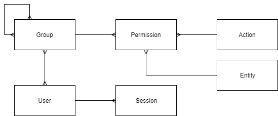
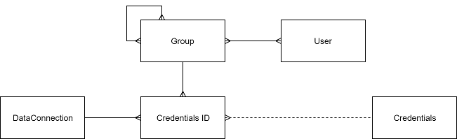

<!-- TITLE: Security -->
<!-- SUBTITLE: -->

# Security overview

Datagrok uses a flexible mechanism for setting up privileges and access rights for
all [entities](../overview/objects.md), largely based on [RBAC](https://en.wikipedia.org/wiki/Role-based_access_control)
. It lets you define [user groups](../govern/group.md) and associate them with permissions for different entities.
Permission sets are different for each entity type, for instance, a
"package" entity has "publish" and "edit" privileges, while a "query" entity has "execute" and "
edit" privileges. To fully control access to external resources, groups can also be associated with
[credentials](#credentials) to access these resources.

Every entity has associated permissions that can be granted to a [user](user.md) or to a [group](../govern/group.md).
Groups have a hierarchical structure, so any group or user can be added to another group. For convenience, a "personal"
group gets automatically created for every user in a system.

Authentication and authorization are central parts of the security system.

* [Authentication](authentication.md) is the process of logging on to Datagrok by which a principal requests access by
  submitting credentials that the server evaluates. Authentication establishes the identity of the user or process being
  authenticated.

* [Authorization](authorization.md) is the process of determining whether a specified operation can be executed against
  the specified entity in the current context.

When an entity is created, by default only the author can access it. In order to share it with other users, you need to
grant permission. Typically, you would do it by right-clicking on an entity and choosing "Share", which will open
the [share dialog](../collaborate/sharing.md).

## Privileges

Granting permissions to groups rather than to users simplifies security administration. Permission sets assigned to a
group are inherited by all members of the group. Groups can be nested, however, circular membership is forbidden. Group
memberships and members can be edited using
[memberships](edit-group-memberships.md) and [members](edit-group-members.md) dialogs.

[Role-based model.drawio](../uploads/security/role-based-model.drawio)

## Credentials

The built-in credentials management system keeps and protects data connections credentials.

A credential is something that contains sensitive information used to connect to a resource. For database connections,
this is typically a login/password pair. For web services, it is often a token, or a private key.

Each credential is associated with a group and a connection. When a particular user accesses a resource, the system
automatically chooses the appropriate credential. Depending on a connection, the call to the external service will be
performed either on the server or on the client-side. For client-side calls, the credential needs to be retrieved from
the server first. Some systems are only meant to be accessible from the server side, so as an additional security
measure, they should have the "server-side only" flag set to true, which prevents retrieval of that credential by the
client-side.

Encrypted credentials are stored in the special [storage](#credentials-storage).

[Entities diagram.drawio](../uploads/security/credentials-entities-diagram.drawio)

### Credentials storage

For security reasons, all external credentials are stored in a separate database and encrypted with the platform key
generated during deployment. By compromising only one of the systems, the attacker still won't be able to get the
credentials. For that reason, it makes sense to administer these systems separately.

If a specialized credential vault already stores sensitive credentials for your organization, the Datagrok platform
should be set up to take advantage of it.

*Credentials retrieving process diagram* ([drawio](../uploads/security/credentials-fetch-diagram.drawio))

Working with credentials storage,
sample: [open at public repository](https://github.com/datagrok-ai/public/blob/master/packages/ApiSamples/scripts/misc/package-credentials.js)
; [open at Datagrok](https://public.datagrok.ai/e/ApiSamples:PackageCredentials).

To store credentials in Datagrok's Credentials Storage programmatically, send a POST request
to `$(GROK_HOST)/api/credentials/for/$(PACKAGE_NAME)` with raw body containing JSON, such
as `{"login": "abc", "password": "123"}`, and
headers `{"Authorization": $(API_KEY), "Content-Type": "application/json"}` (the API key should be taken from your
profile page in Datagrok, e.g., [https://public.datagrok.ai/u](https://public.datagrok.ai/u)). To manually add
credentials from the user interface, right-click on a package of interest in
Datagrok's [Packages](https://public.datagrok.ai/packages) view, select "Credentials..." dialog, and pass on credentials
key-value pairs.

See also:

* [Entities](../overview/objects.md)
* [Groups](group.md)
* [Authentication](authentication.md)
* [Authorization](authorization.md)
