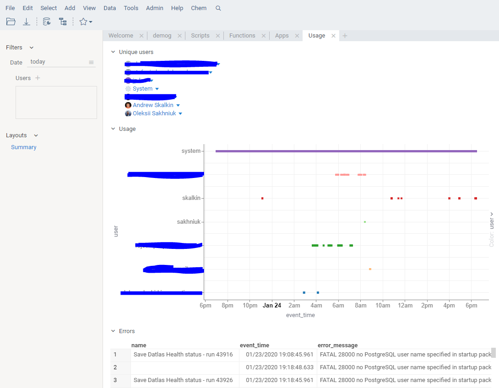

<!-- TITLE: Usage Analysis -->
<!-- SUBTITLE: -->

# Usage analysis

Datagrok is a universal data platform that enables users to perform broad range of tasks, ranging from the self-service
data analytics to using custom applications on top of the platform. In this environment, it is important to understand
how exactly the platform is being used. Here are some of the reasons for doing so:

* UX improvements
    * Remove unused menu items, etc
* Understanding your users better
    * Cluster usage by usage patterns
    * Correlate usage patterns with the organizational groups
* Data history tracking
    * Track origin of datasets
    * See history of modifications
    * See all actions performed with an object (Activity tab)
* Performance analysis
    * See how long each operation takes
* Function usage analysis
    * Analyze function usage as a table of users, timestamps, inputs and outputs
* Error tracking
    * See all errors across the platform
    * See which actions are causing the errors

Logs are stored in a [Postgres database](../develop/admin/architecture.md#database) in a form that allows for easy
analysis of event parameters (See the following tables: `events`, `event_types`,
`event_parameters`, `event_parameter_values`). Each event is associated with a user session that triggered the event.

## Client-based activity

Due to the unique technology used in Datagrok (such
as [in-memory database](../develop/advanced/performance.md#in-memory-database))
, a significant part of the users activity happens completely on the client side, not using the server at all. This
includes things like opening local files, aggregating tables, adding [viewers](../visualize/viewers.md), etc. Still,
each action a user performs generates an internal named event in the platform. These events are used for multiple
purposes:

* Integration between different Datagrok components
* Ad-hoc customizations and extension by plugins
* Logging

A reasonable default set of client-based actions gets logged. For instance, we log opening a file and its name, but not
content. We do not log less important things like "rows selected", although there are ways to override the default
behavior. This could done by writing a script using the [JS API](../develop/js-api.md), and logging the event in the
event handler. This [sample](https://public.datagrok.ai/js/samples/ui/ui-events)
demonstrates how to do it.

It's also possible to create a custom event and log it explicitly from a plugin.

To see all events generated by the client, open `Tools | Dev | Inspector`, and go to the "Client logs" tab. Please note
that this is an internal tool for developers.

## Server-related actions

When an action does something on a server that modifies the server's state in any way, in addition to the log file it
gets recorded in the audit. This is what you see under the "Activity" tab in the property panel.

By default, each [script](../compute/scripting.md) execution gets logged, along with the parameter values. High-level
overview of the usage is available under the "Usage" tag:

## Usage analysis application

Besides the above-mentioned tools, we have developed a specialized application for usage analysis. Since we are big
believers in [dogfooding](https://en.wikipedia.org/wiki/Eating_your_own_dog_food), naturally this application is built
on top of Datagrok as a public package. Moreover, it is being developed in
our [public git repository](https://github.com/datagrok-ai/public/tree/master/packages/UsageAnalysis)
.

To run it (assuming you have the right privileges), open our app store (`Admin | Apps`), and launch "Usage Analysis".

