The predictive modeling toolkit allows an interactive visualization tool for the models. 

There are a lot of cases when models do not have a lot of parameters and could be trained relatively fast. For such situations Datagrok builds a UI for the model: it has all the parameters that model uses. The user has the ability to change parameters, and model will be retrained, providing user with visualizations


## Workflow

To start setting up model, we start with the data configuration. First, we select table to work with, then we have to choose target column and feature columns.

When data is selected, we have established the predictive problem. To start working on the solution, we have to configure model engine (source of model or model architecture), and then configure model hyperparameters. Datagrok automatically builds UI that updates model after parameters are changed. So it allows to use Datagrok as interactive playground for modeling.

### Model auto-selection and auto-configuration

Having access to data, Datagrok can suggest models based on the data structure. It suggest list of models that match the feature columns, but also selects the best matching model from the list.


### Tips as you go

Datagrok analyses data that is used for the prediction and model predictions themselves.
Based on the situation, the platform can suggest data transformations or changes to model configurations or give insights.

Examples of such behavior include:
* If data is imbalanced, Datagrok shows the imbalanced columns
* For data with missing values, Datagrok suggests to ignore rows with missing values or to use Missing Values Imputation
* For binary classification Datagrok will analyze false positive and false negatives.

| Class imbalance | Ignore missing values | Low precision |
|---|---|---|
| 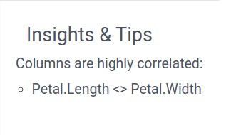 | 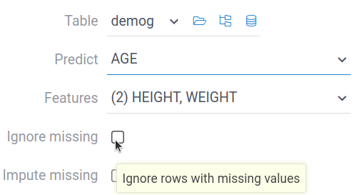 |  |


### Model comparison

Datagrok allows users to play with models by changing parameters on the go. To avoid losing good parameters found during testing, models can be saved to the model comparison tool.

Model comparison tool saves model parameters, so they can be returned to later. So user can get to the best model configurations and save only it.

(Small GIF)

## Visualizations

Datagrok supports extensive list of visualizations, that are shown based on the problem context. For the table, we use $X$ as a notation for the list of columns, and $y$ for the target column. 

| Visualization                | Description                                                                 | Showed for               | Example | Read more                                                                                  |
|------------------------------|-----------------------------------------------------------------------------|--------------------------|---------|-------------------------------------------------------------------------------------------|
| Scatter Plot (regression)    | Visualizes predicted vs actual values.                                      | Regression problems ($y$ is numerical)     | 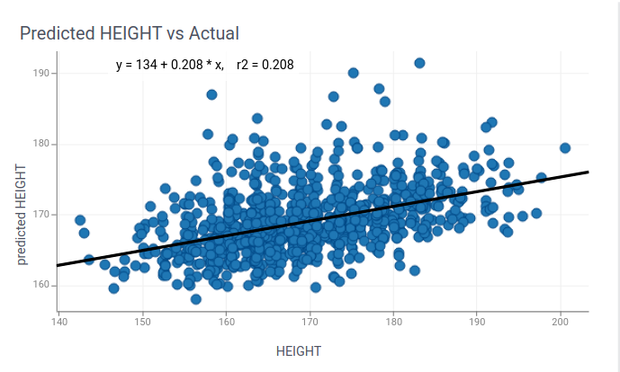  |                                                                                           |
| Residuals plot               | Shows the difference between prediction and the real value.                | Regression problems ($y$ is numerical)     | 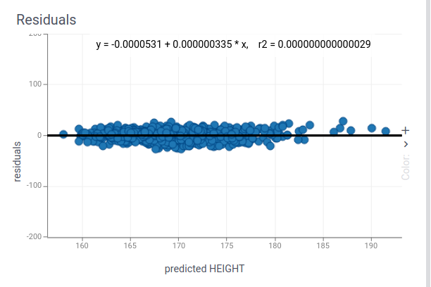     | [Errors and residuals](https://en.wikipedia.org/wiki/Errors_and_residuals)                |
| Scatter plot (classification)| Visualizes predicted vs actual values using colors for classes.            | Classification problems ($y$ is categorical) | 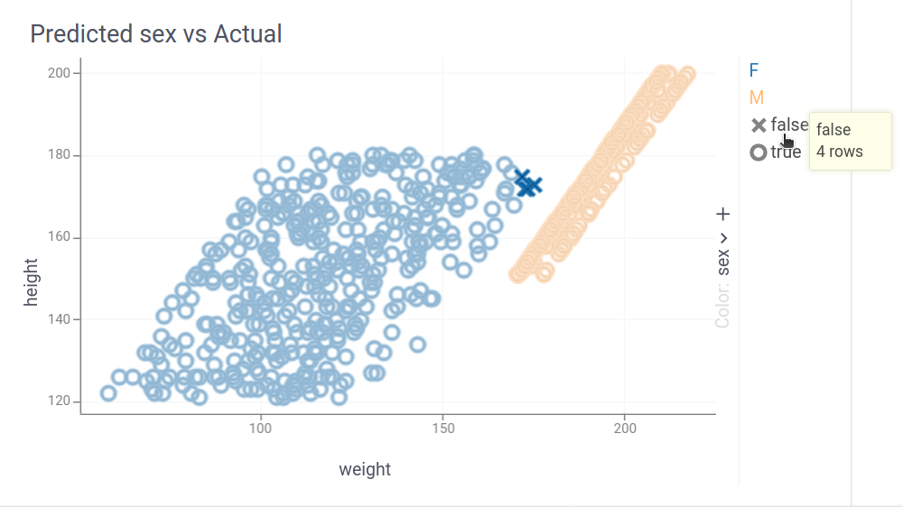      |                                                                                           |
| Roc Curve                    | Displays trade-offs between true/false positive rates for classifiers.     | Binary classification problems ($y$ is categorical with 2 classes) | 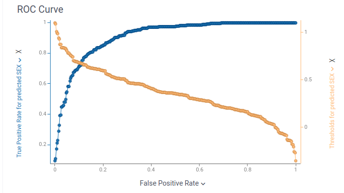      | [ROC curve](https://en.wikipedia.org/wiki/Receiver_operating_characteristic)              |
| PC Plot                      | Parallel coordinates plot.         | $X$ has more than 2 and less than 11 numerical columns                       | 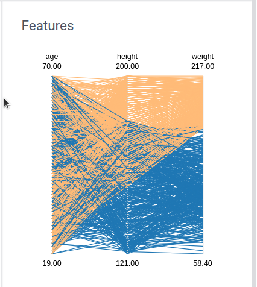      |                                                                                           |
| Statistics                   | Statistics of the $y$ column                          | Regression problems ($y$ is numerical)          | 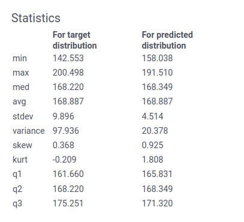      |                                                                               |
| Distribution                 | Shows the distribution of predicted values, and distribution of values in $y$.      | Regression problems ($y$ is numerical)                       | 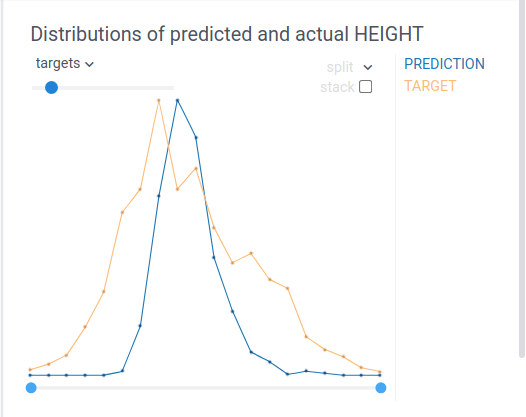      | Kurtosis skewness analysis                                                                                      |
| Confusion matrix             | Each row of the matrix represents the instances in an actual class while each column represents the instances in a predicted class. Also shows relevant metrics.  | Classification problems ($y$ is categorical)  | 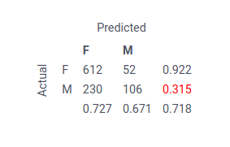     | [Confusion matrix](https://en.wikipedia.org/wiki/Confusion_matrix)                        |
| Correlation plot             | Shows feature interdependencies                 | $X$ has more than 10 numerical columns      |    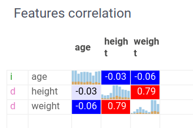 |                                                                                         |
| Performance metrics          | Aggregated performance statistics (e.g., R², accuracy).                    | Always          | 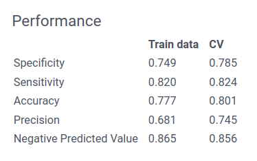     |                                                                                           |
| Wrong predictions            | Highlights incorrectly classified instances of the data. | Classification problems ($y$ is categorical) | 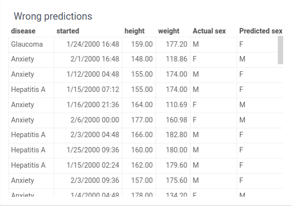      |                                                                                           |
| Custom visualizations        | Enables package-defined visualizations for specific models.                    | Specific models          | --      |                                                                                           |


### Roc curve

Receiver operating characteristic curve, i.e. ROC curve, is a graphical plot that illustrates the diagnostic ability of
a binary classifier system as its discrimination threshold is varied.

The ROC curve is created by plotting the true positive rate (TPR) against the false positive rate (
FPR) at various threshold settings. The true-positive rate is also known as sensitivity, recall or probability of
detection in machine learning. The false-positive rate is also known as the fall-out or probability of false alarm and
can be calculated as (1 - specificity). The ROC curve is thus the sensitivity as a function of fall-out.

ROC analysis provides tools to select possibly optimal models and to discard suboptimal ones independently from
(and prior to specifying) the cost context or the class distribution. ROC analysis is related in a direct and natural
way to cost/benefit analysis of diagnostic decision making.

### Confusion matrix

Confusion matrix, also known as an error matrix, is a specific table layout that allows visualization of the performance
of an algorithm, typically a supervised learning one (in unsupervised learning it is usually called a matching matrix).
Each column of the matrix represents the instances in a predicted class while each row represents the instances in an
actual class (or vice versa). The name stems from the fact that it makes it easy to see if the system is confusing two
classes (i.e. commonly mislabelling one as another).

It is a special kind of contingency table, with two dimensions ("actual" and "predicted"), and identical sets of "
classes" in both dimensions (each combination of dimension and class is a variable in the contingency table).


### Custom visualizations

For the custom models, it is possible to define custom viewers using the JS API. It requires a setup by the rules to similar described in [custom models guide](./custom-machine-learning-models.md).

```js

//name: visualize
//meta.mlname: $MODEL_NAME
//meta.mlrole: visualize
//input: dataframe df
//input: column targetColumn
//input: column predictColumn
//input: dynamic model
//output: dynamic widget
export async function visualize(df: DG.DataFrame, targetColumn: DG.Column, predictColumn: DG.Column, model: any): Promise<any> {
  let view : DG.JSViewer = new DG.JSViewer();
  return view.root;
}
```

Such viewers will be automatically added to the interactive training view