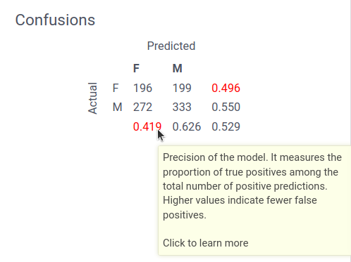

The predictive modeling toolkit allows an interactive visualization tool for the models. 

Many classical ML models can be trained quickly. In these cases, Datagrok creates a UI displaying all model parameters.

Such approach is particulary useful for quick prototyping and data analysis. Datagrok automatically analyses data and predictions to provide user with the most relevant models and insights. So, all the machine learning is done automatically. User then has all the tools to analyze the results and continue exploring problem with the guide of the platform.


## Workflow

Model setup begins with data configuration. First, we select a table to work with, then we have to choose a target column and feature columns.

Selecting data establishes the predictive problem. Next, configure the model engine (e.g., its source or architecture) and hyperparameters. Datagrok dynamically updates the model as parameters are adjusted. This makes Datagrok an interactive playground for modeling.

### Model autoselection and autoconfiguration

Based on the data structure, Datagrok suggests suitable models. Datagrok provides a list of models that match the data and selects the best one.


### Tips as you go

The platform suggests data transformations, model configuration changes, or insights based on the situation.

For example, Datagrok may:
* Show correlated columns
* Suggest handling of missing values
* Analyses false positive and false negative errors for binary classification problem.

| Class imbalance | Ignore missing values | Low precision |
|---|---|---|
|  |  |  |


### Model comparison

Datagrok allows users to play with models by changing parameters on the go. To preserve effective configurations, models can be saved to the comparison tool.

The comparison tool stores model parameters for future reference. This ensures users can identify and save only the best configurations.

## Visualizations

Datagrok offers a wide range of context-aware visualizations. In tables, $X$ represents feature columns and $y$ denotes the target column. 

| Visualization                | Description                                                                 | Showed for               | Example | Read more                                                                                  |
|------------------------------|-----------------------------------------------------------------------------|--------------------------|---------|-------------------------------------------------------------------------------------------|
| Scatter Plot (regression)    | Visualizes predicted vs actual values.                                      | Regression problems ($y$ is numerical)     |   |                                                                                           |
| Residuals plot               | The difference between prediction and the real value.                | Regression problems ($y$ is numerical)     |      | [Errors and residuals](https://en.wikipedia.org/wiki/Errors_and_residuals)                |
| Scatter plot (classification)| Visualizes predicted vs actual values using colors for classes.            | Classification problems ($y$ is categorical) |       |                                                                                           |
| Roc Curve                    | Trade-offs between true/false positive rates for classifiers.     | Binary classification problems ($y$ is categorical with 2 classes) |       | [ROC curve](https://en.wikipedia.org/wiki/Receiver_operating_characteristic)              |
| PC Plot                      | Parallel coordinates plot.         | $X$ has more than 2 and less than 11 numerical columns                       |       |                                                                                           |
| Statistics                   | Statistics of the $y$ column                          | Regression problems ($y$ is numerical)          |       |                                                                               |
| Distribution      |            Distribution of the predicted values, and distribution of values in $y$.      | Regression problems ($y$ is numerical)                       |       |                                                                                  |
| Confusion matrix             | Rows represent actual classes, columns represent predicted classes, and relevant metrics are displayed.  | Classification problems ($y$ is categorical)  |      | [Confusion matrix](https://en.wikipedia.org/wiki/Confusion_matrix)                        |
| Correlation plot             | Shows feature interdependencies                 | $X$ has more than 10 numerical columns      |     |                                                                                         |
| Performance metrics          | Aggregated performance statistics (e.g., R², accuracy).                    | Always          |      |                                                                                           |
| Wrong predictions            | Highlights incorrectly classified instances of the data. | Classification problems ($y$ is categorical) |       |                                                                                           |
| Custom visualizations        | Package-defined visualizations for specific models.                    | Specific models          | --      |                                                                                           |

### Custom visualizations

Custom viewers can be defined for specific models using the JS API. It requires a setup by the rules to similar described in [custom models guide](./custom-machine-learning-models.md).

```js

//name: visualize
//meta.mlname: $MODEL_NAME
//meta.mlrole: visualize
//input: dataframe df
//input: column targetColumn
//input: column predictColumn
//input: dynamic model
//output: dynamic widget
export async function visualize(df: DG.DataFrame, targetColumn: DG.Column, predictColumn: DG.Column, model: any): Promise<any> {
  let view : DG.JSViewer = new DG.JSViewer();
  return view.root;
}
```

These viewers are automatically added to the interactive training view.