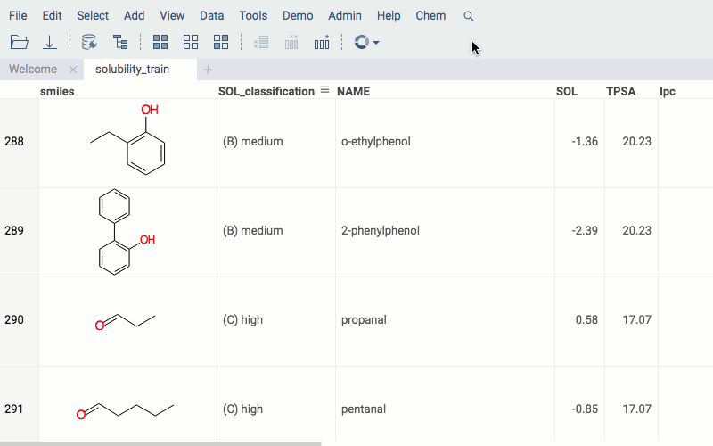
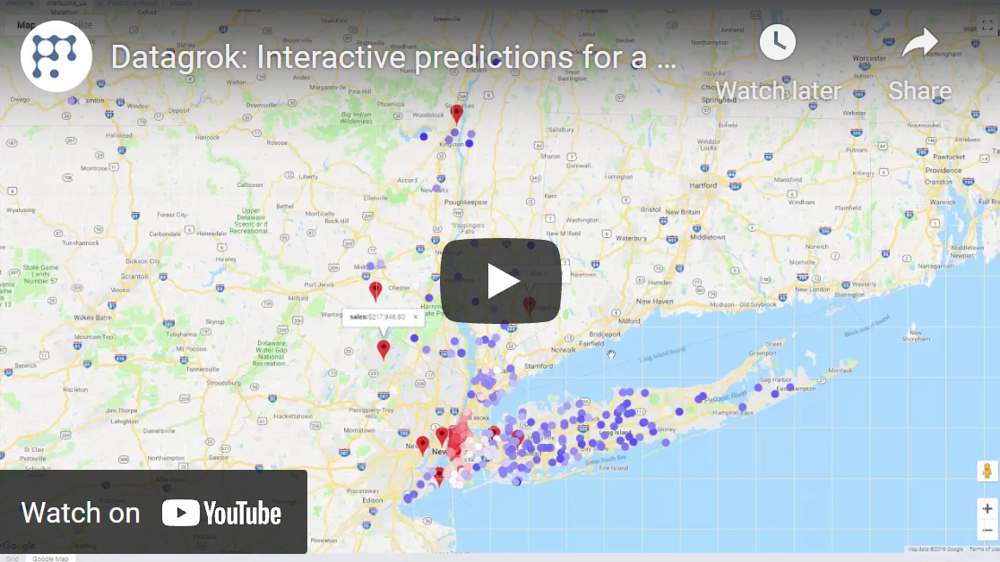
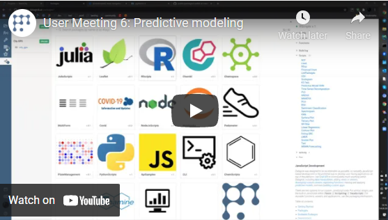

Predictive modeling uses statistics to predict outcomes.

## Algorithms

Predictive models can be used either directly to estimate a response (outcome) given a defined set of
characteristics (features), or indirectly to drive the choice of decision rules.

Predictive modeling toolkit uses a wide range of models: based on popular frameworks (Caret, Chemprop), 
self-written in-browser toolkit (EDA). There is also a support for [custom models](./custom-machine-learning-models.md).

### Model engines

#### Caret

Caret models use [R Caret](https://topepo.github.io/caret/index.html) package.
It provides a set of methods that could be used for 
[classification problems](https://en.wikipedia.org/wiki/Statistical_classification).

| Method    | Model                                                     |
|-----------|-----------------------------------------------------------|
| rf        | Random Forest                                             |
| gbm       | Stochastic Gradient Boosting Machine                      |
| svmLinear | Support Vector Machines with Linear Kernel                |
| svmRadial | Support Vector Machines with Radial Basis Function Kernel |

#### Chemprop

[Chemprop](https://github.com/chemprop/chemprop) model engine is used for applying models 
to chemical compounds to predict molecule properties.

Under the hood, Chemprop uses message passing neural networks. The model engine has an extensive set of parameters: dimensions of network layers, activation functions, learning rate etc.

#### EDA

[EDA](https://github.com/datagrok-ai/public/tree/master/packages/EDA) is a Datagrok package providing toolkit for exploratory data analysis. Among other tools, it contains the most popular classical ML models that are trained in-browser:

* SVM 
* XGBoost
* Linear Regression
* Softmax Classifier
* PCA Regression
 
## Train model

Example for R Caret engine:

* Open table
* Run from menu: **Tools** | **ML** | **Train model**
* Select table that contains features
* Select feature columns
* Select outcome column
* Set checkbox to impute missing values, if required
* Set number of nearest neighbors to predict missing values, if required
* Select modeling method. Configure suggested hyperparameters
* Click **TRAIN** button
* Fill the information about the model
* Run model training

## Apply model

* Open table
* Run from menu: **Tools** | **Predictive modeling** | **Apply**
* Select table that contains features
* Select applicable model
* Set checkbox to impute missing values, if required
* Set number of nearest neighbors to predict missing values, if required
* Apply model
* Result of modelling will be concatenated to source table as a new column.

Also apply model available through "Models Browser" (**Tools** | **Predictive modeling** | **Browse Models**)
or as suggested models in table properties in **Toolbox**
or [Context Panel](../datagrok/navigation/panels/panels.md#context-panel).

## Deployment

By itself, building a good model typically does not have a lot of value, but sharing the gained knowledge does. Even if
the purpose of the model is to increase knowledge of the data, the knowledge gained will need to be organized and
presented in a way that the customer can use it. Depending on the data and on the requirements, the results could be
presented as a data table, a report, an interactive visualization, or something else.

Datagrok platform was specifically designed with that in mind. In addition to traditional model deployment techniques
such as table and reports, Datagrok offers a unique way of distributing predictive model results via
the [data augmentation](../explore/data-augmentation/data-augmentation.md)
and [info panels](../datagrok/navigation/panels/info-panels.md).

### Videos

See also:

* [Cheminformatics predictive modeling](../datagrok/solutions/domains/chem/chem.md#qsar-and-qspr-modeling)
* [Predictive modeling](https://en.wikipedia.org/wiki/Predictive_modelling)
* [Statistical classification](https://en.wikipedia.org/wiki/Statistical_classification)
* [R Caret package](https://topepo.github.io/caret/index.html)
* [Chemprop](https://github.com/chemprop/chemprop)
* [Samples](https://public.datagrok.ai/js/samples/domains/data-science/predictive-model)
