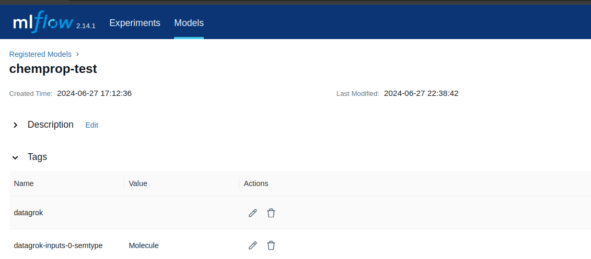

MLFlow is a platform that facilitates machine learning development through tracking experiments, packaging code into reproducible runs, and sharing and deploying models.

Datagrok predictive modeling supports models uploaded to the MLFlow Model Registry. Models are automatically fetched in the background and are inferenced in Docker containers on demand.

## MLFlow Connection

MLFlow connection is used to fetch models from the MLFlow service.

To set up a connection:
1. Navigate to **Browse > Platform > Predictive Modeling > MLFlow**.
2. Create a new connection by clicking **New Connection**.
3. Select **MLFlow** as Data Source.
4. Set up the connection, using the URL of the MLFlow service (also known as the Tracking URI).

## MLFlow Model Tags

The MLFlow connector fetches all models marked with the `datagrok` tag. This tag is mandatory to make the model fetchable by Datagrok.

For better integration of models into Datagrok, we recommend annotating model inputs using model tags. Model tags have the structure `datagrok-PARAMETERS-INDEX-TYPE`, where _PARAMETERS_ is either _inputs_ or _outputs_, _INDEX_ is the index of the parameter in the model configuration using 0-based numeration, and _TYPE_ is either _name_ or _semtype_.

For example, the value of the tag `datagrok-inputs-1-name` specifies the name of the second model input parameter, and the value of the tag `datagrok-outputs-0-semtype` specifies the semtype of the model output.

Sometimes Datagrok can automatically detect parameter names, but this heavily depends on the MLFlow model type. You can check if parameter names are available in the MLFlow UI.



## Sample MLFlow Model

MLFlow supports most of the popular tools for predictive modeling. The list is available [here](https://mlflow.org/docs/latest/models.html#built-in-model-flavors).

Here we present a sample Python code that uploads a custom Python model to MLFlow. We do not present model-specific code and consider that it is incasulated in the `create_model` function, which creates a model from model weights, and the `predict()` function, which takes features as input and returns predictions.

```python
import mlflow.pyfunc
import pandas as pd
import numpy as np
import sys
from mlflow import MlflowClient
from mlflow.models import infer_signature

# MLFlow tracking server setup
mlflow.set_tracking_uri(TRACKING_URI)
experiment_name = "datagrok_experiment"
mlflow.set_experiment(experiment_name)

# Setup data
checkpoint_path = './model.bin'
context = mlflow.pyfunc.PythonModelContext({'weights': checkpoint_path}, None)
test_path = 'test_data.csv'
input_column = 'Molecule'
df = pd.read_csv(test_path)[[input_column]]

# Create model
model = Model()

# Use sample data to get a signature
model.load_context(context)
model_output = model.predict(context, df)
signature = infer_signature(df, model_output)

# Save the model using MLflow
model_path = "datagrok_model"
mlflow.pyfunc.save_model(path=model_path, python_model=model, artifacts=context.artifacts)

# Upload model to the server
# Add pip_requirements = ["package_name"] or pip_requirements = ["-r requirements.txt"] to add dependencies
mlflow.pyfunc.log_model(model_path, python_model=model, signature=signature, registered_model_name=model_path, artifacts=context.artifacts)

class Model(mlflow.pyfunc.PythonModel):
    def load_context(self, context):
        # Load model checkpoint and initialize featurizer
        self.model = create_model(context.artifacts['weights'])

    def predict(self, context, df):
        # Convert pd.DataFrame to values
        inputs = df[input_column].to_list()

        predictions = self.model.predict(inputs)
        return pd.DataFrame({'Predicted': predictions})
```

As MLFlow PythonModel uses DataFrames, input and output parameters are already named. So, adding tags `datagrok-inputs-0-name = "Molecule"` and `datagrok-outputs-0-name = "Predicted"` is not required, as they are fetched automatically from the model configuration provided by MLFlow.

See also:
* [MLFlow](https://mlflow.org)
* [MLFlow Model Registry](https://mlflow.org/docs/latest/model-registry.html)
* [Model application](/help/learn/#apply-model)

