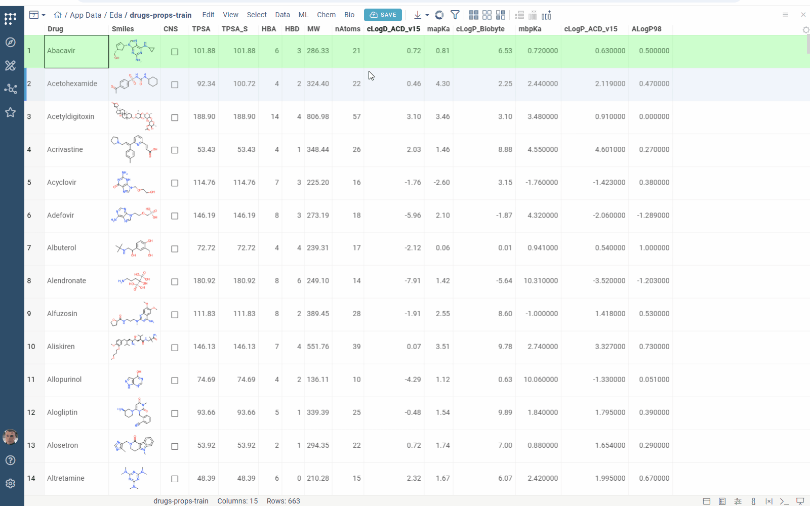
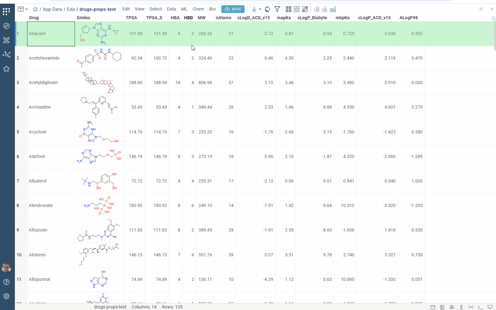

Multiparameter optimization ([MPO](https://en.wikipedia.org/wiki/Multi-objective_optimization)) is a systematic approach to simultaneously optimizing multiple variables, typically requiring careful trade-offs since improving one parameter often compromises another. A [desirability function](https://www.itl.nist.gov/div898/handbook/pri/section5/pri5322.htm) combines multiple parameters into a single score for optimization.

Probabilistic MPO ([pMPO](https://pmc.ncbi.nlm.nih.gov/articles/PMC4716604/)) is a data-driven method for constructing desirability functions from labeled datasets. Each sample in these datasets is labeled as preferred or not preferred based on experimental results or expert assessment. The method first identifies statistically significant and non-redundant features through significance testing and correlation filtering. These features are then combined into weighted desirability functions. This approach enables robust multiparameter optimization and ranking based on balanced property trade-offs.

In chemistry applications, pMPO uses molecular descriptors as features to score and rank compounds based on their predicted properties.

## Building a pMPO Model

Construct a pMPO model from your labeled dataset of pre-computed molecular descriptors using the interactive pMPO application:

1. Open the table.
2. Navigate to **Top Menu > Chem > Calculate > Train pMPO...**. The application opens.
3. In the left panel, configure the following parameters:
   * **Train data**:
     * **Descriptors**: numerical columns containing the descriptors for model construction.
     * **Desirability**: a boolean column indicating whether each sample is preferred.
   * **Thresholds**:
     * **p-value**: significance level for filtering descriptors. Descriptors with p-values above this threshold are excluded.
     * **R²**: correlation threshold. Descriptors with squared correlation above this value are considered highly correlated; the descriptor with the lower p-value is retained.
     * **q-cutoff**: z-score or normalized desirability cutoff for excluding outlier descriptors from the model.

   The application automatically recalculates the pMPO model when any input changes.
4. Review the results:
   * The **pMPO Score** column displays the calculated score for each compound.
   * The **Descriptor Statistics** grid shows computation results, highlights selected descriptors, and visualizes their desirability functions.

5. To save the model, click **SAVE MODEL** in the left panel. Configure the following in the dialog:
   * **Path**: specify the **Folder** and **File** location.
   * **Model details**: enter the **Name** and **Description**.
   * **Desirability Profile**: enable this option to save results as a desirability profile.

## Applying a pMPO Model

To apply the saved pMPO model:

1. Open the table.
2. Navigate to **Top Menu > Chem > Calculate > MPO Score...**. A dialog opens.
3. Select the desired model from the **Template** dropdown and click **OK**. The scores are calculated and added to the table in a new column.

See also:

* [Multiparameter optimization](../datagrok/solutions/domains/chem/chem.md#multiparameter-optimization)
* [Pareto front viewer](../visualize/viewers/pareto-front-viewer.md)
* [Community: Multi-Parameter Optimization](https://community.datagrok.ai/t/mpo-multi-parameter-optimization/1120/14)
