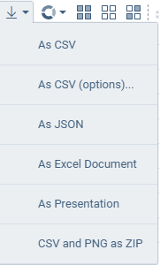
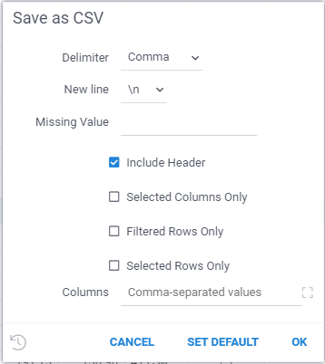

<!-- TITLE: Data Export -->
<!-- SUBTITLE: -->

# Data Export

When working on the Datagrok platform, you can always save the currently open data to a file or a set of files in your local environment.

Currently Datagrok supports the following formats for data export:

* CSV
* Excel documents (.xlsx)
* JSON
* PNG
* PowerPoint presentations (.pptx)

To export file, use the corresponding button on the toolbar while a table view is open:

It is possible to flexibly configure the format of the downloaded CSV file (**As CSV (options)**): 

It is also possible to save the selected settings for use by default when saving to **CSV** format.

It is important to remember that when exporting to **CSV** and **JSON** format, only the table whose view is open (currently displayed on the screen) is downloaded.

To save data from all open tables into separate CVS files, you can use saving as Zip archive.
Such **Zip** archive will contain not only CSV files with tables, but also **screenshots** of all tables and viewers added to all open table views.

When saving in **Excel format**, each open table is saved as a separate sheet.

A PowerPoint presentation will contain screenshots of all tables and all viewers added to open tables. 

See also:

  * [Projects](../overview/project.md)
  * [Layout](../visualize/view-layout.md)
  * [Viewers](../visualize/viewers.md)
