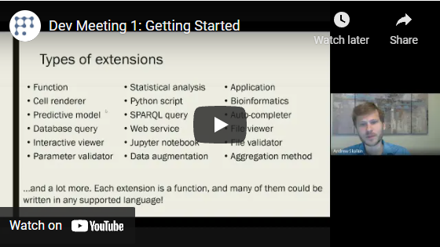

<!-- TITLE: Functions -->
<!-- SUBTITLE: -->

# Functions

Grok platform provides first-class support for functions, which is an incredibly powerful concept. Pretty much anything
that can be executed within the platform is a function. Here are some examples of the different types of functions:

* [Querying](../../access/data-query.md) external Postgres database
* Executing a [JavaScript function](../../develop/develop.md) in the browser that uses Grok API for integration purposes
* Calculating Sin(PI)
* Deleting a column from the table
* Sending an email
* Applying [predictive model](../../learn/predictive-modeling.md) to a dataset
* Calculating molecule properties via a [Python script](../../compute/scripting.md)
* Showing a dialog

All of the above-mentioned functions are quite different in terms of what and how they do - some of them execute on the
server and others in the browser, some of them perform scientific computation while others show UI elements. Yet, they
all share the same mechanism and therefore have the same features:

* Scriptable - each function call is represented as a string, which can be executed
  from [console](../../overview/navigation.md#console), or as part of a bigger script
* Findable - open `Help | Functions` to search
* Introspectable - programmatically find out function parameter's metadata
* Secure - A function can have privileges associated with it. For instance, you might want the
  "ApproveExpense" function be available only to people belonging to the "
  Managers" [group](../../govern/group.md).
* Auditable - find out who and when executed a particular function, and which parameters were used
* Ability to get a table with all parameters used for a particular function
* Runnable - dynamically generated UI for editing parameter values
* Linkable - simply drag-and-drop a function to a [conversation](../../collaborate/chat.md) or to a dashboard to link to
  it. Run it by right-clicking on the link and choosing "Run..."
* Usable in workflow designers and [query result transformations](../../transform/recipe-editor.md)

## Macros

Interactive visual data munging is a powerful feature. Every transformation that is triggered visually
(such as by clicking "Delete selected rows" icon) is backed by a corresponding function. By printing function call in
the [console](../../overview/navigation.md#console)), we get macro recording capability - and unlike Excel, there is no
need to start recording, simply open `View | Console` to see what had been executed.

This feature is especially useful for data cleansing, where you would visually clean one dataset and get a script that
could be used to clean similar datasets. Once you've written something useful that other people would benefit from,
share it with your team.

When enabled, a history of all changes made to the table is saved automatically, so that users will later be able to
figure out how that particular table was produced, or to reproduce the process on a new table with the structure similar
to the original one. To access it, open table's 'History' pane on
the [property panel](../../overview/navigation.md#properties).

## Data flow

When dealing with sensitive data, it is important to understand its flow. It is usually not a concern if you run an
enterprise version of the Datagrok platform in a virtual private cloud, but it might be a bigger issue when using the
public environment.

While we try to do as many computations on the client-side (in the browser) as possible, certain operations, such as
[training a predictive model](../../learn/predictive-modeling.md),
[running an R script](../../compute/scripting.md), or
[computing chemical descriptors](../../domains/chem/cheminformatics.md#chemical-properties-and-descriptors)
run on a [server](../../develop/admin/architecture.md#compute-virtual-machine). When such operation executes, the
relevant part of the input gets sent to the server, where it gets processed, and the result is sent back to the client.
Results of the computations reside on the server until either the client retrieves it, or an automatic cleanup happens.
Neither inputs nor outputs can be accessed by functions executed by other users. Only administrators can access compute
server, where the data is stored or processed. All traffic between client and server
is [TLS-encrypted](https://www.websecurity.symantec.com/security-topics/what-is-ssl-tls-https).

Most of the actions performed by users are logged for the usage analysis and [audit](../../govern/audit.md) purposes.
For logging, only the metadata associated with the parameters (such as table and column names) will be additionally
stored in the database. Additionally, if a table passed as a parameter is already residing on a server, the
corresponding audit record will contain a reference to it.

## Filtering

You can use these fields to filter functions with [smart search](../smart-search.md):

| Field       | Description                                 |
|-------------|---------------------------------------------|
| ID          |                                             |
| name        |                                             |
| runs        | list of [FuncCall](function-call.md) object |
| createdOn   |                                             |
| updatedOn   |                                             |
| author      | [User](../../govern/user.md) object         |
| starredBy   | [User](../../govern/user.md) object         |
| commentedBy | [User](../../govern/user.md) object         |
| usedBy      | [User](../../govern/user.md) object         |

## Videos

See also:

* [Console](../../overview/navigation.md#console)
* [Scripting](../../compute/scripting.md)
