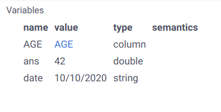

<!-- TITLE: Navigation -->
<!-- SUBTITLE: -->

# Navigation

This article is designed to help you navigate the Datagrok platform. We will introduce core concepts and walk you through the fundamentals of working with our platform.

First of all, you need to launch Datagrok. Assuming that you are going to work with a public instance of the platform, all you need to do is to open our website (https://datagrok.ai/) and hit the `LAUNCH` button. This will lead you to the _Sign-Up/Login_ form.

The first thing you will see after launching the platform is Datagrok's welcome page:

")

Here you can find an overview of the platform's key capabilities as well as the links to our [Wiki](https://datagrok.ai/help), [Community Forums](https://community.datagrok.ai), [Tutorials](), [YouTube Channel](https://www.youtube.com/channel/UCXPHEjOd4gyZ6m6Ji-iOBYg), [API Samples](https://public.datagrok.ai/js), browse a gallery of publicly available [projects](project.md) and more.

The welcome page consists of several visual components: a sidebar, [toolbox](#toolbox), main [view](), [property panel](#properties), and [context help](#context-help). Typically, the view resides in the center and occupies all available area in the screen. The sidebar and toolbox are placed on the left. The sidebar contains controls over the main functionality, while the toolbox displays options specific to the current view. The property panel and context help are docked to the right. This appearance is fully customizable, you can manage the displayed windows from the sidebar (`Windows`), or turn them on/off with the following shortcuts:

|    Menu Option         |      Shortcut               |         Action                |
|------------------------|-----------------------------|-------------------------------|
| Windows | Toolbox      | Alt + X                     | Show/hide the toolbox         |
| Windows | Properties   | F4                          | Show/hide the property panel  | 
| Windows | Context Help | F1                          | Show/hide the context help    |

In addition to the design modularity, these panels can be resized and docked.

Now, let's proceed to the sidebar icons and explore the functionality they offer.

## Data

This tab brings together the platform's main data-retrieving capabilities. There are multiple ways in which you can work with data in Datagrok: from a full in-browser experience to establishing data connections, deploying interactive applications, running data jobs, building pipelines. It all starts with a simple step of [importing data](../access/importing-data.md).

### Local Files

Take a local file to begin with. To open it on the platform, drag-and-drop it into the browser. Other options include file dialog interaction: double-click on the `Data` icon or press `Ctrl + O`, you can access this dialog from the toolbox as well (`Data | Open local file`). It is important to note that the data resides in the browser up until the moment you choose to upload it to the server. This is always done explicitly. See the list of [supported file formats](../access/importing-data.md#supported-file-types) and read more about [saving data to the server](../overview/project.md#uploading-a-project).

### File Browser
### Databases
### Webservices
### Queries
### Projects
### Text

## Functions
## Manage
## Tables
## Favorites
## Projects

## Windows

The `Windows` icon lets you manage windows and see the currently open ones. In particular, you can customize the visibility of the following panes: [Menu](#menu), [Tables](#tables), [Columns](#columns), [Properties](#properties), [Toolbox](#toolbox), [Variables](#variables), [Console](#console), [Context Help](#context-help). To save your preferences regarding the display of certain windows at startup, tweak your user's [general settings](https://public.datagrok.ai/settings/general) (`Settings | General`).

### Menu
### Tables
### Columns

### Properties

This panel describes the properties of a current object. Typically, whenever the user clicks on most objects within the platform, such as a table, data connection, application, command, or any other [supported object type](../overview/objects.md), this object becomes a current object. So, to focus on one, simply click on it. After that, you will see the corresponding property panel as well as the [context help](#context-help).

`F4` toggles the visibility of the property panel. Additionally, you can manage it from the sidebar (`Windows | Properties`). There are several useful icons in the panel header:

|      Icon        |            Action                                           |
|------------------|-------------------------------------------------------------|
| Back/Forward     | Navigate the history of previously viewed object properties |
| Clone and detach | Detach a copy of the property panel preserving the content  |
| Collapse all     | Collapse all listed property values                         |
| Favorites        | Switch to the properties of favorite objects                |

The property panel saves history of viewed objects, so you can switch to the previous selected object if necessary. This also means that the content of the property panel is synchronized with the current object. To display properties of another object along with the currently selected one, click on the `Clone and detach` icon.

The content of a property panel is generated based on the type of a current object, as well as its value. For example, if you open a table, you can find applicable actions, [predictive models](../learn/predictive-modeling.md), and algorithms. To access the properties of a viewer, click on a gear icon `⚙` in the top right corner of the viewer's header. What is more, the information provided for a current object can be expanded by means of [info panels](../discover/info-panels.md).

### Toolbox

The toolbox located on the left shows the properties and actions available for the currently active view. You can toggle its visibility with `Alt + X` or `Windows | Toolbox`. In addition, the icons on the top right let you pin or close the toolbox.

The toolbox contents change in accordance with the current view.

### Variables

`Alt + V` opens a variables view, which contains all variables available in the current context, and allows manipulating them. It is also possible to enable the variables view from the toolbox (`Windows | Variables`) or from the [console](#console).

There are several ways for an object to appear as a variable:

* Direct assignment like `x = 5` in the [console](#console)
* [Drag-and-drop](../overview/drag-and-drop.md) an object to the variables view



The view consists of four fields describing the variables: `name`, `value`, `type`, and `semantics`. The last field contains the semantic type, or quality, of a column value detected out of the box or as per custom semantic type detection rules.

### Console

Console can be used to call [functions](functions/function.md) and record [macros](functions/function.md#macros).

#### Controls

|     Key     |    Action             |
|-------------|-----------------------|
| Tilde `~`   | Open the console      |
| Tab         | Complete a command    |
| Up/Down     | Previous/next command |

Press the tilde key `~` to open the console or enable it from the toolbox (`Windows | Console`).


Two icons on the top left let you clear the console, or open the [variables view](#variables). Clicking on the function name will bring up its details in the [property panel](#properties).

#### Command Examples

Run the `Mul` command (multiply two numbers) with the specified parameters:
```
Mul(2,3)
```
Edit parameters of the `Mul` command and evaluate it in a dialog window:
```
Mul
```
Get help for the `Mul` command:
```
Mul?
```
Access the current object from the console with the `o` variable:
```
o.name
```
Select rows with empty values in the `HEIGHT` column:
```
SelectRows("demog", IsNull("HEIGHT"))
```
Extract rows with empty values in the `HEIGHT` column into a new dataframe:
```
ExtractRows("demog", IsNull("HEIGHT"))
```

#### Recording Macros

Every visual transformation within the platform is backed by a corresponding function, which provides for automatic logging. Whenever a function is executed, the call gets logged in the console. No preliminary action is required on your part, so you can seamlessly have it both ways: use the console to examine which functions got triggered by particular UI events to reproduce those steps in the future, or call functions on your data directly from the console. The first case can be used in [data transformations](../transform/recipe-editor.md) and [data pipelines](../access/data-pipeline.md). The second use case is a common practice for debugging custom functions defined in a [package](../develop/develop.md#packages).


### Context Help

Context help appears at the bottom right and shows additional information about objects you are currently working with. You can toggle this pane with the `F1` hot key or manage it from `Windows | Context Help`. It is enabled by default to help you navigate the platform and get the hang of its core components.

While thorough explanations can be found in our documentation, the main purpose of contextual help is to provide you with concise cues along the way. To learn more about a topic of your interest, make use of the icons available at the top left:

|      Icon                |            Action             |
|--------------------------|-------------------------------|
| Back/Forward             | Navigate visited pages        |
| Home page                | Open Wiki's home page         |
| Clone and extend to view | Open a page in the main view  |
| Open in new tab          | Redirect to the Wiki page     |

## Settings

Client-side settings are specific to the user, and are controlled by the user (unless the organization's IT policy overrides this).

To edit client settings, open `Settings` from the sidebar.


## User Profile

Click on your user image on the sidebar to open the [user profile](../govern/user.md#profile). Here you can find a summary of your data, read notifications, change your password, retrieve API and developer keys. The data on your activity is provided by the platform's internal [audit system](../govern/audit.md).

## Help

The help section at the bottom left resets the toolbox options to the ones you typically see on the welcome page.

If an error occurs during any operation, you will be notified with the corresponding error message under the help section. In this case, you can open the `Inspector` tool (via an exclamation mark `!` icon or by pressing `Alt + I`) to further investigate the issue.

If you run into any difficulties, please refer to our [documentation](https://datagrok.ai/help) or ask a question in our [community forums](https://community.datagrok.ai). Quick access to these links, as well as other useful resources, is provided in the toolbox of the help icon.

See also:

  * [Functions](functions/function.md)
  * [Info Panels](../discover/info-panels.md)
  * [Entities](objects.md)
