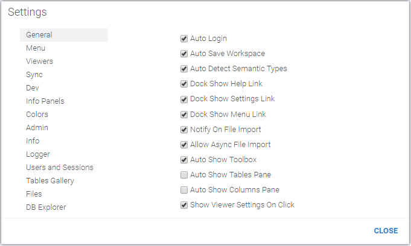

<!-- TITLE: Settings-->
<!-- SUBTITLE: -->

# Settings

Client-side settings are specific to the user, and are controlled by the user (unless 
organizations's IT policy overrides it).

To edit client settings, open `Tools | Settings`.

